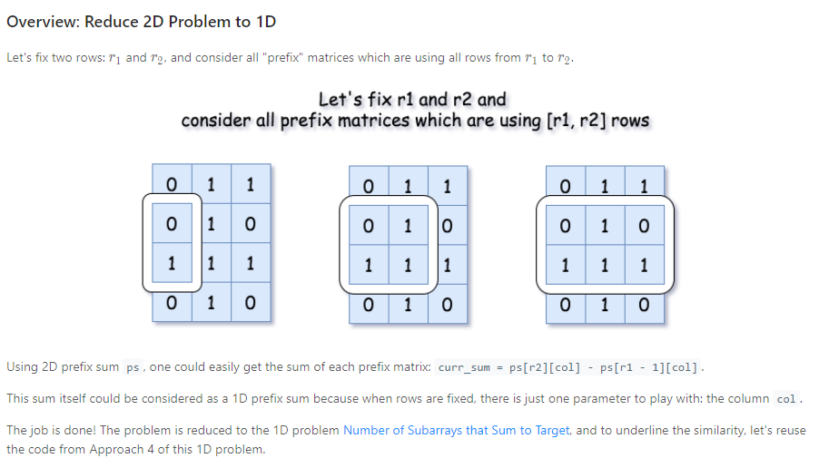
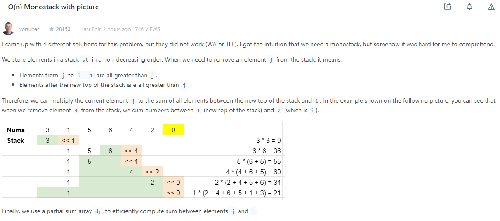

### [496. Next Greater Element I](https://leetcode.com/problems/next-greater-element-i/)

You are given two arrays (without duplicates) nums1 and nums2 where nums1’s elements are subset of nums2. Find all the next greater numbers for nums1's elements in the corresponding places of nums2.

The Next Greater Number of a number x in nums1 is the first greater number to its right in nums2. If it does not exist, output -1 for this number.

```
Example 1:
Input: nums1 = [4,1,2], nums2 = [1,3,4,2].
Output: [-1,3,-1]
Explanation:
    For number 4 in the first array, you cannot find the next greater number for it in the second array, so output -1.
    For number 1 in the first array, the next greater number for it in the second array is 3.
    For number 2 in the first array, there is no next greater number for it in the second array, so output -1.
```

```java
/*
nums1 = [4,1,2]
nums2 = [1,3,4,2]

alg1: hashmap (value at nums1, index at nums2), time O(n^2), space: O(n)

alg2: hashmap + increasing stack, m = nums1.len, n = nums2.len, time: O(m + n) space: O(m)
    create int[] res := new int[nums1.length]
    preprocess to create and init hashmap < value at nums1, greater value at nums2 >, so (n1, -1),(n2, -1) are inserted
    create a stack
    for i < len:
        if !stack.isEmpty && nums2[i] > nums2[stack.top]:
            smallIdx := stack.pop
            if map[nums2[smalIdx]] != null: //this greater value needs to be recorded
                map[nums2[smallIdx]] = nums2[i]
        stack.offer(i)
    
    post process to add all greater element into result
            
*/
class Solution {
    public int[] nextGreaterElement(int[] nums1, int[] nums2) {
        int[] res = new int[nums1.length];
        Map<Integer, Integer> map = new HashMap<>();
        for (int n : nums1) {
            map.put(n, -1);
        }
        Deque<Integer> stack = new ArrayDeque<>();
        for (int i = 0; i < nums2.length; i++) {
            while (!stack.isEmpty() && nums2[i] > nums2[stack.peekFirst()]) {
                int idx = stack.pollFirst();
                //System.out.println("at i: " + i + " idx: " + idx);
                if (map.containsKey(nums2[idx])) {
                    map.put(nums2[idx], nums2[i]);
                }
            }
            stack.offerFirst(i);
        }
        
        for (int i = 0; i < nums1.length; i++) {
            res[i] = map.get(nums1[i]);
        }
        return res;
    }
}
```

### [498. Diagonal Traverse](https://leetcode.com/problems/diagonal-traverse/)
Given a matrix of M x N elements (M rows, N columns), return all elements of the matrix in diagonal order as shown in the below image.

```
Example:

Input:
[
 [ 1, 2, 3 ],
 [ 4, 5, 6 ],
 [ 7, 8, 9 ]
]

Output:  [1,2,4,7,5,3,6,8,9]
```
```java
/*
alg: traverse by requirement
*/
class Solution {
    public int[] findDiagonalOrder(int[][] matrix) {
        int m = matrix.length;
        if (m == 0) {
            return new int[0];
        }
        int n = matrix[0].length;
        int i = 0;
        int j = 0;
        int[] res = new int[m * n];
        int cur = 0;
        int dir = 0;
        //even going up, odd going down
        while (i != m - 1 || j != n - 1) {
            //System.out.println("i: " + i + "j: " + j);
            res[cur++] = matrix[i][j];
            if (dir == 0) {
                //up
                if (j == n - 1) {
                    i++;
                    dir = 1;
                } else if (i == 0) {
                    j++;
                    dir = 1;
                } else {
                    i--;
                    j++;
                }
            } else {
                //down
                if (i == m - 1) {
                    j++;
                    dir = 0;
                } else if (j == 0) {
                    i++;
                    dir = 0;
                } else {
                    i++;
                    j--;
                }
            }
        }
        res[cur] = matrix[m - 1][n - 1];
        return res;
    
    }
}
```


### [493. Reverse Pairs](https://leetcode.com/problems/reverse-pairs/) *****
Given an array nums, we call (i, j) an important reverse pair if `i < j and nums[i] > 2*nums[j].`

You need to return the number of important reverse pairs in the given array.
```
Example1:

Input: [1,3,2,3,1]
Output: 2
Example2:

Input: [2,4,3,5,1]
Output: 3
Note:
The length of the given array will not exceed 50,000.
All the numbers in the input array are in the range of 32-bit integer.
```
```java
/*
merge sort: since merge sort essentially is equivalent to the problem of comparing elements in the array, and each pair of element will be compared at most once and will be sorted and thus not be compared again, thus we can compute the count of reverse pairs at each merging step and aggregate the result

recursive rule:
    split the nums into left and right
    recursively mergeSort left half and collect the count of reverse pairs found
    recursively mergeSort .... right half
        //count # of reversed pair with i = elements from left half, j = elements from right half, note this relation is *transitive*, thus can be computed in linear time
    merge and count the reverse pair during comparing left and right half
    
    return the aggregating counts of left, right, and reverse pairs during the merge process

time: O(nlogn)
space: O(n) for merge helper array

*/
class Solution {
    public int reversePairs(int[] nums) {
        if (nums.length == 0) {
            return 0;
        }
        
        int[] helper = new int[nums.length];
        return mergeSort(nums, helper, 0, nums.length - 1);
    }
    public int mergeSort(int[] nums, int[] helper, int l, int r) {
        if (l >= r) {
            return 0;
        }
        
        int mid = l + (r - l) / 2;
        int lcount = mergeSort(nums, helper, l, mid);   //left bounded by [l ... mid]
        int rcount = mergeSort(nums, helper, mid + 1, r);   //right bounded by [mid + 1 ... r]
        
        //compute the count from two sorted array, based on the transitive nature
        // if nums[i] > nums[i - k], then j such that nums[i - k] > 2 * nums[j] can beadded to nums[i]'s count
        int count = 0;
        int j = mid + 1;
        for (int i = l; i <= mid; i++) {
            while (j <= r && (long) nums[i] > (long)2L * nums[j]) {
                j++;
            } //j > r || nums[i] <= 2 * nums[j]
            count += j - (mid + 1); //add every thing besides nums[j]
        }
        merge(nums, helper, l, mid, mid + 1, r);
        return lcount + rcount + count;
    }
    public void merge(int[] nums, int[] helper, int l1, int r1, int l2, int r2) {
        copyArr(nums, helper, l1, r2);
        int count = 0;
        int sortIdx = l1;
        int rightSize = r2 - l2 + 1;
        while (l1 <= r1 && l2 <= r2) {
            if (helper[l1] > helper[l2]) {
                nums[sortIdx++] = helper[l2++]; 
            } else {
                nums[sortIdx++] = helper[l1++];
            }
        }//post condition: l1 > r1 || l2 > r2
        while (l1 <= r1) {
            nums[sortIdx++] = helper[l1++];
        }
        //l2 > r2 case already sorted
    }
    public void copyArr(int[] src, int[] dest, int l, int r) {
        while (l <= r) {
            dest[l] = src[l];
            l++;
        }
    }
}
```

### 442. Find All Duplicates in an Array ****
Given an array of integers, 1 ≤ a[i] ≤ n (n = size of array), some elements appear twice and others appear once.

Find all the elements that appear twice in this array.

Could you do it without extra space and in O(n) runtime?
```
Example:
Input:
[4,3,2,7,8,2,3,1]

Output:
[2,3]
```
```java
/*
alg: swap each nums[i] to position i - 1, continue until the element in in position or we find a duplicate
    - when find a duplicate, to avoid finding it again, we set the duplicate to -1, special placeholder

time: O(n)
space: O(1)
*/
class Solution {
    public List<Integer> findDuplicates(int[] nums) {
        List<Integer> res = new ArrayList<>();
        if (nums == null || nums.length == 0) {
            return res;
        }
        /*
        index map:
            for each nums[i], its corresp location index = nums[i] - 1
        */
        for (int i = 0; i < nums.length; i++) {
            while (nums[i] != -1 && nums[i] - 1 != i) {
                //check if duplicate
                if (nums[i] == nums[nums[i] - 1]) {
                    res.add(nums[i]);
                    nums[i] = -1;
                } else {
                    swap(nums, i, nums[i] - 1);
                }
            }
        }
        return res;
    }
    public void swap(int[] nums, int i, int j) {
        int temp = nums[i];
        nums[i] = nums[j];
        nums[j] = temp;
    }
}
```

### 435. Non-overlapping Intervals
Given a collection of intervals, find the minimum number of intervals you need to remove to make the rest of the intervals non-overlapping.

```
Example 1:

Input: [[1,2],[2,3],[3,4],[1,3]]
Output: 1
Explanation: [1,3] can be removed and the rest of intervals are non-overlapping.
Example 2:

Input: [[1,2],[1,2],[1,2]]
Output: 2
Explanation: You need to remove two [1,2] to make the rest of intervals non-overlapping.
Example 3:

Input: [[1,2],[2,3]]
Output: 0
Explanation: You don't need to remove any of the intervals since they're already non-overlapping.
```
```java
/*
best first search(greedy):
    preprocess sort the interval by j then by i
    linear scan(from left to right) the sorted intervals, and keep a global interval right end, remove excessive intervals one by one
    
time: O(nlogn)
space: O(n)
*/
class Solution {
    public int eraseOverlapIntervals(int[][] intervals) {
        int n = intervals.length;
        if (n == 0) {
            return n;
        }
        Arrays.sort(intervals, (i1, i2) -> {
            return i1[1] - i2[1] == 0 ? i1[0] - i2[0] : i1[1] - i2[1];
        });
        
        int res = 0;
        int r = intervals[0][1];
        
        for (int i = 1; i < intervals.length; i++) {
            int[] it = intervals[i];
            if (it[0] < r) {
                res++;
            } else {
                r = it[1];
            }
        }
        return res;
    }
}
```

### 835. Image Overlap
```java
/*
One important insight is that shifting one matrix to a direction is equivalent to shifting the other matrix to the opposite direction, in the sense that we would have the same overlapping zone at the end.

we iterate all possible # of shifts and count the overlapping region at each step. (we count moving left and up by equivalently shifting B right and down, so index is positive)
time: O(n^4)
space: O(1)
*/
class Solution {
    protected int shiftAndCount(int xShift, int yShift, int[][] M, int[][] R) {
        int count = 0;
        int rRow = 0;
        // count the cells of ones in the overlapping zone.
        for (int mRow = yShift; mRow < M.length; ++mRow) {
            int rCol = 0;
            for (int mCol = xShift; mCol < M.length; ++mCol) {
                if (M[mRow][mCol] == 1 && M[mRow][mCol] == R[rRow][rCol])
                    count += 1;
                rCol += 1;
            }
            rRow += 1;
        }
        return count;
    }

    public int largestOverlap(int[][] A, int[][] B) {
        int maxOverlaps = 0;

        for (int yShift = 0; yShift < A.length; ++yShift)
            for (int xShift = 0; xShift < A.length; ++xShift) {
                // move one of the matrice up and left and vice versa.
                // (equivalent to move the other matrix down and right)
                maxOverlaps = Math.max(maxOverlaps, shiftAndCount(xShift, yShift, A, B));
                maxOverlaps = Math.max(maxOverlaps, shiftAndCount(xShift, yShift, B, A));
            }

        return maxOverlaps;
    }
}
```


### 57. Insert Interval
Given a set of non-overlapping intervals, insert a new interval into the intervals (merge if necessary).

You may assume that the intervals were initially sorted according to their start times.
```
Example 1:

Input: intervals = [[1,3],[6,9]], newInterval = [2,5]
Output: [[1,5],[6,9]]
```

```java
/*
alg: recursion


recursively insert interval i into intervals in index range [cur ... len - 1]

recursive rule:
    get current interval intervals[cur]
    if i.end <= cur_interval.end: merge i and cur as new_interval
    recursively insert the interval in rnage [cur + 1 ... len - 1]

base case:
    if cur == len, simply insert interval at the last
    if i.end < cur_interval.start, insert at position cur
    
time: O(n)
space: O(n)

*/
class Solution {
    public int[][] insert(int[][] intervals, int[] newInterval) {
        List<List<Integer>> ls = new ArrayList<>();
        rec(intervals, 0, ls, newInterval);
        
        int s = ls.size();
        int[][] res = new int[s][2];
        for (int i = 0; i < s; i++) {
            List<Integer> in = ls.get(i);
            res[i][0] = in.get(0);
            res[i][1] = in.get(1);
        }
        
        return res;
    }
    
    public void rec(int[][] intervals, int cur, List<List<Integer>> ls, int[] i) {
        if (cur == intervals.length) {
            ls.add(Arrays.asList(i[0], i[1]));
            return;
        } 
        
        int[] curInterval = intervals[cur];
        
        if (i[1] < curInterval[0]) {
            //i and cur are non overlapping, and insert position is at cur
            //insert at pos = cur
            ls.add(Arrays.asList(i[0], i[1]));
            
            //append the rest of the intervals
            for (int k = cur; k < intervals.length; k++) {
                ls.add(Arrays.asList(intervals[k][0], intervals[k][1]));
            }
            return;
        } 
        
        if (i[0] > curInterval[1]) {    //i and cur are non overlapping, add cur to result list
            ls.add(Arrays.asList(curInterval[0], curInterval[1]));
            rec(intervals, cur + 1, ls, i);
        } else {
            //merge interval i and cur
            i[0] = Math.min(i[0], curInterval[0]);
            i[1] = Math.max(i[1], curInterval[1]);
            rec(intervals, cur + 1, ls, i);
        }
    }
}
```


### 1094. Car Pooling

You are driving a vehicle that has capacity empty seats initially available for passengers.  The vehicle only drives east (ie. it cannot turn around and drive west.)

Given a list of trips, trip[i] = [num_passengers, start_location, end_location] contains information about the i-th trip: the number of passengers that must be picked up, and the locations to pick them up and drop them off.  The locations are given as the number of kilometers due east from your vehicle's initial location.

Return true if and only if it is possible to pick up and drop off all passengers for all the given trips. 


```
Example 1:

Input: trips = [[2,1,5],[3,3,7]], capacity = 4
Output: false
Example 2:

Input: trips = [[2,1,5],[3,3,7]], capacity = 5
Output: true
```

```java
/*

algorithm: best first search
pre sort trips according to the start location
use a min heap sort by end location
for i : trips: 
    if pq.isNotEmpty && pq.top.endLocation <= trip[i].startLocation: poll trips that are done, update the capacity
    add trip[i] to pq, update the capacity
    
    at any iteration, if capacity cannot be updated (say cant fit more ppl), return false
    
time: O(nlogn)
*/

class Solution {
    public boolean carPooling(int[][] trips, int capacity) {
        Arrays.sort(trips, (t1, t2) -> t1[1] - t2[1]);
        PriorityQueue<int[]> pq = new PriorityQueue<>((t1, t2) -> t1[2] - t2[2]);
        
        for (int[] t : trips) {
            while (!pq.isEmpty() && pq.peek()[2] <= t[1]) {
                int[] prev = pq.poll();
                capacity += prev[0];
            }
            
            if (capacity - t[0] < 0) {
                return false;
            }
            capacity -= t[0];
            pq.offer(t);
        }
        return true;
    }
}
```


### 48. rotate image

```java
class Solution {
    public void rotate(int[][] matrix) {
        int n = matrix.length;
        int offset = 0;
        int size = n;
        while (offset < n / 2) {
            for (int k = 0; k < size - 1; k++) {
                int tmp = matrix[offset][offset + k];
                matrix[offset][offset + k] = matrix[offset + size - 1 - k][offset]; //botLeft -> topLeft
                matrix[offset + size - 1 - k][offset] = matrix[offset + size - 1][offset + size - 1 - k]; //botRight -> botLeft
                matrix[offset + size - 1][offset + size - 1 - k] = matrix[offset + k][offset + size - 1]; //topRight -> botRight
                matrix[offset + k][offset + size - 1] = tmp; //topLeft -> topRight
            }
            size -= 2;
            offset += 1;
        }
    }
}
```

### 31. Next Permutation \*\*

```java

/*
- consider str 4321, there is no larger permutation
- for str 1432, next permutation lies in set of strings where 1 is swaped with {4, 3, 2}, this is because 1 is the first
decreasing number from a right-to-left increasing sequence, by swapping 1 with any of those numbers in increasing sequence{4,3,2} we get a bigger string
- to generalize this, consider string 35421, once we found the decreasing number 3, the current increasing sequence {5, 4, 2, 1}, we want to swap with {5, 4} cause its the way to result a bigger number instead of {1, 2}

observation
- find the first decreasing number x in a right-to-left increasing sequence
- find the smallest digit y in the increasing sequence such that y > x
- swap y with x, we will have x..y.. -> y..x..; note ..x.. is still a decreasing sequnce, and reverse(..x..) < ..x.. since reverse(..x..) < ..x..
- reverse (..x..) and result = y + reverse(..x..)
    - e.g., think for 35421
        - swap x = 3 and y = 4 -> 45321
        - reverse(5321) = 1235 < 5321
        - result = 41235

time: O(n)
space: O(1)
*/
class Solution {
    public void nextPermutation(int[] nums) {
        int x = nums.length - 2;
        while (x >= 0 && nums[x] >= nums[x + 1]) {
            x--;
        }
        
        if (x == -1) { //if nums is a decreasing sequence left to right
            reverse(nums, 0, nums.length - 1);
            return;
        }
        
        int y = nums.length - 1;
        while (y >= 0 && nums[y] <= nums[x]) {
            y--;
        }
        swap(nums, x, y);
        reverse(nums, x + 1, nums.length - 1);
    }
    
    public void reverse(int[] arr, int i, int j) {
        while (i < j) {
            swap(arr, i++, j--);
        }
    }
    public void swap(int[] arr, int i, int j) {
        int tmp = arr[i];
        arr[i] = arr[j];
        arr[j] = tmp;
    }
}
```

### 1354. Construct Target Array With Multiple Sums

```java
/*
brute force: simulation. since we must build target array by building the smallest first, thus each time do a O(n) to build the smallest element in the target array. do such until we reach or over run the largest element in the target array. but this approach will take exponential time since we need a dfs fashion to decide which index to replace with our sum.

optimization: reverse simulation
suppose we have [8, 5], it must be the cause that the previous construction is [3, 5], and by following this idea
we have [8, 5] -> [8 - 5, 5] = [3, 5] -> [3, 2] -> [1, 2] -> [1, 1]
doing so we can reversely construct the array, each cost O(n) to find the maximum to replace with the sum(elements except maximum), there are in total k constructions, so O(k*n)

optimization2: reverse simulation with max heap to find the max element with a cumulative sum
[9, 3, 5] => cumulative sum  s = sum([9, 3, 5]) = 17

[3, 5, 9] s = 17 -> [3, 5, 9 - (s - 9)] = [3, 5, 1] s = s - (s - 9) = 9
-> [3, 5 - (s - 5), 1] = [3, 1, 1], s = s - (s - 5) = 5
-> [3 - (s - 3), 1, 1] = [1, 1, 1], s = 3 = len(arr)

update rule:
    - offer max - (cumulativeSum - max) into heap
    - update sum = (sum - elements except) = max
time: O(nlogn + n) -> TLE, we can improve the update using modulo:
        - offer max = max % (cumulativeSum - max)
space: O(n)
*/

class Solution {
    public boolean isPossible(int[] target) {
        PriorityQueue<Integer> pq = new PriorityQueue<>(Collections.reverseOrder());
        int s = 0;
        for (int i : target) {
            s += i;
            pq.offer(i);
        }
        
        while (!pq.isEmpty() && pq.peek() > 1) {
            int max = pq.poll();
            int child = max - s + max;
            if (child < 1) {
                return false;
            }
            pq.offer(child);
            s = max;
            System.out.println("child: " + child + ", sum = " + s);
        }
        
        return !pq.isEmpty() && pq.peek() == 1 && s == target.length;
    }
}
```


### 5760. Minimum Number of Swaps to Make the Binary String Alternating

Given a binary string `s`, return *the **minimum** number of character swaps to make it **alternating**, or* `-1` *if it is impossible.*

The string is called **alternating** if no two adjacent characters are equal. For example, the strings `"010"` and `"1010"` are alternating, while the string `"0100"` is not.

Any two characters may be swapped, even if they are **not adjacent**.

 

**Example 1:**

```
Input: s = "111000"
Output: 1
Explanation: Swap positions 1 and 4: "111000" -> "101010"
The string is now alternating.
```

**Example 2:**

```
Input: s = "010"
Output: 0
Explanation: The string is already alternating, no swaps are needed.
```

**Example 3:**

```
Input: s = "1110"
Output: -1
```

```java
/*
let ones = # of 1's, zeros = # of 0's

the final string is either:
    010101...
    or
    101010...
    we count both and return the minimum

time: O(n)
space: O(1)
*/
class Solution {
    public int minSwaps(String s) {
        int ones = 0;
        int zeros = 0;
        for (char c : s.toCharArray()) {
            if (c - '0' == 0) {
                zeros++;
            } else {
                ones++;
            }
        }
        
        if (Math.abs(ones - zeros) > 1) {
            return -1;
        }
        int zstart = 0;
        int m1 = 0; //marker for zero start
        int ostart = 0;
        int m2 = 1; //marker for 1 start
        for (char c : s.toCharArray()) {
            if (c - '0' == m1) {
                ostart++;
            } else {
                zstart++;
            }
            //update markers
            m1 = (m1 + 1) % 2;
            m2 = (m2 + 1) % 2;
        }
        
        return ones < zeros ? zstart / 2 : (zeros < ones ? ostart / 2 : Math.min(zstart / 2, ostart / 2));
    }
}
```


# Stack

### 227. Basic Calculator II \*\*\*

#### Bad Try

```java
/*
alg: linear scan + prev num&operation stack

use a prev to track the current number, res = current evaluated result

if c = num: accumulate the number
if c = space: skip
if c = oprator:
    if op stack is empty: push op and num
    check the prevOp from op stack,  if prev == '* or /' or c == '+ or -', evaluate
    else just push the op and number
post processing for remaining numbers nad oprators on the stack
*/
class Solution {
    public int calculate(String s) {
        Deque<Integer> stack = new ArrayDeque<>();
        Deque<Character> opStack = new ArrayDeque<>();
        int prev = 0;
        for (int i = 0; i < s.length(); i++) {
            char c = s.charAt(i);
            if (Character.isDigit(c)) {
                prev = prev * 10 + (c - '0');
            } else if (c == ' ') {
                continue;
            } else {
                if (!opStack.isEmpty() && (c == '+' || c == '-' || opStack.peekFirst() == '*' || opStack.peekFirst() == '/')) {
                    stack.offerFirst(prev);
                    while (!opStack.isEmpty()) {
                        char prevOp = opStack.pollFirst();
                        int n1 = stack.pollFirst();
                        int n2 = stack.pollFirst();
                        int e = evaluate(n1, n2, prevOp);
                        //System.out.println("at char " + c + ", 1st = " + n1 + ", sec = " + n2 + ", e = " + e);
                        stack.offerFirst(e);
                        if (c == '*' || c == '/') {
                            break;
                        }
                    }
                    
                } else {
                    stack.offerFirst(prev);
                }
                opStack.offerFirst(c);    //push the current op
                prev = 0;               //reset prev
            }
        }
        stack.offerFirst(prev);
        /*
        for (int i : stack) {
            System.out.print(i + " ");
        }
        for (char c : opStack) {
            System.out.print(c + " ");
        }
        */
        int res = 0;
        while (stack.size() != 1) {
            int n1= stack.pollFirst();
            int n2 = stack.pollFirst();
            char op = opStack.pollFirst();
            stack.offerFirst(evaluate(n1, n2, op));
        }
        return stack.peekFirst();
    }
    int evaluate(int a, int b, char op) {
        if (op == '-') {
            return b - a;
        } else if (op == '+') {
            return a + b;
        } else if (op == '*') {
            return a * b;
        } else {
            return b / a;
        }
    }
}

```

#### Optimal

- above code has the problem of handling case like `1 - 2 - 3`, it became hard to interpret since we are doing `2 - 3` first and we would get it wrong since we have `1 - (2 + 3)`. One way to treat the negative numbers is when evaluating `-`, say at 2, we can simply push another number `-2` onto the stack as a previous number

```java
/*
optimal
*/
class Solution {
    public int calculate(String s) {

        if (s == null || len == 0) return 0;
        int len = s.length();
        Stack<Integer> stack = new Stack<Integer>();
        int currentNumber = 0;
        char operation = '+';
        for (int i = 0; i < len; i++) {
            char currentChar = s.charAt(i);
            if (Character.isDigit(currentChar)) {
                currentNumber = (currentNumber * 10) + (currentChar - '0');
            }
            if (!Character.isDigit(currentChar) && !Character.isWhitespace(currentChar) || i == len - 1) {
                if (operation == '-') {
                    stack.push(-currentNumber);
                }
                else if (operation == '+') {
                    stack.push(currentNumber);
                }
                else if (operation == '*') {
                    stack.push(stack.pop() * currentNumber);
                }
                else if (operation == '/') {
                    stack.push(stack.pop() / currentNumber);
                }
                operation = currentChar;
                currentNumber = 0;
            }
        }
        int result = 0;
        while (!stack.isEmpty()) {
            result += stack.pop();
        }
        return result;
    }
}
```

### 1209. Remove All Adjacent Duplicates in String II

You are given a string `s` and an integer `k`, a `k` **duplicate removal** consists of choosing `k` adjacent and equal letters from `s` and removing them, causing the left and the right side of the deleted substring to concatenate together.

We repeatedly make `k` **duplicate removals** on `s` until we no longer can.

Return the final string after all such duplicate removals have been made. It is guaranteed that the answer is unique.

 

**Example 1:**

```
Input: s = "abcd", k = 2
Output: "abcd"
Explanation: There's nothing to delete.
```

**Example 2:**

```
Input: s = "deeedbbcccbdaa", k = 3
Output: "aa"
Explanation: 
First delete "eee" and "ccc", get "ddbbbdaa"
Then delete "bbb", get "dddaa"
Finally delete "ddd", get "aa"
```

```java
/*
alg: 
brute force: full scan the string s, remove k letters for each scan, at most n/k scan, each scan cost n. time = O(n^2 / k), space = O(n)

alg2:
stack + two pointer
stack stores (character, consecutive count)

for j < s.len:
    j_next = j + 1;
    run j_next until s[j_next] != s[j]
    len = length of repeating string from s[j..j_next) = j_next - j
    
    if (len % k == 0):
        we can cut all s[j ... j_next]
        simply update j to j_next for next iteration
    else:
        we first cut s[j] to length = len % k
        we then check if its the case that s[j] == stack.top() for the cascading effect
        update j to j_next for next iteration

time: O(n)
space: O(n)
*/
class Solution {
    public String removeDuplicates(String s, int k) {
        Deque<List<Integer>> st = new ArrayDeque<>();
        
        int j = 0;
        while (j < s.length()) {
            int j_next = j + 1;
            while (j_next < s.length() && s.charAt(j_next) == s.charAt(j)) {
                j_next++;
            }
            char c = s.charAt(j);
            int len = (j_next - j) % k;
            j = j_next; //update j
            if (len == 0) {
                continue;
            }
            
            //cascading if possible
            if (st.isEmpty() || (st.peekFirst().get(0) + 'a') != c) {
                st.offerFirst(Arrays.asList(c - 'a', len));
            } else {
                char prev = (char) (st.peekFirst().get(0) + 'a');
                //trigger cascade
                List<Integer> pair = st.pollFirst();
                len = (len + pair.get(1)) % k;
                if (len > 0) {
                    st.offerFirst(Arrays.asList(c - 'a', len)); //push back, if remain some length
                }
            }
        }
        
        //build string from stack
        StringBuilder sb = new StringBuilder();
        while (!st.isEmpty()) {
            List<Integer> pair = st.pollFirst();
            int count = pair.get(1);
            char c = (char) (pair.get(0) + 'a');
            for (int i = 0; i < count; i++) {
                sb.append(c);
            }
        }
        
        return sb.reverse().toString();
    }
}
```


# Accumulative Sum

### 560. Subarray Sum Equals K ***

- the key of this problem is to realize we can make subarray by substracting the current accumulative sum with the previous accumulative sum

  > specifically, let M[i] = sum(arr[0 .... i]), then any subarray, say bounded by [x, i], that ends at index i and sums too K must satisfy the condition M[i] - M[x] = k, where x is in the range of [0, i - 1]

- from this observation, we can then track the occurrence of the accumulative sums seen in a hashmap (since there are negative numbers), and add up the result count as we iterating the array

```java
/*
alg: linear scan with accumulative sums
*/
class Solution {
    public int subarraySum(int[] nums, int k) {
        int s = 0;
        int res = 0;
        Map<Integer, Integer> countMap = new HashMap<>();
        countMap.put(0, 1); //this line took me 3 min to figure out
        for (int i : nums) {
            s += i;
            int count = countMap.getOrDefault(s - k, 0);
            res += count;
            countMap.put(s, countMap.getOrDefault(s, 0) + 1);
        }
        return res;
    }
}
```


### 525. Contiguous Array ***

```java
/*
alg: linear scan with accumulative scan
*/
class Solution {
    public int findMaxLength(int[] nums) {
        int sum = 0;
        int max = 0;
        Map<Integer, Integer> map = new HashMap<>(); //<accumulativeSum, firstOccurance>
        map.put(0, -1);
        for (int i = 0; i < nums.length; i++) {
            sum += nums[i] == 0 ? -1 : 1;
            if (map.containsKey(sum)) {
                max = Math.max(max, i - map.get(sum));
            } else {
                map.put(sum, i);
            }
        }
        return max;
    }
}
```


### 953. [Verifying an Alien Dictionary](https://leetcode.com/problems/verifying-an-alien-dictionary)  

```java
/*
alg: build an order map, linear scan words to check if pair wise characters that are in the order map are ordered 

time: (m + n), m = len of order, n = len or words
space: O(m)
*/
class Solution {
    public boolean isAlienSorted(String[] words, String order) {
        int[] map = new int[26];
        //map place holders
        for (int i = 0; i < map.length; i++) {
            map[i] = -1;
        }
        //fill in map
        for (int i = 0; i < order.length(); i++) {
            map[order.charAt(i) - 'a'] = i;
        }
        
        for (int i = 1; i < words.length; i++) {
            if (!isSmallerEqual(words[i - 1], 0, words[i], 0, map)) {
                return false;
            }
        }
        return true;
    }
    public boolean isSmallerEqual(String s1, int i, String s2, int j, int[] map) {
        if (i == s1.length() && j == s2.length()) {
            return true;
        } else if (i == s1.length() || j == s2.length()) {
            return i == s1.length() ? true : false;
        } 
        
        char c1 = s1.charAt(i);
        char c2 = s2.charAt(j);
        if (c1 == c2) {
            return isSmallerEqual(s1, i + 1, s2, j + 1, map);
        } else if (map[c1 - 'a'] == -1) {
            return isSmallerEqual(s1, i + 1, s2, j, map);
        } else if (map[c2 - 'a'] == -1) {
            return isSmallerEqual(s1, i, s2, j + 1, map);
        } else {
            return map[c1 - 'a'] < map[c2 - 'a'];
        }
    }
}
```

### 1074. Number of Submatrices That Sum to Target \*\*\*

```java
/*
alg1: brute force with accumulative sum

suppose we hav accumulative sum dp[i][j] = accumulative sums of all entris in matrix with (i, j) as right corner and (0, 0) as left corner
so if matrix:
    = [1, 2, 3
       4, 5, 6
       7, 8, 9]
    then dp[1][1] = 1 + 2 + 4 + 5
         dp[2][1] = 1 + 2 + 4 + 5 + 7 + 8

to find a submatrix of target sum, we can define a submatrix using 4 loop up on the dp
so suppose we want to find if there exist a submatrix with (i,j) as right corner

[    |      |
     |      |
____a|_____b|
     |      |
     |      |
____c|_____d| <- (i,j) entry
]

suppose , abcd are 4 accumulative sums, then we want to find a partition such that d - c - b + a = target, since a is the intersection, we need to add it back.

- algorithm simply for each (i, j), do another double for loop to iterate all such partitions. and if any of these partitions satisfies the equation, we increment the count
time: O(n^4) pass with 15% speed
space: O(n^2)
*/


class Solution {
    public int numSubmatrixSumTarget(int[][] matrix, int target) {
        //build dp
        int m = matrix.length;
        int n = matrix[0].length;
        int[][] dp = new int[m + 1][n + 1];
        dp[0][0] = matrix[0][0];
        /*
        for (int j = 1; j < n; j++) {
            dp[0][j] = dp[0][j - 1] + matrix[0][j];
        }
        for (int i = 1; i < m; i++) {
            dp[i][0] = dp[i - 1][0] + matrix[i][0];
        }
        */
        for (int i = 1; i <= m; i++) {
            for (int j = 1; j <= n; j++) {
                dp[i][j] = dp[i - 1][j] + dp[i][j - 1] - dp[i - 1][j - 1] + matrix[i - 1][j - 1];
            }
        }
        
        //iterate
        int res = 0;
        for (int i = 1; i <= m; i++) {
            for (int j = 1; j <= n; j++) {
                //partition
                for (int k = j - 1; k >= 0; k--) {
                    for (int q = i - 1; q >= 0; q--) {
                        if (target == dp[i][j] - dp[i][k] - dp[q][j] + dp[q][k]) {
                            res++;
                        }
                    }
                }
                
            }
        }
        return res;
        
    }
}
```

#### Better Prefix Sum Sol: Dimension Reduction




suppose we have a column prefix sum `dp[][]`, where `dp[i][j] = sum(matrix[0 ... i][j])`. Then after we fixed 2 rows r1, r2, we can then compute the horizontal prefix sum by scanning left to right using `dp[i][j]` in O(1) time for each entry and O(n = # of column) for each fixed (r1, r2). there are in total O(m^2) ways to pick (r1, r2), and for each time we pick (r1, r2), it cost O(n = # of column) to find prefix sums using (r1, r2). In total time = O(m^2 * n),  m = # of rows.

- **Comparing to the original brute force**: by compressing the 2D array, we can utilize the idea of **two sums** to look up previous prefix sum in O(1) time

```java
class Solution {
  public int numSubmatrixSumTarget(int[][] matrix, int target) {
    int r = matrix.length, c = matrix[0].length;

    // compute 2D prefix sum
    int[][] ps = new int[r + 1][c + 1];
    for (int i = 1; i < r + 1; ++i) {
      for (int j = 1; j < c + 1; ++j) {
        ps[i][j] = ps[i - 1][j] + ps[i][j - 1] - ps[i - 1][j - 1] + matrix[i - 1][j - 1];
      }
    }

    int count = 0, currSum;
    Map<Integer, Integer> h = new HashMap();
    // reduce 2D problem to 1D one
    // by fixing two rows r1 and r2 and 
    // computing 1D prefix sum for all matrices using [r1..r2] rows
    for (int r1 = 1; r1 < r + 1; ++r1) {
      for (int r2 = r1; r2 < r + 1; ++r2) {
        h.clear();
        h.put(0, 1);
        for (int col = 1; col < c + 1; ++col) {
          // current 1D prefix sum
          currSum = ps[r2][col] - ps[r1 - 1][col];

          // add subarrays which sum up to (currSum - target)
          count += h.getOrDefault(currSum - target, 0);

          // save current prefix sum
          h.put(currSum, h.getOrDefault(currSum, 0) + 1);
        }
      }
    }

    return count;
  }
}
```


# Mono stack

### 84. Largest Rectangle in Histogram

```java
/*
alg1:
brute force:
- for each index i, suppose we want to make a rectangle with heights = heights[i]
- for such rectangle, we need to find the leftmost left bound and rightmost right bound
- do a full scan for each index i to find such two bounds

alg2:
- to optimize the brute force, we maintain a increasing stack
- note for the left bound, it is the first index x < i s.t. h[x] < h[i]; Similarly for the right bound, it is the first index y > i s.t. h[y] < h[i]
1. for the "right bound" of the maximum rectangle made with height = h[i], since we are maintaining a increasing sequence, for each new element that to be added to the sequence, we check h[newIdx] with h[stack.top].
    - Using stack allows us to detect the first smaller height for each index i, such idx with smaller height is the right bound
2. by maintaining a increasing sequence, for any two adjacent idx i1, i2, if i1 < i2 then h[i1] < h[i2], and i1 is the "left bound" of the maximum rectangle made with height = h[i2]
    - left bound for index stack.top = stack.secondToTop, bc h[stack.secondToTop] < h[stack.top]

- since each element enter/exit the stack exactly once. time = O(n) space = O(n)
*/
class Solution {
    public int largestRectangleArea(int[] heights) {
        Deque<Integer> st = new ArrayDeque<>();
        int max = 0;
        for (int i = 0; i < heights.length; i++) {
            int h = heights[i]; 
            while (!st.isEmpty() && heights[st.peekFirst()] > h) {
                int idx = st.pollFirst();
                int height = heights[idx];
                int width = i - (st.isEmpty() ? 0 : st.peekFirst() + 1);
                max = Math.max(max, height * width);
            }
            st.offerFirst(i);
        }
        
        // when we're done, clean elements on the stack. since elements left on the stack has no "right bound" to form the rectangle
        while (!st.isEmpty()) {
            int idx = st.pollFirst();
            int height = heights[idx];
            int width = heights.length - (st.isEmpty() ? 0 : st.peekFirst() + 1);
            max = Math.max(max, height * width);
        }
        return max;
    }
}
```


### 402. Remove K Digits \*\*\*

Given string num representing a non-negative integer `num`, and an integer `k`, return *the smallest possible integer after removing* `k` *digits from* `num`.

 

**Example 1:**

```
Input: num = "1432219", k = 3
Output: "1219"
Explanation: Remove the three digits 4, 3, and 2 to form the new number 1219 which is the smallest.
```

**Example 2:**

```
Input: num = "10200", k = 1
Output: "200"
Explanation: Remove the leading 1 and the number is 200. Note that the output must not contain leading zeroes.
```

**Example 3:**

```
Input: num = "10", k = 2
Output: "0"
Explanation: Remove all the digits from the number and it is left with nothing which is 0.
```

```java
/*
alg: increasing stack

observation:
- for '1234', k = 2 we want to scan from left to right, and keep left small since left digits are most significant digits, so we want to go through the num, and maintain a increasing sequence. 
    - in this exmaple, all 1234 will be kept by the end of the scan
    - then we do a right to left scan to remove digits one by one (think for 1234, since its already increasing, by scanning from right to left, remove the last/biggest digit always results in a smaller number)
- for '4321', k = 2, as we maintaining a increasing sequence from left to right, 4 and 3 will be removed

maintain a stack and scan left to right to maintain increasing sequence, then if k > 0 by the end of first scan, do a right to left scan to remove numbers 1 by 1

time: O(n)
space: O(n)
*/
class Solution {
    public String removeKdigits(String num, int k) {
        Deque<Integer> st = new ArrayDeque<>();
        
        //left to right
        for (char c : num.toCharArray()) {
            int i = c - '0';
            while (k > 0 && !st.isEmpty() && i < st.peekFirst()) {
                st.pollFirst();
                k--;
            }
            
            if (i == 0 && st.isEmpty()) { //not pushing leading zero
                continue;
            }
            st.offerFirst(i);
        }
        
        //right to left
        while (k > 0) {
            st.pollFirst();
            k--;
        }
        
        //collect result
        if (st.isEmpty()) {
            return "0";
        }
        StringBuilder res = new StringBuilder();
        while (!st.isEmpty()) {
            res.append(st.pollLast());
        }
        return res.toString();
        
    }
}
```

### 1856. Maximum Subarray Min-Product \*\*\*

This problem is extremely similar to problem **84. Largest Rectangle in Histogram, just change the histogram width with sum.**



```java
/*
alg: increasing monostack

for any arr[i], suppose we want arr[i] as the min height and we want to maximize the window so [i - k ... i ... i + c] is the maximum window with arr[i] being the minimum

notice that the left bound of such window is the first element < arr[i], right bound is also the first element < arr[i]. if we maintain a increasing sequence from left to right, then the first number on the left of arr[i] in the sequence is the left bound, and first element we encounter on the right is the right bound.
thus we use a increasing stack to track the first smaller element on the left and discover the first element smaller on the right
- we also use a cumulative sum array to compute the sum of all windows in O(1) time

time: O(n)
space: O(n)

*/
class Solution {
    public int maxSumMinProduct(int[] nums) {
        long[] dp = new long[nums.length + 1]; //dp[i] = sum(nums[0 ... i)), exclusive
            //extra length for computing/appending 0 at the end of the array
        for (int i = 1; i <= nums.length; i++) {
            dp[i] = dp[i - 1] + nums[i - 1];
        }
        long max = 0;
        Deque<Integer> st = new ArrayDeque<>(); //stack of index
        for (int i = 0; i <= nums.length; i++) {
            while (!st.isEmpty() && (i == nums.length || nums[i] < nums[st.peekFirst()])) {
                int top = st.pollFirst();
                int left = st.isEmpty() ? 0 : st.peekFirst() + 1; //nums[st.peek] < nums[top]
                int right = i; //nums[right] < nums[top]
                long sum = dp[right] - dp[left];
                int minHeight = nums[top];
                max = Math.max(max, sum * minHeight);
            }
            st.offerFirst(i);
        }
        return (int) (max % 1000000007);
    }
}
```


# Bit XOR and Mask

### 1835. Find XOR Sum of All Pairs Bitwise AND

The **XOR sum** of a list is the bitwise `XOR` of all its elements. If the list only contains one element, then its **XOR sum** will be equal to this element.

- For example, the **XOR sum** of `[1,2,3,4]` is equal to `1 XOR 2 XOR 3 XOR 4 = 4`, and the **XOR sum** of `[3]` is equal to `3`.

You are given two **0-indexed** arrays `arr1` and `arr2` that consist only of non-negative integers.

Consider the list containing the result of `arr1[i] AND arr2[j]` (bitwise `AND`) for every `(i, j)` pair where `0 <= i < arr1.length` and `0 <= j < arr2.length`.

Return *the **XOR sum** of the aforementioned list*.

 

**Example 1:**

```
Input: arr1 = [1,2,3], arr2 = [6,5]
Output: 0
Explanation: The list = [1 AND 6, 1 AND 5, 2 AND 6, 2 AND 5, 3 AND 6, 3 AND 5] = [0,1,2,0,2,1].
The XOR sum = 0 XOR 1 XOR 2 XOR 0 XOR 2 XOR 1 = 0.
```

**Example 2:**

```
Input: arr1 = [12], arr2 = [4]
Output: 4
Explanation: The list = [12 AND 4] = [4]. The XOR sum = 4.
```


```java
/*
arr1 = [1, 2, 3], arr2 = [5, 6]
res = (1 and 5) xor (2 and 5) xor (3 and 5) 
					xor
	  (1 and 6) xor (2 and 6) xor (3 and 6)

note (1 and 5) xor (2 and 5) xor (3 and 5) = different bits in {1, 2, 3} xor 5 = (1 xor 2 xor 3) and 5
similarly, (1 and 6) xor (2 and 6) xor (3 and 6) = (1 xor 2 xor 3) and 6

thus we can reduce res = (1 xor 2 xor 3) and 5
							xor
						 (1 xor 2 xor 3) and 6
we save the result for (1 xor 2 xor 3), and compute the result by iterating arr2

time: O(m + n)
space: O(1)
*/
class Solution {
    public int getXORSum(int[] arr1, int[] arr2) {
        int mask = 0;
        for (int i : arr1) {
            mask = (mask ^ i);
        }
        int res = 0;
        for (int i : arr2) {
            res = res ^ (mask & i);
        }
        return res;
    }
}
```

# Line Sweep

### 1854. Maximum Population Year \*

We can mark the start and end of each life as +1 and -1 on the timeline. Then, we go through timeline from 1950 to 2050 and accumulate the current population for each year.

```java
public int maximumPopulation(int[][] logs) {
    int pop[] = new int[2051], res = 0;
    for (var l : logs) {
        ++pop[l[0]];
        --pop[l[1]];
    }
    for (int i = 1950; i < 2050; ++i) {
        pop[i] += pop[i - 1];
        res = pop[i] > pop[res] ? i : res;
    }
    return res;
}
```

### E. Maximum CPU Load \**\*\*

We are given a list of Jobs. Each job has a Start time, an End time, and a CPU load when it is running. Our goal is to find the **maximum CPU load** at any time if all the **jobs are running on the same machine**.

**Example 1:**

```
Jobs: [[1,4,3], [2,5,4], [7,9,6]]
Output: 7
Explanation: Since [1,4,3] and [2,5,4] overlap, their maximum CPU load (3+4=7) will be when both the 
jobs are running at the same time i.e., during the time interval (2,4).
```

**Example 2:**

```
Jobs: [[6,7,10], [2,4,11], [8,12,15]]
Output: 15
Explanation: None of the jobs overlap, therefore we will take the maximum load of any job which is 15.
```

**Example 3:**

```
Jobs: [[1,4,2], [2,4,1], [3,6,5]]
Output: 8
Explanation: Maximum CPU load will be 8 as all jobs overlap during the time interval [3,4]. 
```

```java
import java.util.*;

class Job {
  int start;
  int end;
  int cpuLoad;

  public Job(int start, int end, int cpuLoad) {
    this.start = start;
    this.end = end;
    this.cpuLoad = cpuLoad;
  }
};
/*
the problem is same as a sweepline problem, we mark left bound +load and right bound as -load, linearly scan from smallest time
to the maximal time, and compute the accumulative points. the maximal point obtained is the maximal load

time: O(nlogn) for insertions onto the treemap
space: O(n)
*/
class MaximumCPULoad {

  public static int findMaxCPULoad(List<Job> jobs) {
    Map<Integer, Integer> map = new TreeMap<>();
    for (Job j : jobs) {
      map.put(j.start, map.getOrDefault(j.start, 0) + j.cpuLoad);
      map.put(j.end, map.getOrDefault(j.end, 0) - j.cpuLoad);
    }

    //scan from smallest time
    int cur = 0;
    int max = 0;
    for (Map.Entry<Integer, Integer> e : map.entrySet()) {
      cur += e.getValue();
      max = Math.max(max, cur);
    }
    return max;
  }
}
```


# Merge Interval

### Notes

Given unsorted intervals

- to find union of intervals (or merge all so each intervals are non overlapping). Sort by **start of interval**, since each if interval i + 1 has a non overlapping start, it is guaranteed that all i + k intervals are non overlapping with interval i
- 

### E. Merge Intervals

```java
import java.util.*;

class Interval {
  int start;
  int end;

  public Interval(int start, int end) {
    this.start = start;
    this.end = end;
  }
};

class MergeIntervals {
  public static List<Interval> merge(List<Interval> intervals) {
    List<Interval> res = new LinkedList<Interval>();
    // TODO: Write your code here
    Collections.sort(intervals, (i1, i2) -> i1.start - i2.start);
    Interval prev = new Interval(intervals.get(0).start, intervals.get(0).end);
    for (int i = 1; i < intervals.size(); i++) {
      Interval cur = intervals.get(i);
      if (cur.start > prev.end) {
        res.add(new Interval(prev.start, prev.end));
        prev.end = cur.end;
        prev.start = cur.start;
      } else {
        prev.end = Math.max(prev.end, cur.end);
      }
    }
    res.add(new Interval(prev.start, prev.end));
    return res;
  }
}
```


### E. Insert Interval

```java
class InsertInterval {

  public static List<Interval> insert(List<Interval> intervals, Interval newInterval) {
    List<Interval> res = new ArrayList<>();
    //non overlapping intervals before newInterval
    Collections.sort(intervals, (i1, i2) -> i1.start - i2.start);
    int cur = 0;
    while (cur < intervals.size() && intervals.get(cur).end < newInterval.start) {
      res.add(new Interval(intervals.get(cur).start, intervals.get(cur).end));
      cur++;
    }

    if (cur == intervals.size()) {
      res.add(newInterval);
      return res;
    }
	//intervals includes and after the insertion of newInterval
    Interval prev = new Interval(Math.min(intervals.get(cur).start, newInterval.start), Math.max(intervals.get(cur).end, newInterval.end));
    cur += 1;
    while (cur < intervals.size()) {
      Interval curInterval = intervals.get(cur);
      if (curInterval.start > prev.end) {
        res.add(new Interval(prev.start, prev.end));
        prev.start = curInterval.start;
        prev.end = curInterval.end;
      } else {
        prev.end = Math.max(prev.end, curInterval.end);
      }
      cur++;
    }
    res.add(new Interval(prev.start, prev.end));
    return res;
  }
}

```

### E. Minimum Meeting Rooms \*\*\*

```java
import java.util.*;
/*
alg: linear scan with a mim heap. storing the end time of concurrent rooms
if cur.start <= maxRoom.end:
  we must schedule a new room for cur
else:
  if put current meeting onto the eariest end time room, will this schedule be optimal?
    - Yes, because by putting in earliest end time room r, it yields earliest next availible time for this room.
      If we put in other rooms, they will all end up in later availible time.

time: O(nlogk + nlogn) k = max concurrent rooms, nlogn since we need to presort the array to do such greedy schedule
space: O(k + n), n for sorting
*/
class Meeting {
  int start;
  int end;
  public Meeting(int start, int end) {
    this.start = start;
    this.end = end;
  }
};

class MinimumMeetingRooms {
  public static int findMinimumMeetingRooms(List<Meeting> meetings) {
    Collections.sort(meetings, (m1, m2) -> m1.start - m2.start);
    PriorityQueue<Meeting> pq = new PriorityQueue<>((m1, m2) -> m1.end - m2.end);
    for (Meeting m : meetings) {
      if (pq.isEmpty() || m.start < pq.peek().end) {
        pq.offer(m);
      } else {
        Meeting min = pq.poll();
        min.end = m.end;
        pq.offer(min);
      }
    }
    return pq.size();
  }
}
```


### E. Intervals Intersection \*\*

Given two lists of intervals, find the **intersection of these two lists**. Each list consists of **disjoint intervals sorted on their start time**.

**Example 1:**

```
Input: arr1=[[1, 3], [5, 6], [7, 9]], arr2=[[2, 3], [5, 7]]
Output: [2, 3], [5, 6], [7, 7]
Explanation: The output list contains the common intervals between the two lists.
```

**Example 2:**

```
Input: arr1=[[1, 3], [5, 7], [9, 12]], arr2=[[5, 10]]
Output: [5, 7], [9, 10]
Explanation: The output list contains the common intervals between the two lists.
```

```java
import java.util.*;

class Interval {
  int start;
  int end;

  public Interval(int start, int end) {
    this.start = start;
    this.end = end;
  }
};
class IntervalsIntersection {
  public static Interval[] merge(Interval[] arr1, Interval[] arr2) {
    List<Interval> res = new ArrayList<Interval>();
    // TODO: Write your code here
    int i = 0;
    int j = 0;
    while (i < arr1.length && j < arr2.length) {
      if (arr1[i].start > arr2[j].end) {
        j++;
      } else if (arr2[j].start > arr1[i].end) {
        i++;
      } else {
        Interval inter = new Interval(Math.max(arr1[i].start, arr2[j].start), Math.min(arr1[i].end, arr2[j].end));
        res.add(inter);
        if (arr1[i].end < arr2[j].end) {
          i++;
        } else {
          j++;
        }
        
      }
    }
    return res.toArray(new Interval[res.size()]);
  }
}
```

### E. Maximum CPU Load \*\*\*\*

We are given a list of Jobs. Each job has a Start time, an End time, and a CPU load when it is running. Our goal is to find the **maximum CPU load** at any time if all the **jobs are running on the same machine**.

**Example 1:**

```
Jobs: [[1,4,3], [2,5,4], [7,9,6]]
Output: 7
Explanation: Since [1,4,3] and [2,5,4] overlap, their maximum CPU load (3+4=7) will be when both the 
jobs are running at the same time i.e., during the time interval (2,4).
```

**Example 2:**

```
Jobs: [[6,7,10], [2,4,11], [8,12,15]]
Output: 15
Explanation: None of the jobs overlap, therefore we will take the maximum load of any job which is 15.
```

**Example 3:**

```
Jobs: [[1,4,2], [2,4,1], [3,6,5]]
Output: 8
Explanation: Maximum CPU load will be 8 as all jobs overlap during the time interval [3,4]. 
```

```java
/*
alg1: line sweep: look at line sweep session
	time: O(nlogn)
	space: O(n)
alg2: this problem can also be solved using idea similar to minimum meeting rooms, where we use a min heap sorted by job end time, min heap contains the concurrent jobs that are currently running. For each new job, we want to try to pop the previous jobs if it has finished(thus a min heap storing earliest finished concurrent jobs), and linear scan the job array
	time: O(nlogn)
	space: O(n)
*/
class MaximumCPULoad {
  public static int findMaxCPULoad(List<Job> jobs) {
    // sort the jobs by start time
    Collections.sort(jobs, (a, b) -> Integer.compare(a.start, b.start));

    int maxCPULoad = 0;
    int currentCPULoad = 0;
    PriorityQueue<Job> minHeap = new PriorityQueue<>(jobs.size(), (a, b) -> Integer.compare(a.end, b.end));
    for (Job job : jobs) {
      // remove all jobs that have ended
      while (!minHeap.isEmpty() && job.start > minHeap.peek().end)
        currentCPULoad -= minHeap.poll().cpuLoad;

      // add the current job into the minHeap
      minHeap.offer(job);
      currentCPULoad += job.cpuLoad;
      maxCPULoad = Math.max(maxCPULoad, currentCPULoad);
    }
    return maxCPULoad;
  }
}
```


### E. Employee Free Time \*\*\*

For ‘K’ employees, we are given a list of intervals representing each employee’s working hours. Our goal is to determine if there is a **free interval which is common to all employees**. You can assume that each list of employee working hours is sorted on the start time.

**Example 1:**

```
Input: Employee Working Hours=[[[1,3], [5,6]], [[2,3], [6,8]]]
Output: [3,5]
Explanation: All the employees are free between [3,5].
```

**Example 2:**

```
Input: Employee Working Hours=[[[1,3], [9,12]], [[2,4]], [[6,8]]]
Output: [4,6], [8,9]
Explanation: All employees are free between [4,6] and [8,9].
```

**Example 3:**

```
Input: Employee Working Hours=[[[1,3]], [[2,4]], [[3,5], [7,9]]]
Output: [5,7]
Explanation: All employees are free between [5,7].
```

This problem follows the [Merge Intervals](https://www.educative.io/collection/page/5668639101419520/5671464854355968/5652017242439680/) pattern. Let’s take the above-mentioned example (2) and visually draw it:

```
Input: Employee Working Hours=[[[1,3], [9,12]], [[2,4]], [[6,8]]]
Output: [4,6], [8,9]
```

![svg viewer](data:image/svg+xml;base64,PHN2ZyB4bWxucz0iaHR0cDovL3d3dy53My5vcmcvMjAwMC9zdmciIHhtbG5zOnhsaW5rPSJodHRwOi8vd3d3LnczLm9yZy8xOTk5L3hsaW5rIiB3aWR0aD0iNzIxcHgiIGhlaWdodD0iMjExcHgiIHZlcnNpb249IjEuMSI+PGRlZnMvPjxnIHRyYW5zZm9ybT0idHJhbnNsYXRlKDAuNSwwLjUpIj48cmVjdCB4PSIwIiB5PSIwIiB3aWR0aD0iNzIwIiBoZWlnaHQ9IjIxMCIgZmlsbD0iI2Q1ZThkNCIgc3Ryb2tlPSIjMDAwMDAwIiBwb2ludGVyLWV2ZW50cz0ibm9uZSIvPjxyZWN0IHg9IjI3NSIgeT0iNDAiIHdpZHRoPSI4MCIgaGVpZ2h0PSIxNTAiIGZpbGw9IiM2N2FiOWYiIHN0cm9rZT0iIzAwMDAwMCIgcG9pbnRlci1ldmVudHM9Im5vbmUiLz48cmVjdCB4PSI0MzUiIHk9IjQwIiB3aWR0aD0iNDAiIGhlaWdodD0iMTUwIiBmaWxsPSIjNjdhYjlmIiBzdHJva2U9IiMwMDAwMDAiIHBvaW50ZXItZXZlbnRzPSJub25lIi8+PHBhdGggZD0iTSAxMTUgNDAgTCA2MjguNjMgNDAiIGZpbGw9Im5vbmUiIHN0cm9rZT0iIzAwMDAwMCIgc3Ryb2tlLW1pdGVybGltaXQ9IjEwIiBwb2ludGVyLWV2ZW50cz0ibm9uZSIvPjxwYXRoIGQ9Ik0gNjMzLjg4IDQwIEwgNjI2Ljg4IDQzLjUgTCA2MjguNjMgNDAgTCA2MjYuODggMzYuNSBaIiBmaWxsPSIjMDAwMDAwIiBzdHJva2U9IiMwMDAwMDAiIHN0cm9rZS1taXRlcmxpbWl0PSIxMCIgcG9pbnRlci1ldmVudHM9Im5vbmUiLz48cGF0aCBkPSJNIDE0NSA0MCBMIDE2NSA0MCIgZmlsbD0ibm9uZSIgc3Ryb2tlPSIjMDAwMDAwIiBzdHJva2Utd2lkdGg9IjIiIHN0cm9rZS1taXRlcmxpbWl0PSIxMCIgdHJhbnNmb3JtPSJyb3RhdGUoOTAsMTU1LDQwKSIgcG9pbnRlci1ldmVudHM9Im5vbmUiLz48ZyB0cmFuc2Zvcm09InRyYW5zbGF0ZSgxNTAuNSwxMi41KSI+PHN3aXRjaD48Zm9yZWlnbk9iamVjdCBzdHlsZT0ib3ZlcmZsb3c6dmlzaWJsZTsiIHBvaW50ZXItZXZlbnRzPSJhbGwiIHdpZHRoPSI3IiBoZWlnaHQ9IjEyIiByZXF1aXJlZEZlYXR1cmVzPSJodHRwOi8vd3d3LnczLm9yZy9UUi9TVkcxMS9mZWF0dXJlI0V4dGVuc2liaWxpdHkiPjxkaXYgeG1sbnM9Imh0dHA6Ly93d3cudzMub3JnLzE5OTkveGh0bWwiIHN0eWxlPSJkaXNwbGF5OiBpbmxpbmUtYmxvY2s7IGZvbnQtc2l6ZTogMTJweDsgZm9udC1mYW1pbHk6IEhlbHZldGljYTsgY29sb3I6IHJnYigwLCAwLCAwKTsgbGluZS1oZWlnaHQ6IDEuMjsgdmVydGljYWwtYWxpZ246IHRvcDsgd2hpdGUtc3BhY2U6IG5vd3JhcDsgdGV4dC1hbGlnbjogY2VudGVyOyI+PGRpdiB4bWxucz0iaHR0cDovL3d3dy53My5vcmcvMTk5OS94aHRtbCIgc3R5bGU9ImRpc3BsYXk6aW5saW5lLWJsb2NrO3RleHQtYWxpZ246aW5oZXJpdDt0ZXh0LWRlY29yYXRpb246aW5oZXJpdDtiYWNrZ3JvdW5kLWNvbG9yOiNmZmZmZmY7Ij48c3BhbiBzdHlsZT0iYmFja2dyb3VuZC1jb2xvcjogcmdiKDIxMyAsIDIzMiAsIDIxMikiPjE8L3NwYW4+PC9kaXY+PC9kaXY+PC9mb3JlaWduT2JqZWN0Pjx0ZXh0IHg9IjQiIHk9IjEyIiBmaWxsPSIjMDAwMDAwIiB0ZXh0LWFuY2hvcj0ibWlkZGxlIiBmb250LXNpemU9IjEycHgiIGZvbnQtZmFtaWx5PSJIZWx2ZXRpY2EiPltOb3Qgc3VwcG9ydGVkIGJ5IHZpZXdlcl08L3RleHQ+PC9zd2l0Y2g+PC9nPjxwYXRoIGQ9Ik0gMTg1IDQwIEwgMjA1IDQwIiBmaWxsPSJub25lIiBzdHJva2U9IiMwMDAwMDAiIHN0cm9rZS13aWR0aD0iMiIgc3Ryb2tlLW1pdGVybGltaXQ9IjEwIiB0cmFuc2Zvcm09InJvdGF0ZSg5MCwxOTUsNDApIiBwb2ludGVyLWV2ZW50cz0ibm9uZSIvPjxnIHRyYW5zZm9ybT0idHJhbnNsYXRlKDE5MC41LDEyLjUpIj48c3dpdGNoPjxmb3JlaWduT2JqZWN0IHN0eWxlPSJvdmVyZmxvdzp2aXNpYmxlOyIgcG9pbnRlci1ldmVudHM9ImFsbCIgd2lkdGg9IjciIGhlaWdodD0iMTIiIHJlcXVpcmVkRmVhdHVyZXM9Imh0dHA6Ly93d3cudzMub3JnL1RSL1NWRzExL2ZlYXR1cmUjRXh0ZW5zaWJpbGl0eSI+PGRpdiB4bWxucz0iaHR0cDovL3d3dy53My5vcmcvMTk5OS94aHRtbCIgc3R5bGU9ImRpc3BsYXk6IGlubGluZS1ibG9jazsgZm9udC1zaXplOiAxMnB4OyBmb250LWZhbWlseTogSGVsdmV0aWNhOyBjb2xvcjogcmdiKDAsIDAsIDApOyBsaW5lLWhlaWdodDogMS4yOyB2ZXJ0aWNhbC1hbGlnbjogdG9wOyB3aGl0ZS1zcGFjZTogbm93cmFwOyB0ZXh0LWFsaWduOiBjZW50ZXI7Ij48ZGl2IHhtbG5zPSJodHRwOi8vd3d3LnczLm9yZy8xOTk5L3hodG1sIiBzdHlsZT0iZGlzcGxheTppbmxpbmUtYmxvY2s7dGV4dC1hbGlnbjppbmhlcml0O3RleHQtZGVjb3JhdGlvbjppbmhlcml0O2JhY2tncm91bmQtY29sb3I6I2ZmZmZmZjsiPjxzcGFuIHN0eWxlPSJiYWNrZ3JvdW5kLWNvbG9yOiByZ2IoMjEzICwgMjMyICwgMjEyKSI+Mjwvc3Bhbj48L2Rpdj48L2Rpdj48L2ZvcmVpZ25PYmplY3Q+PHRleHQgeD0iNCIgeT0iMTIiIGZpbGw9IiMwMDAwMDAiIHRleHQtYW5jaG9yPSJtaWRkbGUiIGZvbnQtc2l6ZT0iMTJweCIgZm9udC1mYW1pbHk9IkhlbHZldGljYSI+W05vdCBzdXBwb3J0ZWQgYnkgdmlld2VyXTwvdGV4dD48L3N3aXRjaD48L2c+PHBhdGggZD0iTSAxOTUgNDUgTCAxOTUgNDUiIGZpbGw9Im5vbmUiIHN0cm9rZT0iIzAwMDAwMCIgc3Ryb2tlLW1pdGVybGltaXQ9IjEwIiBwb2ludGVyLWV2ZW50cz0ibm9uZSIvPjxwYXRoIGQ9Ik0gMTk1IDQ1IEwgMTk1IDQ1IEwgMTk1IDQ1IEwgMTk1IDQ1IFoiIGZpbGw9IiMwMDAwMDAiIHN0cm9rZT0iIzAwMDAwMCIgc3Ryb2tlLW1pdGVybGltaXQ9IjEwIiBwb2ludGVyLWV2ZW50cz0ibm9uZSIvPjxwYXRoIGQ9Ik0gMTk1IDM1IEwgMTk1IDM1IiBmaWxsPSJub25lIiBzdHJva2U9IiMwMDAwMDAiIHN0cm9rZS1taXRlcmxpbWl0PSIxMCIgcG9pbnRlci1ldmVudHM9Im5vbmUiLz48cGF0aCBkPSJNIDE5NSAzNSBMIDE5NSAzNSBMIDE5NSAzNSBMIDE5NSAzNSBaIiBmaWxsPSIjMDAwMDAwIiBzdHJva2U9IiMwMDAwMDAiIHN0cm9rZS1taXRlcmxpbWl0PSIxMCIgcG9pbnRlci1ldmVudHM9Im5vbmUiLz48cGF0aCBkPSJNIDIyNSA0MCBMIDI0NSA0MCIgZmlsbD0ibm9uZSIgc3Ryb2tlPSIjMDAwMDAwIiBzdHJva2Utd2lkdGg9IjIiIHN0cm9rZS1taXRlcmxpbWl0PSIxMCIgdHJhbnNmb3JtPSJyb3RhdGUoOTAsMjM1LDQwKSIgcG9pbnRlci1ldmVudHM9Im5vbmUiLz48ZyB0cmFuc2Zvcm09InRyYW5zbGF0ZSgyMzAuNSwxMi41KSI+PHN3aXRjaD48Zm9yZWlnbk9iamVjdCBzdHlsZT0ib3ZlcmZsb3c6dmlzaWJsZTsiIHBvaW50ZXItZXZlbnRzPSJhbGwiIHdpZHRoPSI3IiBoZWlnaHQ9IjEyIiByZXF1aXJlZEZlYXR1cmVzPSJodHRwOi8vd3d3LnczLm9yZy9UUi9TVkcxMS9mZWF0dXJlI0V4dGVuc2liaWxpdHkiPjxkaXYgeG1sbnM9Imh0dHA6Ly93d3cudzMub3JnLzE5OTkveGh0bWwiIHN0eWxlPSJkaXNwbGF5OiBpbmxpbmUtYmxvY2s7IGZvbnQtc2l6ZTogMTJweDsgZm9udC1mYW1pbHk6IEhlbHZldGljYTsgY29sb3I6IHJnYigwLCAwLCAwKTsgbGluZS1oZWlnaHQ6IDEuMjsgdmVydGljYWwtYWxpZ246IHRvcDsgd2hpdGUtc3BhY2U6IG5vd3JhcDsgdGV4dC1hbGlnbjogY2VudGVyOyI+PGRpdiB4bWxucz0iaHR0cDovL3d3dy53My5vcmcvMTk5OS94aHRtbCIgc3R5bGU9ImRpc3BsYXk6aW5saW5lLWJsb2NrO3RleHQtYWxpZ246aW5oZXJpdDt0ZXh0LWRlY29yYXRpb246aW5oZXJpdDtiYWNrZ3JvdW5kLWNvbG9yOiNmZmZmZmY7Ij48c3BhbiBzdHlsZT0iYmFja2dyb3VuZC1jb2xvcjogcmdiKDIxMyAsIDIzMiAsIDIxMikiPjM8L3NwYW4+PC9kaXY+PC9kaXY+PC9mb3JlaWduT2JqZWN0Pjx0ZXh0IHg9IjQiIHk9IjEyIiBmaWxsPSIjMDAwMDAwIiB0ZXh0LWFuY2hvcj0ibWlkZGxlIiBmb250LXNpemU9IjEycHgiIGZvbnQtZmFtaWx5PSJIZWx2ZXRpY2EiPltOb3Qgc3VwcG9ydGVkIGJ5IHZpZXdlcl08L3RleHQ+PC9zd2l0Y2g+PC9nPjxwYXRoIGQ9Ik0gMjY1IDQwIEwgMjg1IDQwIiBmaWxsPSJub25lIiBzdHJva2U9IiMwMDAwMDAiIHN0cm9rZS13aWR0aD0iMiIgc3Ryb2tlLW1pdGVybGltaXQ9IjEwIiB0cmFuc2Zvcm09InJvdGF0ZSg5MCwyNzUsNDApIiBwb2ludGVyLWV2ZW50cz0ibm9uZSIvPjxnIHRyYW5zZm9ybT0idHJhbnNsYXRlKDI3MC41LDEyLjUpIj48c3dpdGNoPjxmb3JlaWduT2JqZWN0IHN0eWxlPSJvdmVyZmxvdzp2aXNpYmxlOyIgcG9pbnRlci1ldmVudHM9ImFsbCIgd2lkdGg9IjciIGhlaWdodD0iMTIiIHJlcXVpcmVkRmVhdHVyZXM9Imh0dHA6Ly93d3cudzMub3JnL1RSL1NWRzExL2ZlYXR1cmUjRXh0ZW5zaWJpbGl0eSI+PGRpdiB4bWxucz0iaHR0cDovL3d3dy53My5vcmcvMTk5OS94aHRtbCIgc3R5bGU9ImRpc3BsYXk6IGlubGluZS1ibG9jazsgZm9udC1zaXplOiAxMnB4OyBmb250LWZhbWlseTogSGVsdmV0aWNhOyBjb2xvcjogcmdiKDAsIDAsIDApOyBsaW5lLWhlaWdodDogMS4yOyB2ZXJ0aWNhbC1hbGlnbjogdG9wOyB3aGl0ZS1zcGFjZTogbm93cmFwOyB0ZXh0LWFsaWduOiBjZW50ZXI7Ij48ZGl2IHhtbG5zPSJodHRwOi8vd3d3LnczLm9yZy8xOTk5L3hodG1sIiBzdHlsZT0iZGlzcGxheTppbmxpbmUtYmxvY2s7dGV4dC1hbGlnbjppbmhlcml0O3RleHQtZGVjb3JhdGlvbjppbmhlcml0O2JhY2tncm91bmQtY29sb3I6I2ZmZmZmZjsiPjxzcGFuIHN0eWxlPSJiYWNrZ3JvdW5kLWNvbG9yOiByZ2IoMjEzICwgMjMyICwgMjEyKSI+NDwvc3Bhbj48L2Rpdj48L2Rpdj48L2ZvcmVpZ25PYmplY3Q+PHRleHQgeD0iNCIgeT0iMTIiIGZpbGw9IiMwMDAwMDAiIHRleHQtYW5jaG9yPSJtaWRkbGUiIGZvbnQtc2l6ZT0iMTJweCIgZm9udC1mYW1pbHk9IkhlbHZldGljYSI+W05vdCBzdXBwb3J0ZWQgYnkgdmlld2VyXTwvdGV4dD48L3N3aXRjaD48L2c+PHBhdGggZD0iTSAzMDUgNDAgTCAzMjUgNDAiIGZpbGw9Im5vbmUiIHN0cm9rZT0iIzAwMDAwMCIgc3Ryb2tlLXdpZHRoPSIyIiBzdHJva2UtbWl0ZXJsaW1pdD0iMTAiIHRyYW5zZm9ybT0icm90YXRlKDkwLDMxNSw0MCkiIHBvaW50ZXItZXZlbnRzPSJub25lIi8+PGcgdHJhbnNmb3JtPSJ0cmFuc2xhdGUoMzEwLjUsMTIuNSkiPjxzd2l0Y2g+PGZvcmVpZ25PYmplY3Qgc3R5bGU9Im92ZXJmbG93OnZpc2libGU7IiBwb2ludGVyLWV2ZW50cz0iYWxsIiB3aWR0aD0iNyIgaGVpZ2h0PSIxMiIgcmVxdWlyZWRGZWF0dXJlcz0iaHR0cDovL3d3dy53My5vcmcvVFIvU1ZHMTEvZmVhdHVyZSNFeHRlbnNpYmlsaXR5Ij48ZGl2IHhtbG5zPSJodHRwOi8vd3d3LnczLm9yZy8xOTk5L3hodG1sIiBzdHlsZT0iZGlzcGxheTogaW5saW5lLWJsb2NrOyBmb250LXNpemU6IDEycHg7IGZvbnQtZmFtaWx5OiBIZWx2ZXRpY2E7IGNvbG9yOiByZ2IoMCwgMCwgMCk7IGxpbmUtaGVpZ2h0OiAxLjI7IHZlcnRpY2FsLWFsaWduOiB0b3A7IHdoaXRlLXNwYWNlOiBub3dyYXA7IHRleHQtYWxpZ246IGNlbnRlcjsiPjxkaXYgeG1sbnM9Imh0dHA6Ly93d3cudzMub3JnLzE5OTkveGh0bWwiIHN0eWxlPSJkaXNwbGF5OmlubGluZS1ibG9jazt0ZXh0LWFsaWduOmluaGVyaXQ7dGV4dC1kZWNvcmF0aW9uOmluaGVyaXQ7YmFja2dyb3VuZC1jb2xvcjojZmZmZmZmOyI+PHNwYW4gc3R5bGU9ImJhY2tncm91bmQtY29sb3I6IHJnYigyMTMgLCAyMzIgLCAyMTIpIj41PC9zcGFuPjwvZGl2PjwvZGl2PjwvZm9yZWlnbk9iamVjdD48dGV4dCB4PSI0IiB5PSIxMiIgZmlsbD0iIzAwMDAwMCIgdGV4dC1hbmNob3I9Im1pZGRsZSIgZm9udC1zaXplPSIxMnB4IiBmb250LWZhbWlseT0iSGVsdmV0aWNhIj5bTm90IHN1cHBvcnRlZCBieSB2aWV3ZXJdPC90ZXh0Pjwvc3dpdGNoPjwvZz48cGF0aCBkPSJNIDM0NSA0MCBMIDM2NSA0MCIgZmlsbD0ibm9uZSIgc3Ryb2tlPSIjMDAwMDAwIiBzdHJva2Utd2lkdGg9IjIiIHN0cm9rZS1taXRlcmxpbWl0PSIxMCIgdHJhbnNmb3JtPSJyb3RhdGUoOTAsMzU1LDQwKSIgcG9pbnRlci1ldmVudHM9Im5vbmUiLz48ZyB0cmFuc2Zvcm09InRyYW5zbGF0ZSgzNTAuNSwxMi41KSI+PHN3aXRjaD48Zm9yZWlnbk9iamVjdCBzdHlsZT0ib3ZlcmZsb3c6dmlzaWJsZTsiIHBvaW50ZXItZXZlbnRzPSJhbGwiIHdpZHRoPSI3IiBoZWlnaHQ9IjEyIiByZXF1aXJlZEZlYXR1cmVzPSJodHRwOi8vd3d3LnczLm9yZy9UUi9TVkcxMS9mZWF0dXJlI0V4dGVuc2liaWxpdHkiPjxkaXYgeG1sbnM9Imh0dHA6Ly93d3cudzMub3JnLzE5OTkveGh0bWwiIHN0eWxlPSJkaXNwbGF5OiBpbmxpbmUtYmxvY2s7IGZvbnQtc2l6ZTogMTJweDsgZm9udC1mYW1pbHk6IEhlbHZldGljYTsgY29sb3I6IHJnYigwLCAwLCAwKTsgbGluZS1oZWlnaHQ6IDEuMjsgdmVydGljYWwtYWxpZ246IHRvcDsgd2hpdGUtc3BhY2U6IG5vd3JhcDsgdGV4dC1hbGlnbjogY2VudGVyOyI+PGRpdiB4bWxucz0iaHR0cDovL3d3dy53My5vcmcvMTk5OS94aHRtbCIgc3R5bGU9ImRpc3BsYXk6aW5saW5lLWJsb2NrO3RleHQtYWxpZ246aW5oZXJpdDt0ZXh0LWRlY29yYXRpb246aW5oZXJpdDtiYWNrZ3JvdW5kLWNvbG9yOiNmZmZmZmY7Ij48c3BhbiBzdHlsZT0iYmFja2dyb3VuZC1jb2xvcjogcmdiKDIxMyAsIDIzMiAsIDIxMikiPjY8L3NwYW4+PC9kaXY+PC9kaXY+PC9mb3JlaWduT2JqZWN0Pjx0ZXh0IHg9IjQiIHk9IjEyIiBmaWxsPSIjMDAwMDAwIiB0ZXh0LWFuY2hvcj0ibWlkZGxlIiBmb250LXNpemU9IjEycHgiIGZvbnQtZmFtaWx5PSJIZWx2ZXRpY2EiPltOb3Qgc3VwcG9ydGVkIGJ5IHZpZXdlcl08L3RleHQ+PC9zd2l0Y2g+PC9nPjxwYXRoIGQ9Ik0gMzg1IDQwIEwgNDA1IDQwIiBmaWxsPSJub25lIiBzdHJva2U9IiMwMDAwMDAiIHN0cm9rZS13aWR0aD0iMiIgc3Ryb2tlLW1pdGVybGltaXQ9IjEwIiB0cmFuc2Zvcm09InJvdGF0ZSg5MCwzOTUsNDApIiBwb2ludGVyLWV2ZW50cz0ibm9uZSIvPjxnIHRyYW5zZm9ybT0idHJhbnNsYXRlKDM5MC41LDEyLjUpIj48c3dpdGNoPjxmb3JlaWduT2JqZWN0IHN0eWxlPSJvdmVyZmxvdzp2aXNpYmxlOyIgcG9pbnRlci1ldmVudHM9ImFsbCIgd2lkdGg9IjciIGhlaWdodD0iMTIiIHJlcXVpcmVkRmVhdHVyZXM9Imh0dHA6Ly93d3cudzMub3JnL1RSL1NWRzExL2ZlYXR1cmUjRXh0ZW5zaWJpbGl0eSI+PGRpdiB4bWxucz0iaHR0cDovL3d3dy53My5vcmcvMTk5OS94aHRtbCIgc3R5bGU9ImRpc3BsYXk6IGlubGluZS1ibG9jazsgZm9udC1zaXplOiAxMnB4OyBmb250LWZhbWlseTogSGVsdmV0aWNhOyBjb2xvcjogcmdiKDAsIDAsIDApOyBsaW5lLWhlaWdodDogMS4yOyB2ZXJ0aWNhbC1hbGlnbjogdG9wOyB3aGl0ZS1zcGFjZTogbm93cmFwOyB0ZXh0LWFsaWduOiBjZW50ZXI7Ij48ZGl2IHhtbG5zPSJodHRwOi8vd3d3LnczLm9yZy8xOTk5L3hodG1sIiBzdHlsZT0iZGlzcGxheTppbmxpbmUtYmxvY2s7dGV4dC1hbGlnbjppbmhlcml0O3RleHQtZGVjb3JhdGlvbjppbmhlcml0O2JhY2tncm91bmQtY29sb3I6I2ZmZmZmZjsiPjxzcGFuIHN0eWxlPSJiYWNrZ3JvdW5kLWNvbG9yOiByZ2IoMjEzICwgMjMyICwgMjEyKSI+Nzwvc3Bhbj48L2Rpdj48L2Rpdj48L2ZvcmVpZ25PYmplY3Q+PHRleHQgeD0iNCIgeT0iMTIiIGZpbGw9IiMwMDAwMDAiIHRleHQtYW5jaG9yPSJtaWRkbGUiIGZvbnQtc2l6ZT0iMTJweCIgZm9udC1mYW1pbHk9IkhlbHZldGljYSI+W05vdCBzdXBwb3J0ZWQgYnkgdmlld2VyXTwvdGV4dD48L3N3aXRjaD48L2c+PHBhdGggZD0iTSA0MjUgMjUgTCA0MjUgMjUiIGZpbGw9Im5vbmUiIHN0cm9rZT0iIzAwMDAwMCIgc3Ryb2tlLW1pdGVybGltaXQ9IjEwIiBwb2ludGVyLWV2ZW50cz0ibm9uZSIvPjxwYXRoIGQ9Ik0gNDI1IDI1IEwgNDI1IDI1IEwgNDI1IDI1IEwgNDI1IDI1IFoiIGZpbGw9IiMwMDAwMDAiIHN0cm9rZT0iIzAwMDAwMCIgc3Ryb2tlLW1pdGVybGltaXQ9IjEwIiBwb2ludGVyLWV2ZW50cz0ibm9uZSIvPjxwYXRoIGQ9Ik0gNDI1IDQwIEwgNDQ1IDQwIiBmaWxsPSJub25lIiBzdHJva2U9IiMwMDAwMDAiIHN0cm9rZS13aWR0aD0iMiIgc3Ryb2tlLW1pdGVybGltaXQ9IjEwIiB0cmFuc2Zvcm09InJvdGF0ZSg5MCw0MzUsNDApIiBwb2ludGVyLWV2ZW50cz0ibm9uZSIvPjxnIHRyYW5zZm9ybT0idHJhbnNsYXRlKDQzMC41LDEyLjUpIj48c3dpdGNoPjxmb3JlaWduT2JqZWN0IHN0eWxlPSJvdmVyZmxvdzp2aXNpYmxlOyIgcG9pbnRlci1ldmVudHM9ImFsbCIgd2lkdGg9IjciIGhlaWdodD0iMTIiIHJlcXVpcmVkRmVhdHVyZXM9Imh0dHA6Ly93d3cudzMub3JnL1RSL1NWRzExL2ZlYXR1cmUjRXh0ZW5zaWJpbGl0eSI+PGRpdiB4bWxucz0iaHR0cDovL3d3dy53My5vcmcvMTk5OS94aHRtbCIgc3R5bGU9ImRpc3BsYXk6IGlubGluZS1ibG9jazsgZm9udC1zaXplOiAxMnB4OyBmb250LWZhbWlseTogSGVsdmV0aWNhOyBjb2xvcjogcmdiKDAsIDAsIDApOyBsaW5lLWhlaWdodDogMS4yOyB2ZXJ0aWNhbC1hbGlnbjogdG9wOyB3aGl0ZS1zcGFjZTogbm93cmFwOyB0ZXh0LWFsaWduOiBjZW50ZXI7Ij48ZGl2IHhtbG5zPSJodHRwOi8vd3d3LnczLm9yZy8xOTk5L3hodG1sIiBzdHlsZT0iZGlzcGxheTppbmxpbmUtYmxvY2s7dGV4dC1hbGlnbjppbmhlcml0O3RleHQtZGVjb3JhdGlvbjppbmhlcml0O2JhY2tncm91bmQtY29sb3I6I2ZmZmZmZjsiPjxzcGFuIHN0eWxlPSJiYWNrZ3JvdW5kLWNvbG9yOiByZ2IoMjEzICwgMjMyICwgMjEyKSI+ODwvc3Bhbj48L2Rpdj48L2Rpdj48L2ZvcmVpZ25PYmplY3Q+PHRleHQgeD0iNCIgeT0iMTIiIGZpbGw9IiMwMDAwMDAiIHRleHQtYW5jaG9yPSJtaWRkbGUiIGZvbnQtc2l6ZT0iMTJweCIgZm9udC1mYW1pbHk9IkhlbHZldGljYSI+W05vdCBzdXBwb3J0ZWQgYnkgdmlld2VyXTwvdGV4dD48L3N3aXRjaD48L2c+PHBhdGggZD0iTSA0NjUgNDAgTCA0ODUgNDAiIGZpbGw9Im5vbmUiIHN0cm9rZT0iIzAwMDAwMCIgc3Ryb2tlLXdpZHRoPSIyIiBzdHJva2UtbWl0ZXJsaW1pdD0iMTAiIHRyYW5zZm9ybT0icm90YXRlKDkwLDQ3NSw0MCkiIHBvaW50ZXItZXZlbnRzPSJub25lIi8+PGcgdHJhbnNmb3JtPSJ0cmFuc2xhdGUoNDcwLjUsMTIuNSkiPjxzd2l0Y2g+PGZvcmVpZ25PYmplY3Qgc3R5bGU9Im92ZXJmbG93OnZpc2libGU7IiBwb2ludGVyLWV2ZW50cz0iYWxsIiB3aWR0aD0iNyIgaGVpZ2h0PSIxMiIgcmVxdWlyZWRGZWF0dXJlcz0iaHR0cDovL3d3dy53My5vcmcvVFIvU1ZHMTEvZmVhdHVyZSNFeHRlbnNpYmlsaXR5Ij48ZGl2IHhtbG5zPSJodHRwOi8vd3d3LnczLm9yZy8xOTk5L3hodG1sIiBzdHlsZT0iZGlzcGxheTogaW5saW5lLWJsb2NrOyBmb250LXNpemU6IDEycHg7IGZvbnQtZmFtaWx5OiBIZWx2ZXRpY2E7IGNvbG9yOiByZ2IoMCwgMCwgMCk7IGxpbmUtaGVpZ2h0OiAxLjI7IHZlcnRpY2FsLWFsaWduOiB0b3A7IHdoaXRlLXNwYWNlOiBub3dyYXA7IHRleHQtYWxpZ246IGNlbnRlcjsiPjxkaXYgeG1sbnM9Imh0dHA6Ly93d3cudzMub3JnLzE5OTkveGh0bWwiIHN0eWxlPSJkaXNwbGF5OmlubGluZS1ibG9jazt0ZXh0LWFsaWduOmluaGVyaXQ7dGV4dC1kZWNvcmF0aW9uOmluaGVyaXQ7YmFja2dyb3VuZC1jb2xvcjojZmZmZmZmOyI+PHNwYW4gc3R5bGU9ImJhY2tncm91bmQtY29sb3I6IHJnYigyMTMgLCAyMzIgLCAyMTIpIj45PC9zcGFuPjwvZGl2PjwvZGl2PjwvZm9yZWlnbk9iamVjdD48dGV4dCB4PSI0IiB5PSIxMiIgZmlsbD0iIzAwMDAwMCIgdGV4dC1hbmNob3I9Im1pZGRsZSIgZm9udC1zaXplPSIxMnB4IiBmb250LWZhbWlseT0iSGVsdmV0aWNhIj5bTm90IHN1cHBvcnRlZCBieSB2aWV3ZXJdPC90ZXh0Pjwvc3dpdGNoPjwvZz48cGF0aCBkPSJNIDUwNSA0MCBMIDUyNSA0MCIgZmlsbD0ibm9uZSIgc3Ryb2tlPSIjMDAwMDAwIiBzdHJva2Utd2lkdGg9IjIiIHN0cm9rZS1taXRlcmxpbWl0PSIxMCIgdHJhbnNmb3JtPSJyb3RhdGUoOTAsNTE1LDQwKSIgcG9pbnRlci1ldmVudHM9Im5vbmUiLz48ZyB0cmFuc2Zvcm09InRyYW5zbGF0ZSg1MDcuNSwxMi41KSI+PHN3aXRjaD48Zm9yZWlnbk9iamVjdCBzdHlsZT0ib3ZlcmZsb3c6dmlzaWJsZTsiIHBvaW50ZXItZXZlbnRzPSJhbGwiIHdpZHRoPSIxMyIgaGVpZ2h0PSIxMiIgcmVxdWlyZWRGZWF0dXJlcz0iaHR0cDovL3d3dy53My5vcmcvVFIvU1ZHMTEvZmVhdHVyZSNFeHRlbnNpYmlsaXR5Ij48ZGl2IHhtbG5zPSJodHRwOi8vd3d3LnczLm9yZy8xOTk5L3hodG1sIiBzdHlsZT0iZGlzcGxheTogaW5saW5lLWJsb2NrOyBmb250LXNpemU6IDEycHg7IGZvbnQtZmFtaWx5OiBIZWx2ZXRpY2E7IGNvbG9yOiByZ2IoMCwgMCwgMCk7IGxpbmUtaGVpZ2h0OiAxLjI7IHZlcnRpY2FsLWFsaWduOiB0b3A7IHdoaXRlLXNwYWNlOiBub3dyYXA7IHRleHQtYWxpZ246IGNlbnRlcjsiPjxkaXYgeG1sbnM9Imh0dHA6Ly93d3cudzMub3JnLzE5OTkveGh0bWwiIHN0eWxlPSJkaXNwbGF5OmlubGluZS1ibG9jazt0ZXh0LWFsaWduOmluaGVyaXQ7dGV4dC1kZWNvcmF0aW9uOmluaGVyaXQ7YmFja2dyb3VuZC1jb2xvcjojZmZmZmZmOyI+PHNwYW4gc3R5bGU9ImJhY2tncm91bmQtY29sb3I6IHJnYigyMTMgLCAyMzIgLCAyMTIpIj4xMDwvc3Bhbj48L2Rpdj48L2Rpdj48L2ZvcmVpZ25PYmplY3Q+PHRleHQgeD0iNyIgeT0iMTIiIGZpbGw9IiMwMDAwMDAiIHRleHQtYW5jaG9yPSJtaWRkbGUiIGZvbnQtc2l6ZT0iMTJweCIgZm9udC1mYW1pbHk9IkhlbHZldGljYSI+W05vdCBzdXBwb3J0ZWQgYnkgdmlld2VyXTwvdGV4dD48L3N3aXRjaD48L2c+PHJlY3QgeD0iMTU1IiB5PSI3MCIgd2lkdGg9IjgwIiBoZWlnaHQ9IjIwIiBmaWxsPSIjZmZjZTlmIiBzdHJva2U9IiMwMDAwMDAiIHBvaW50ZXItZXZlbnRzPSJub25lIi8+PGcgdHJhbnNmb3JtPSJ0cmFuc2xhdGUoMTg1LjUsNzMuNSkiPjxzd2l0Y2g+PGZvcmVpZ25PYmplY3Qgc3R5bGU9Im92ZXJmbG93OnZpc2libGU7IiBwb2ludGVyLWV2ZW50cz0iYWxsIiB3aWR0aD0iMTgiIGhlaWdodD0iMTIiIHJlcXVpcmVkRmVhdHVyZXM9Imh0dHA6Ly93d3cudzMub3JnL1RSL1NWRzExL2ZlYXR1cmUjRXh0ZW5zaWJpbGl0eSI+PGRpdiB4bWxucz0iaHR0cDovL3d3dy53My5vcmcvMTk5OS94aHRtbCIgc3R5bGU9ImRpc3BsYXk6IGlubGluZS1ibG9jazsgZm9udC1zaXplOiAxMnB4OyBmb250LWZhbWlseTogSGVsdmV0aWNhOyBjb2xvcjogcmdiKDAsIDAsIDApOyBsaW5lLWhlaWdodDogMS4yOyB2ZXJ0aWNhbC1hbGlnbjogdG9wOyB3aWR0aDogMThweDsgd2hpdGUtc3BhY2U6IG5vd3JhcDsgb3ZlcmZsb3ctd3JhcDogbm9ybWFsOyB0ZXh0LWFsaWduOiBjZW50ZXI7Ij48ZGl2IHhtbG5zPSJodHRwOi8vd3d3LnczLm9yZy8xOTk5L3hodG1sIiBzdHlsZT0iZGlzcGxheTppbmxpbmUtYmxvY2s7dGV4dC1hbGlnbjppbmhlcml0O3RleHQtZGVjb3JhdGlvbjppbmhlcml0OyI+MS0zPC9kaXY+PC9kaXY+PC9mb3JlaWduT2JqZWN0Pjx0ZXh0IHg9IjkiIHk9IjEyIiBmaWxsPSIjMDAwMDAwIiB0ZXh0LWFuY2hvcj0ibWlkZGxlIiBmb250LXNpemU9IjEycHgiIGZvbnQtZmFtaWx5PSJIZWx2ZXRpY2EiPjEtMzwvdGV4dD48L3N3aXRjaD48L2c+PHJlY3QgeD0iMTk1IiB5PSIxMDAiIHdpZHRoPSI4MCIgaGVpZ2h0PSIyMCIgZmlsbD0iIzk5Y2NmZiIgc3Ryb2tlPSIjMDAwMDAwIiBwb2ludGVyLWV2ZW50cz0ibm9uZSIvPjxnIHRyYW5zZm9ybT0idHJhbnNsYXRlKDIyNS41LDEwMy41KSI+PHN3aXRjaD48Zm9yZWlnbk9iamVjdCBzdHlsZT0ib3ZlcmZsb3c6dmlzaWJsZTsiIHBvaW50ZXItZXZlbnRzPSJhbGwiIHdpZHRoPSIxOCIgaGVpZ2h0PSIxMiIgcmVxdWlyZWRGZWF0dXJlcz0iaHR0cDovL3d3dy53My5vcmcvVFIvU1ZHMTEvZmVhdHVyZSNFeHRlbnNpYmlsaXR5Ij48ZGl2IHhtbG5zPSJodHRwOi8vd3d3LnczLm9yZy8xOTk5L3hodG1sIiBzdHlsZT0iZGlzcGxheTogaW5saW5lLWJsb2NrOyBmb250LXNpemU6IDEycHg7IGZvbnQtZmFtaWx5OiBIZWx2ZXRpY2E7IGNvbG9yOiByZ2IoMCwgMCwgMCk7IGxpbmUtaGVpZ2h0OiAxLjI7IHZlcnRpY2FsLWFsaWduOiB0b3A7IHdpZHRoOiAxOHB4OyB3aGl0ZS1zcGFjZTogbm93cmFwOyBvdmVyZmxvdy13cmFwOiBub3JtYWw7IHRleHQtYWxpZ246IGNlbnRlcjsiPjxkaXYgeG1sbnM9Imh0dHA6Ly93d3cudzMub3JnLzE5OTkveGh0bWwiIHN0eWxlPSJkaXNwbGF5OmlubGluZS1ibG9jazt0ZXh0LWFsaWduOmluaGVyaXQ7dGV4dC1kZWNvcmF0aW9uOmluaGVyaXQ7Ij4yLTQ8L2Rpdj48L2Rpdj48L2ZvcmVpZ25PYmplY3Q+PHRleHQgeD0iOSIgeT0iMTIiIGZpbGw9IiMwMDAwMDAiIHRleHQtYW5jaG9yPSJtaWRkbGUiIGZvbnQtc2l6ZT0iMTJweCIgZm9udC1mYW1pbHk9IkhlbHZldGljYSI+Mi00PC90ZXh0Pjwvc3dpdGNoPjwvZz48cmVjdCB4PSIzNTUiIHk9IjEzMCIgd2lkdGg9IjgwIiBoZWlnaHQ9IjIwIiBmaWxsPSIjZjhjZWNjIiBzdHJva2U9IiMwMDAwMDAiIHBvaW50ZXItZXZlbnRzPSJub25lIi8+PGcgdHJhbnNmb3JtPSJ0cmFuc2xhdGUoMzg1LjUsMTMzLjUpIj48c3dpdGNoPjxmb3JlaWduT2JqZWN0IHN0eWxlPSJvdmVyZmxvdzp2aXNpYmxlOyIgcG9pbnRlci1ldmVudHM9ImFsbCIgd2lkdGg9IjE4IiBoZWlnaHQ9IjEyIiByZXF1aXJlZEZlYXR1cmVzPSJodHRwOi8vd3d3LnczLm9yZy9UUi9TVkcxMS9mZWF0dXJlI0V4dGVuc2liaWxpdHkiPjxkaXYgeG1sbnM9Imh0dHA6Ly93d3cudzMub3JnLzE5OTkveGh0bWwiIHN0eWxlPSJkaXNwbGF5OiBpbmxpbmUtYmxvY2s7IGZvbnQtc2l6ZTogMTJweDsgZm9udC1mYW1pbHk6IEhlbHZldGljYTsgY29sb3I6IHJnYigwLCAwLCAwKTsgbGluZS1oZWlnaHQ6IDEuMjsgdmVydGljYWwtYWxpZ246IHRvcDsgd2lkdGg6IDE4cHg7IHdoaXRlLXNwYWNlOiBub3dyYXA7IG92ZXJmbG93LXdyYXA6IG5vcm1hbDsgdGV4dC1hbGlnbjogY2VudGVyOyI+PGRpdiB4bWxucz0iaHR0cDovL3d3dy53My5vcmcvMTk5OS94aHRtbCIgc3R5bGU9ImRpc3BsYXk6aW5saW5lLWJsb2NrO3RleHQtYWxpZ246aW5oZXJpdDt0ZXh0LWRlY29yYXRpb246aW5oZXJpdDsiPjYtODwvZGl2PjwvZGl2PjwvZm9yZWlnbk9iamVjdD48dGV4dCB4PSI5IiB5PSIxMiIgZmlsbD0iIzAwMDAwMCIgdGV4dC1hbmNob3I9Im1pZGRsZSIgZm9udC1zaXplPSIxMnB4IiBmb250LWZhbWlseT0iSGVsdmV0aWNhIj42LTg8L3RleHQ+PC9zd2l0Y2g+PC9nPjxwYXRoIGQ9Ik0gNTQ2IDQwIEwgNTY2IDQwIiBmaWxsPSJub25lIiBzdHJva2U9IiMwMDAwMDAiIHN0cm9rZS13aWR0aD0iMiIgc3Ryb2tlLW1pdGVybGltaXQ9IjEwIiB0cmFuc2Zvcm09InJvdGF0ZSg5MCw1NTYsNDApIiBwb2ludGVyLWV2ZW50cz0ibm9uZSIvPjxnIHRyYW5zZm9ybT0idHJhbnNsYXRlKDU0OS41LDEyLjUpIj48c3dpdGNoPjxmb3JlaWduT2JqZWN0IHN0eWxlPSJvdmVyZmxvdzp2aXNpYmxlOyIgcG9pbnRlci1ldmVudHM9ImFsbCIgd2lkdGg9IjEyIiBoZWlnaHQ9IjEyIiByZXF1aXJlZEZlYXR1cmVzPSJodHRwOi8vd3d3LnczLm9yZy9UUi9TVkcxMS9mZWF0dXJlI0V4dGVuc2liaWxpdHkiPjxkaXYgeG1sbnM9Imh0dHA6Ly93d3cudzMub3JnLzE5OTkveGh0bWwiIHN0eWxlPSJkaXNwbGF5OiBpbmxpbmUtYmxvY2s7IGZvbnQtc2l6ZTogMTJweDsgZm9udC1mYW1pbHk6IEhlbHZldGljYTsgY29sb3I6IHJnYigwLCAwLCAwKTsgbGluZS1oZWlnaHQ6IDEuMjsgdmVydGljYWwtYWxpZ246IHRvcDsgd2hpdGUtc3BhY2U6IG5vd3JhcDsgdGV4dC1hbGlnbjogY2VudGVyOyI+PGRpdiB4bWxucz0iaHR0cDovL3d3dy53My5vcmcvMTk5OS94aHRtbCIgc3R5bGU9ImRpc3BsYXk6aW5saW5lLWJsb2NrO3RleHQtYWxpZ246aW5oZXJpdDt0ZXh0LWRlY29yYXRpb246aW5oZXJpdDtiYWNrZ3JvdW5kLWNvbG9yOiNmZmZmZmY7Ij48c3BhbiBzdHlsZT0iYmFja2dyb3VuZC1jb2xvcjogcmdiKDIxMyAsIDIzMiAsIDIxMikiPjExPC9zcGFuPjwvZGl2PjwvZGl2PjwvZm9yZWlnbk9iamVjdD48dGV4dCB4PSI2IiB5PSIxMiIgZmlsbD0iIzAwMDAwMCIgdGV4dC1hbmNob3I9Im1pZGRsZSIgZm9udC1zaXplPSIxMnB4IiBmb250LWZhbWlseT0iSGVsdmV0aWNhIj5bTm90IHN1cHBvcnRlZCBieSB2aWV3ZXJdPC90ZXh0Pjwvc3dpdGNoPjwvZz48cGF0aCBkPSJNIDU4NiA0MCBMIDYwNiA0MCIgZmlsbD0ibm9uZSIgc3Ryb2tlPSIjMDAwMDAwIiBzdHJva2Utd2lkdGg9IjIiIHN0cm9rZS1taXRlcmxpbWl0PSIxMCIgdHJhbnNmb3JtPSJyb3RhdGUoOTAsNTk2LDQwKSIgcG9pbnRlci1ldmVudHM9Im5vbmUiLz48ZyB0cmFuc2Zvcm09InRyYW5zbGF0ZSg1ODguNSwxMi41KSI+PHN3aXRjaD48Zm9yZWlnbk9iamVjdCBzdHlsZT0ib3ZlcmZsb3c6dmlzaWJsZTsiIHBvaW50ZXItZXZlbnRzPSJhbGwiIHdpZHRoPSIxMyIgaGVpZ2h0PSIxMiIgcmVxdWlyZWRGZWF0dXJlcz0iaHR0cDovL3d3dy53My5vcmcvVFIvU1ZHMTEvZmVhdHVyZSNFeHRlbnNpYmlsaXR5Ij48ZGl2IHhtbG5zPSJodHRwOi8vd3d3LnczLm9yZy8xOTk5L3hodG1sIiBzdHlsZT0iZGlzcGxheTogaW5saW5lLWJsb2NrOyBmb250LXNpemU6IDEycHg7IGZvbnQtZmFtaWx5OiBIZWx2ZXRpY2E7IGNvbG9yOiByZ2IoMCwgMCwgMCk7IGxpbmUtaGVpZ2h0OiAxLjI7IHZlcnRpY2FsLWFsaWduOiB0b3A7IHdoaXRlLXNwYWNlOiBub3dyYXA7IHRleHQtYWxpZ246IGNlbnRlcjsiPjxkaXYgeG1sbnM9Imh0dHA6Ly93d3cudzMub3JnLzE5OTkveGh0bWwiIHN0eWxlPSJkaXNwbGF5OmlubGluZS1ibG9jazt0ZXh0LWFsaWduOmluaGVyaXQ7dGV4dC1kZWNvcmF0aW9uOmluaGVyaXQ7YmFja2dyb3VuZC1jb2xvcjojZmZmZmZmOyI+PHNwYW4gc3R5bGU9ImJhY2tncm91bmQtY29sb3I6IHJnYigyMTMgLCAyMzIgLCAyMTIpIj4xMjwvc3Bhbj48L2Rpdj48L2Rpdj48L2ZvcmVpZ25PYmplY3Q+PHRleHQgeD0iNyIgeT0iMTIiIGZpbGw9IiMwMDAwMDAiIHRleHQtYW5jaG9yPSJtaWRkbGUiIGZvbnQtc2l6ZT0iMTJweCIgZm9udC1mYW1pbHk9IkhlbHZldGljYSI+W05vdCBzdXBwb3J0ZWQgYnkgdmlld2VyXTwvdGV4dD48L3N3aXRjaD48L2c+PHJlY3QgeD0iNDc1IiB5PSI3MCIgd2lkdGg9IjEyMCIgaGVpZ2h0PSIyMCIgZmlsbD0iI2ZmY2U5ZiIgc3Ryb2tlPSIjMDAwMDAwIiBwb2ludGVyLWV2ZW50cz0ibm9uZSIvPjxnIHRyYW5zZm9ybT0idHJhbnNsYXRlKDUyMi41LDczLjUpIj48c3dpdGNoPjxmb3JlaWduT2JqZWN0IHN0eWxlPSJvdmVyZmxvdzp2aXNpYmxlOyIgcG9pbnRlci1ldmVudHM9ImFsbCIgd2lkdGg9IjI0IiBoZWlnaHQ9IjEyIiByZXF1aXJlZEZlYXR1cmVzPSJodHRwOi8vd3d3LnczLm9yZy9UUi9TVkcxMS9mZWF0dXJlI0V4dGVuc2liaWxpdHkiPjxkaXYgeG1sbnM9Imh0dHA6Ly93d3cudzMub3JnLzE5OTkveGh0bWwiIHN0eWxlPSJkaXNwbGF5OiBpbmxpbmUtYmxvY2s7IGZvbnQtc2l6ZTogMTJweDsgZm9udC1mYW1pbHk6IEhlbHZldGljYTsgY29sb3I6IHJnYigwLCAwLCAwKTsgbGluZS1oZWlnaHQ6IDEuMjsgdmVydGljYWwtYWxpZ246IHRvcDsgd2lkdGg6IDI2cHg7IHdoaXRlLXNwYWNlOiBub3dyYXA7IG92ZXJmbG93LXdyYXA6IG5vcm1hbDsgdGV4dC1hbGlnbjogY2VudGVyOyI+PGRpdiB4bWxucz0iaHR0cDovL3d3dy53My5vcmcvMTk5OS94aHRtbCIgc3R5bGU9ImRpc3BsYXk6aW5saW5lLWJsb2NrO3RleHQtYWxpZ246aW5oZXJpdDt0ZXh0LWRlY29yYXRpb246aW5oZXJpdDsiPjktMTI8L2Rpdj48L2Rpdj48L2ZvcmVpZ25PYmplY3Q+PHRleHQgeD0iMTIiIHk9IjEyIiBmaWxsPSIjMDAwMDAwIiB0ZXh0LWFuY2hvcj0ibWlkZGxlIiBmb250LXNpemU9IjEycHgiIGZvbnQtZmFtaWx5PSJIZWx2ZXRpY2EiPjktMTI8L3RleHQ+PC9zd2l0Y2g+PC9nPjxwYXRoIGQ9Ik0gOTUgODAgTCAxMjguNjMgODAiIGZpbGw9Im5vbmUiIHN0cm9rZT0iIzAwMDAwMCIgc3Ryb2tlLW1pdGVybGltaXQ9IjEwIiBwb2ludGVyLWV2ZW50cz0ibm9uZSIvPjxwYXRoIGQ9Ik0gMTMzLjg4IDgwIEwgMTI2Ljg4IDgzLjUgTCAxMjguNjMgODAgTCAxMjYuODggNzYuNSBaIiBmaWxsPSIjMDAwMDAwIiBzdHJva2U9IiMwMDAwMDAiIHN0cm9rZS1taXRlcmxpbWl0PSIxMCIgcG9pbnRlci1ldmVudHM9Im5vbmUiLz48ZyB0cmFuc2Zvcm09InRyYW5zbGF0ZSgxNi41LDcyLjUpIj48c3dpdGNoPjxmb3JlaWduT2JqZWN0IHN0eWxlPSJvdmVyZmxvdzp2aXNpYmxlOyIgcG9pbnRlci1ldmVudHM9ImFsbCIgd2lkdGg9IjYzIiBoZWlnaHQ9IjEyIiByZXF1aXJlZEZlYXR1cmVzPSJodHRwOi8vd3d3LnczLm9yZy9UUi9TVkcxMS9mZWF0dXJlI0V4dGVuc2liaWxpdHkiPjxkaXYgeG1sbnM9Imh0dHA6Ly93d3cudzMub3JnLzE5OTkveGh0bWwiIHN0eWxlPSJkaXNwbGF5OiBpbmxpbmUtYmxvY2s7IGZvbnQtc2l6ZTogMTJweDsgZm9udC1mYW1pbHk6IEhlbHZldGljYTsgY29sb3I6IHJnYigwLCAwLCAwKTsgbGluZS1oZWlnaHQ6IDEuMjsgdmVydGljYWwtYWxpZ246IHRvcDsgd2hpdGUtc3BhY2U6IG5vd3JhcDsiPjxkaXYgeG1sbnM9Imh0dHA6Ly93d3cudzMub3JnLzE5OTkveGh0bWwiIHN0eWxlPSJkaXNwbGF5OmlubGluZS1ibG9jazt0ZXh0LWFsaWduOmluaGVyaXQ7dGV4dC1kZWNvcmF0aW9uOmluaGVyaXQ7Ij5FbXBsb3llZSAxPC9kaXY+PC9kaXY+PC9mb3JlaWduT2JqZWN0Pjx0ZXh0IHg9IjMyIiB5PSIxMiIgZmlsbD0iIzAwMDAwMCIgdGV4dC1hbmNob3I9Im1pZGRsZSIgZm9udC1zaXplPSIxMnB4IiBmb250LWZhbWlseT0iSGVsdmV0aWNhIj5FbXBsb3llZSAxPC90ZXh0Pjwvc3dpdGNoPjwvZz48cGF0aCBkPSJNIDk1IDExMCBMIDEyOC42MyAxMTAiIGZpbGw9Im5vbmUiIHN0cm9rZT0iIzAwMDAwMCIgc3Ryb2tlLW1pdGVybGltaXQ9IjEwIiBwb2ludGVyLWV2ZW50cz0ibm9uZSIvPjxwYXRoIGQ9Ik0gMTMzLjg4IDExMCBMIDEyNi44OCAxMTMuNSBMIDEyOC42MyAxMTAgTCAxMjYuODggMTA2LjUgWiIgZmlsbD0iIzAwMDAwMCIgc3Ryb2tlPSIjMDAwMDAwIiBzdHJva2UtbWl0ZXJsaW1pdD0iMTAiIHBvaW50ZXItZXZlbnRzPSJub25lIi8+PGcgdHJhbnNmb3JtPSJ0cmFuc2xhdGUoMTYuNSwxMDIuNSkiPjxzd2l0Y2g+PGZvcmVpZ25PYmplY3Qgc3R5bGU9Im92ZXJmbG93OnZpc2libGU7IiBwb2ludGVyLWV2ZW50cz0iYWxsIiB3aWR0aD0iNjMiIGhlaWdodD0iMTIiIHJlcXVpcmVkRmVhdHVyZXM9Imh0dHA6Ly93d3cudzMub3JnL1RSL1NWRzExL2ZlYXR1cmUjRXh0ZW5zaWJpbGl0eSI+PGRpdiB4bWxucz0iaHR0cDovL3d3dy53My5vcmcvMTk5OS94aHRtbCIgc3R5bGU9ImRpc3BsYXk6IGlubGluZS1ibG9jazsgZm9udC1zaXplOiAxMnB4OyBmb250LWZhbWlseTogSGVsdmV0aWNhOyBjb2xvcjogcmdiKDAsIDAsIDApOyBsaW5lLWhlaWdodDogMS4yOyB2ZXJ0aWNhbC1hbGlnbjogdG9wOyB3aGl0ZS1zcGFjZTogbm93cmFwOyI+PGRpdiB4bWxucz0iaHR0cDovL3d3dy53My5vcmcvMTk5OS94aHRtbCIgc3R5bGU9ImRpc3BsYXk6aW5saW5lLWJsb2NrO3RleHQtYWxpZ246aW5oZXJpdDt0ZXh0LWRlY29yYXRpb246aW5oZXJpdDsiPkVtcGxveWVlIDI8L2Rpdj48L2Rpdj48L2ZvcmVpZ25PYmplY3Q+PHRleHQgeD0iMzIiIHk9IjEyIiBmaWxsPSIjMDAwMDAwIiB0ZXh0LWFuY2hvcj0ibWlkZGxlIiBmb250LXNpemU9IjEycHgiIGZvbnQtZmFtaWx5PSJIZWx2ZXRpY2EiPkVtcGxveWVlIDI8L3RleHQ+PC9zd2l0Y2g+PC9nPjxwYXRoIGQ9Ik0gOTUgMTQwIEwgMTI4LjYzIDE0MCIgZmlsbD0ibm9uZSIgc3Ryb2tlPSIjMDAwMDAwIiBzdHJva2UtbWl0ZXJsaW1pdD0iMTAiIHBvaW50ZXItZXZlbnRzPSJub25lIi8+PHBhdGggZD0iTSAxMzMuODggMTQwIEwgMTI2Ljg4IDE0My41IEwgMTI4LjYzIDE0MCBMIDEyNi44OCAxMzYuNSBaIiBmaWxsPSIjMDAwMDAwIiBzdHJva2U9IiMwMDAwMDAiIHN0cm9rZS1taXRlcmxpbWl0PSIxMCIgcG9pbnRlci1ldmVudHM9Im5vbmUiLz48ZyB0cmFuc2Zvcm09InRyYW5zbGF0ZSgxNi41LDEzMi41KSI+PHN3aXRjaD48Zm9yZWlnbk9iamVjdCBzdHlsZT0ib3ZlcmZsb3c6dmlzaWJsZTsiIHBvaW50ZXItZXZlbnRzPSJhbGwiIHdpZHRoPSI2MyIgaGVpZ2h0PSIxMiIgcmVxdWlyZWRGZWF0dXJlcz0iaHR0cDovL3d3dy53My5vcmcvVFIvU1ZHMTEvZmVhdHVyZSNFeHRlbnNpYmlsaXR5Ij48ZGl2IHhtbG5zPSJodHRwOi8vd3d3LnczLm9yZy8xOTk5L3hodG1sIiBzdHlsZT0iZGlzcGxheTogaW5saW5lLWJsb2NrOyBmb250LXNpemU6IDEycHg7IGZvbnQtZmFtaWx5OiBIZWx2ZXRpY2E7IGNvbG9yOiByZ2IoMCwgMCwgMCk7IGxpbmUtaGVpZ2h0OiAxLjI7IHZlcnRpY2FsLWFsaWduOiB0b3A7IHdoaXRlLXNwYWNlOiBub3dyYXA7Ij48ZGl2IHhtbG5zPSJodHRwOi8vd3d3LnczLm9yZy8xOTk5L3hodG1sIiBzdHlsZT0iZGlzcGxheTppbmxpbmUtYmxvY2s7dGV4dC1hbGlnbjppbmhlcml0O3RleHQtZGVjb3JhdGlvbjppbmhlcml0OyI+RW1wbG95ZWUgMzwvZGl2PjwvZGl2PjwvZm9yZWlnbk9iamVjdD48dGV4dCB4PSIzMiIgeT0iMTIiIGZpbGw9IiMwMDAwMDAiIHRleHQtYW5jaG9yPSJtaWRkbGUiIGZvbnQtc2l6ZT0iMTJweCIgZm9udC1mYW1pbHk9IkhlbHZldGljYSI+RW1wbG95ZWUgMzwvdGV4dD48L3N3aXRjaD48L2c+PHJlY3QgeD0iMjc1IiB5PSIxNzAiIHdpZHRoPSI4MCIgaGVpZ2h0PSIyMCIgZmlsbD0iIzY3YWI5ZiIgc3Ryb2tlPSJub25lIiBwb2ludGVyLWV2ZW50cz0ibm9uZSIvPjxnIHRyYW5zZm9ybT0idHJhbnNsYXRlKDMwNS41LDE3My41KSI+PHN3aXRjaD48Zm9yZWlnbk9iamVjdCBzdHlsZT0ib3ZlcmZsb3c6dmlzaWJsZTsiIHBvaW50ZXItZXZlbnRzPSJhbGwiIHdpZHRoPSIxOCIgaGVpZ2h0PSIxMiIgcmVxdWlyZWRGZWF0dXJlcz0iaHR0cDovL3d3dy53My5vcmcvVFIvU1ZHMTEvZmVhdHVyZSNFeHRlbnNpYmlsaXR5Ij48ZGl2IHhtbG5zPSJodHRwOi8vd3d3LnczLm9yZy8xOTk5L3hodG1sIiBzdHlsZT0iZGlzcGxheTogaW5saW5lLWJsb2NrOyBmb250LXNpemU6IDEycHg7IGZvbnQtZmFtaWx5OiBIZWx2ZXRpY2E7IGNvbG9yOiByZ2IoMCwgMCwgMCk7IGxpbmUtaGVpZ2h0OiAxLjI7IHZlcnRpY2FsLWFsaWduOiB0b3A7IHdpZHRoOiAxOHB4OyB3aGl0ZS1zcGFjZTogbm93cmFwOyBvdmVyZmxvdy13cmFwOiBub3JtYWw7IHRleHQtYWxpZ246IGNlbnRlcjsiPjxkaXYgeG1sbnM9Imh0dHA6Ly93d3cudzMub3JnLzE5OTkveGh0bWwiIHN0eWxlPSJkaXNwbGF5OmlubGluZS1ibG9jazt0ZXh0LWFsaWduOmluaGVyaXQ7dGV4dC1kZWNvcmF0aW9uOmluaGVyaXQ7Ij40LTY8L2Rpdj48L2Rpdj48L2ZvcmVpZ25PYmplY3Q+PHRleHQgeD0iOSIgeT0iMTIiIGZpbGw9IiMwMDAwMDAiIHRleHQtYW5jaG9yPSJtaWRkbGUiIGZvbnQtc2l6ZT0iMTJweCIgZm9udC1mYW1pbHk9IkhlbHZldGljYSI+NC02PC90ZXh0Pjwvc3dpdGNoPjwvZz48cmVjdCB4PSI0MzUiIHk9IjE3MCIgd2lkdGg9IjQwIiBoZWlnaHQ9IjIwIiBmaWxsPSIjNjdhYjlmIiBzdHJva2U9Im5vbmUiIHBvaW50ZXItZXZlbnRzPSJub25lIi8+PGcgdHJhbnNmb3JtPSJ0cmFuc2xhdGUoNDQ1LjUsMTczLjUpIj48c3dpdGNoPjxmb3JlaWduT2JqZWN0IHN0eWxlPSJvdmVyZmxvdzp2aXNpYmxlOyIgcG9pbnRlci1ldmVudHM9ImFsbCIgd2lkdGg9IjE4IiBoZWlnaHQ9IjEyIiByZXF1aXJlZEZlYXR1cmVzPSJodHRwOi8vd3d3LnczLm9yZy9UUi9TVkcxMS9mZWF0dXJlI0V4dGVuc2liaWxpdHkiPjxkaXYgeG1sbnM9Imh0dHA6Ly93d3cudzMub3JnLzE5OTkveGh0bWwiIHN0eWxlPSJkaXNwbGF5OiBpbmxpbmUtYmxvY2s7IGZvbnQtc2l6ZTogMTJweDsgZm9udC1mYW1pbHk6IEhlbHZldGljYTsgY29sb3I6IHJnYigwLCAwLCAwKTsgbGluZS1oZWlnaHQ6IDEuMjsgdmVydGljYWwtYWxpZ246IHRvcDsgd2lkdGg6IDE4cHg7IHdoaXRlLXNwYWNlOiBub3dyYXA7IG92ZXJmbG93LXdyYXA6IG5vcm1hbDsgdGV4dC1hbGlnbjogY2VudGVyOyI+PGRpdiB4bWxucz0iaHR0cDovL3d3dy53My5vcmcvMTk5OS94aHRtbCIgc3R5bGU9ImRpc3BsYXk6aW5saW5lLWJsb2NrO3RleHQtYWxpZ246aW5oZXJpdDt0ZXh0LWRlY29yYXRpb246aW5oZXJpdDsiPjgtOTwvZGl2PjwvZGl2PjwvZm9yZWlnbk9iamVjdD48dGV4dCB4PSI5IiB5PSIxMiIgZmlsbD0iIzAwMDAwMCIgdGV4dC1hbmNob3I9Im1pZGRsZSIgZm9udC1zaXplPSIxMnB4IiBmb250LWZhbWlseT0iSGVsdmV0aWNhIj44LTk8L3RleHQ+PC9zd2l0Y2g+PC9nPjxwYXRoIGQ9Ik0gODUgMTcwIEwgMjU4LjYzIDE3MCIgZmlsbD0ibm9uZSIgc3Ryb2tlPSIjMDAwMDAwIiBzdHJva2UtbWl0ZXJsaW1pdD0iMTAiIHBvaW50ZXItZXZlbnRzPSJub25lIi8+PHBhdGggZD0iTSAyNjMuODggMTcwIEwgMjU2Ljg4IDE3My41IEwgMjU4LjYzIDE3MCBMIDI1Ni44OCAxNjYuNSBaIiBmaWxsPSIjMDAwMDAwIiBzdHJva2U9IiMwMDAwMDAiIHN0cm9rZS1taXRlcmxpbWl0PSIxMCIgcG9pbnRlci1ldmVudHM9Im5vbmUiLz48ZyB0cmFuc2Zvcm09InRyYW5zbGF0ZSgxNi41LDE2Mi41KSI+PHN3aXRjaD48Zm9yZWlnbk9iamVjdCBzdHlsZT0ib3ZlcmZsb3c6dmlzaWJsZTsiIHBvaW50ZXItZXZlbnRzPSJhbGwiIHdpZHRoPSI1MyIgaGVpZ2h0PSIxMiIgcmVxdWlyZWRGZWF0dXJlcz0iaHR0cDovL3d3dy53My5vcmcvVFIvU1ZHMTEvZmVhdHVyZSNFeHRlbnNpYmlsaXR5Ij48ZGl2IHhtbG5zPSJodHRwOi8vd3d3LnczLm9yZy8xOTk5L3hodG1sIiBzdHlsZT0iZGlzcGxheTogaW5saW5lLWJsb2NrOyBmb250LXNpemU6IDEycHg7IGZvbnQtZmFtaWx5OiBIZWx2ZXRpY2E7IGNvbG9yOiByZ2IoMCwgMCwgMCk7IGxpbmUtaGVpZ2h0OiAxLjI7IHZlcnRpY2FsLWFsaWduOiB0b3A7IHdoaXRlLXNwYWNlOiBub3dyYXA7Ij48ZGl2IHhtbG5zPSJodHRwOi8vd3d3LnczLm9yZy8xOTk5L3hodG1sIiBzdHlsZT0iZGlzcGxheTppbmxpbmUtYmxvY2s7dGV4dC1hbGlnbjppbmhlcml0O3RleHQtZGVjb3JhdGlvbjppbmhlcml0OyI+RnJlZSBzbG90czwvZGl2PjwvZGl2PjwvZm9yZWlnbk9iamVjdD48dGV4dCB4PSIyNyIgeT0iMTIiIGZpbGw9IiMwMDAwMDAiIHRleHQtYW5jaG9yPSJtaWRkbGUiIGZvbnQtc2l6ZT0iMTJweCIgZm9udC1mYW1pbHk9IkhlbHZldGljYSI+RnJlZSBzbG90czwvdGV4dD48L3N3aXRjaD48L2c+PC9nPjwvc3ZnPg==)


```java
import java.util.*;

class Interval {
  int start;
  int end;

  public Interval(int start, int end) {
    this.start = start;
    this.end = end;
  }
};
/*
suppowe there are k employees, in total of n schedules
alg: k-way merge with a min heap ordered by the start time of the schedule. track a previous ending work schedule

init heap with the first schedule of each employee, so initial size of the min heap is k

expand rule:
  - if curTop.start >= prevEndMeeting.end [prevEnd, curStart] is a free schedule  (1)
    else update prevEnd = max(prevEnd, curEnd)
generation rule:
  - push next index of current shedule into the heap

time: O(nlogk)
space: O(k)

reasoning for (1):
  - all meetings j not processed (on the schedule array, but not on the heap), must have bigger start time thus
  j's satisfy j.start > prevEnd
  - all meetings i processed (already processed), must ended already before prev.End 
*/
class EmployeeFreeTime {

  public static List<Interval> findEmployeeFreeTime(List<List<Interval>> schedules) {
    List<Interval> res = new ArrayList<>();
    PriorityQueue<List<Integer>> pq = new PriorityQueue<>((l1, l2) -> schedules.get(l1.get(0)).get(l1.get(1)).start - schedules.get(l2.get(0)).get(l2.get(1)).start); // (indexInSchedulesArr, indexOfThatSchedule)
    for (int i = 0; i < schedules.size(); i++) {
      List<Interval> s = schedules.get(i);
      if (s.size() > 0) {
        pq.offer(Arrays.asList(i, 0));
      }
    }

    int prevEnd = -1;
    while (!pq.isEmpty()) {
      List<Integer> pair = pq.poll();
      int arrIdx = pair.get(0);
      int idx = pair.get(1);
      Interval s = schedules.get(arrIdx).get(idx);
      if (prevEnd != -1 && s.start > prevEnd) { 
        res.add(new Interval(prevEnd, s.start));
      }
      
      prevEnd = Math.max(prevEnd, s.end);
      //generation
      if (idx + 1 < schedules.get(arrIdx).size()) {
        pq.offer(Arrays.asList(arrIdx, idx + 1));
      }
    }
    return res;
  }
}

```

