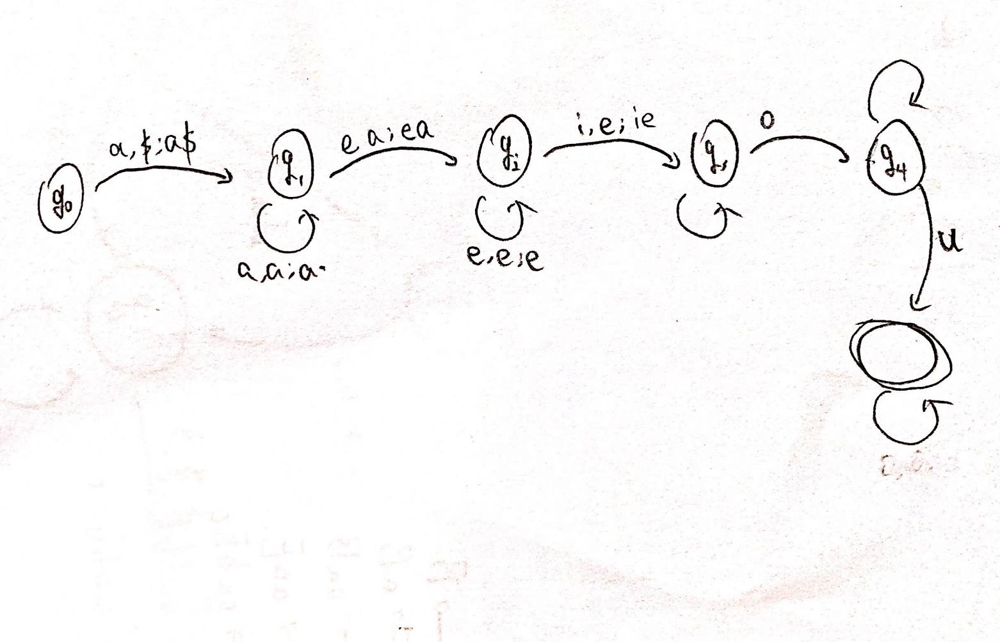
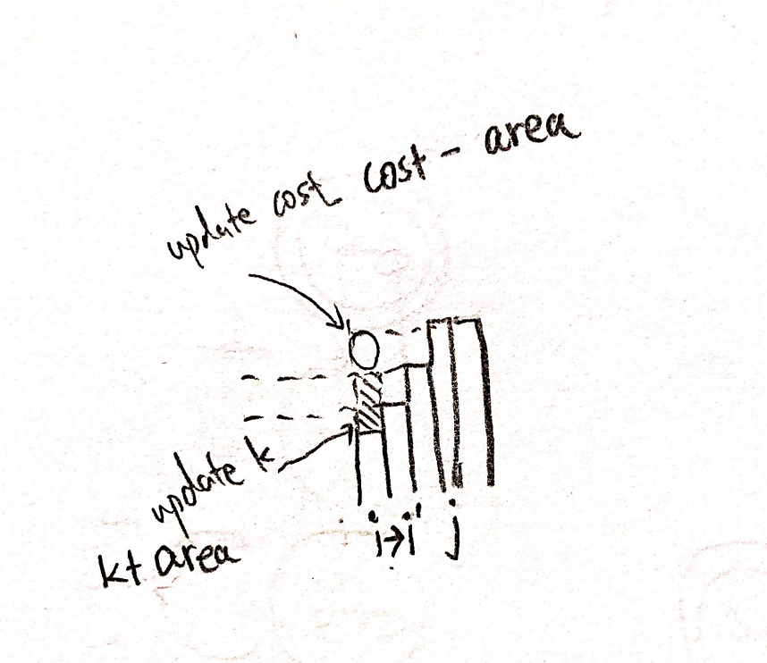
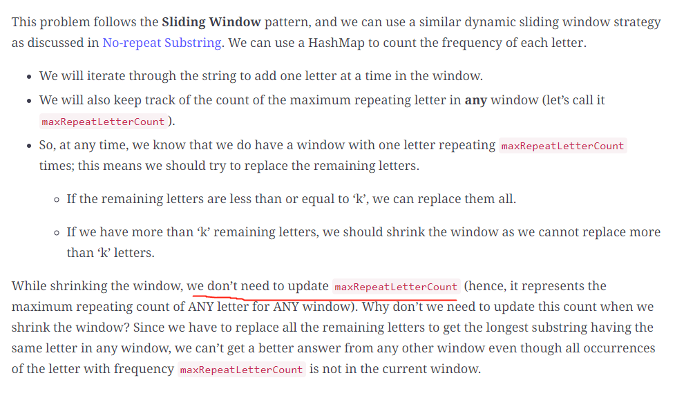

### 395. Longest Substring with At Least K Repeating Characters \* \*

- following is a brute force sliding window solution O(n^2)

```java
/*
let res := Longest Substring with At Least K Repeating Characters ending at s[j]
suppose we are to find the res ending at j
    - we need to find smallest i to maximize the window[i, j], s.t. frequency(s[i]) >= k for all chars in range [i, j]
    - as we iterate through, keep track of the frequency for all letters
    - then at each j, we linear iterate to find such smallest i satisfy the condition
    
time: O(n^2)
space: O(n)
*/
class Solution {
    public int longestSubstring(String s, int k) {
        int n = s.length();
        int[][] f = new int[26][1];
        
        int max = 0;
        for (int j = 0; j < n; j++) {
            char c = s.charAt(j);
            
            //update frequency
            f[c - 'a'][0]++;
        
            //make a copy of frequency
            int[][] fcp = new int[26][1];
            for (int i = 0; i < f.length; i++) {
                fcp[i][0] = f[i][0];
            }
                 
            //for each i, check if its a valid window, cost O(26) for each i
            int i = 0;
            while (i <= j - k + 1) {
                if (check(fcp, k)) {
                    max = Math.max(max, j - i + 1);
                    break;
                }
                fcp[s.charAt(i++) - 'a'][0]--;
            }
        }
        
        return max; 
    }
    
    public boolean check(int[][] f, int k) {
        for (int[] i : f) {
            if (i[0] != 0 && i[0] < k) {
                return false;
            }
        }
        return true;
    }
}
```

- notice that input is only lowercase letters. we can, utilize this fact to do up to 26 sliding window runs, since there can be at most 26 unique characters. each time we allow i unique characters in the window, with i in `[1, 26]`, there can be at most 26 iterations thus runtime is O(26 * n)

```java
public class Solution {
    public int longestSubstring(String s, int k) {
        char[] str = s.toCharArray();
        int[] countMap = new int[26];
        int maxUnique = getMaxUniqueLetters(s);
        int result = 0;
        for (int currUnique = 1; currUnique <= maxUnique; currUnique++) {
            // reset countMap
            Arrays.fill(countMap, 0);
            int windowStart = 0, windowEnd = 0, idx = 0, unique = 0, countAtLeastK = 0;
            while (windowEnd < str.length) {
                // expand the sliding window
                if (unique <= currUnique) {
                    idx = str[windowEnd] - 'a';
                    if (countMap[idx] == 0) unique++;
                    countMap[idx]++;
                    if (countMap[idx] == k) countAtLeastK++;
                    windowEnd++;
                }
                // shrink the sliding window
                else {
                    idx = str[windowStart] - 'a';
                    if (countMap[idx] == k) countAtLeastK--;
                    countMap[idx]--;
                    if (countMap[idx] == 0) unique--;
                    windowStart++;
                }
                if (unique == currUnique && unique == countAtLeastK)
                    result = Math.max(windowEnd - windowStart, result);
            }
        }

        return result;
    }

    // get the maximum number of unique letters in the string s
    int getMaxUniqueLetters(String s) {
        boolean map[] = new boolean[26];
        int maxUnique = 0;
        for (int i = 0; i < s.length(); i++) {
            if (!map[s.charAt(i) - 'a']) {
                maxUnique++;
                map[s.charAt(i) - 'a'] = true;
            }
        }
        return maxUnique;
    }
}

```


### 713. Subarray Product Less Than K \*\*\*\*

#### approach 1 (sliding window)
```java
/*
alg: sliding window bounded by [i, j)

for j in 1 : len
    if nums[j] >= k: discard prev windows, set i to j + 1
    else if prev * nums[j] >= k and nums[j] < k:
        need to remove i, but first we count contiguous subarray from [i, j - 1]
        count += (j - i)
        i++
    while prev * nums[j] < k:
        j++
    
    //here prev * nums[j] >= k, need to move i
    
    windowSize := j - i
    count += windowSize * (windowSize + 1) / 2      //follows geometric series

post processing for last window: count += indowSize * (windowSize + 1) / 2


time: O(n)
space: O(1)
*/
class Solution {
    public int numSubarrayProductLessThanK(int[] nums, int k) {
        long prev = 1;
        long count = 0;
        int i = 0;
        int j = 0;
        while (j < nums.length) {
            if (nums[j] >= k) {
                long len = j - i;
                count = count + (len * (len + 1) / 2);
                i = j + 1;
                prev = 1;   //reset
                j++;
            } else if (prev * nums[j] >= k) {
                prev /= nums[i];   //remove i from prefix sum
                count += (j - i);
                //remove window left
                i++;
            } else {
                prev *= nums[j];
                j++;
            }
        }
        
        //post processing
        if (i < nums.length) {
            long len = j - i;
            count = count + (len * (len + 1) / 2);
        }
        return (int) count;
    }
}
```

#### approach 2: more neat sliding window
```java
class Solution {
    public int numSubarrayProductLessThanK(int[] nums, int k) {
        if (k <= 1) return 0;
        int prod = 1, ans = 0, left = 0;
        for (int right = 0; right < nums.length; right++) {
            prod *= nums[right];
            while (prod >= k) prod /= nums[left++];
            ans += right - left + 1;
        }
        return ans;
    }
}
```


### 849. Maximize Distance to Closest Person
```java
/*
sliding window
1. maintain a window so between [l ... r] is two seated people
2. whenever such window exist, we compute the distance = ((r - l + 1 - 2) / 2 + 1)
*/
class Solution {
    public int maxDistToClosest(int[] seats) {
        int n = seats.length;
        int l = 0;
        int max = 0;
        
        //handling begining left seats are empty
        while (l < seats.length && seats[l] != 1) {
            l++;
        }
        max = Math.max(max, l);
        
        //slide
        for (int r = l + 1; r < n; r++) {
            if (seats[r] == 1) {
                int mid = l + (r - l) / 2;
                int dist = Math.min(mid - l, r - mid);
                max = Math.max(max, dist);
                l = r;
            }
        }
        
        max = Math.max(max, n - l - 1);
        return max;
    }
}
```


### 1004.  Max Consecutive Ones III

```java
/*
alg: maintain a sliding window of allowing at most k zeros
time: O(n)
space: O(1)
*/
class Solution {
    public int longestOnes(int[] arr, int k) {
        int i = 0;
        int max = 0;
        for (int j = 0; j < arr.length; j++) {
            if (arr[j] == 0) {
                while (k == 0) {
                    if (arr[i] == 0) {
                        k++;
                    }
                    i++; //move window left
                }
                k--;
            } 
            
            max = Math.max(max, j - i + 1);
        }
        return max;
    }
}
```


### L. Maximum Values of Size K Sliding Windows \* \*

Given an integer array A and a sliding window of size K, find the maximum value of each window as it slides from left to right.

Assumptions:

- The given array is not null and is not empty
- K >= 1, K <= A.length

Examples:

- A = {1, 2, 3, 2, 4, 2, 1}, K = 3, the windows are {{1,2,3}, {2,3,2}, {3,2,4}, {2,4,2}, {4,2,1}},and the maximum values of each K-sized sliding window are [3, 3, 4, 4, 4]

```java
/*
naive solution: linear scan the array with a max heap of size k 
                  for each new element,
                    new element: add new element into the max heap
                    old element: need to remove the oldest
                  in order to remove the oldest, since cannot operate to delete in a heap, we can store Pair<Value, Index>
                  and we do a lazy deletion: whenever the heap top element's index is before the window, we pop it until
                  the heap top is an element inside the window
              Complexity: Time: O(nlogn), n operations for maximum size of n heap
                          Space: O(n), for maximum size of the heap

improved solution: to improve the above algorithm, we need to aovid lazy deletion as it causes the size of heap of n
            [1, 4, 5, 6, 3, 7 ....]
            [1, 4, 5] ->
                1, 4, 5 [6] -> after 6 is pushed in, all maximum possible in the future is at least 6,
                                so we can remove 1, 4, 5.
                       [6, 3] -> 
                        6, 3 [7] -> similarly, remove 6 and 3 when 7 goes in 
    Summery: maintain a decreasing deque since operate on both sides of the window
        for each i:
          if i > dequeRight:
            delete elements to maintain decreasing sequence
          if i <= dequeRight:
            delete dequeLeft and append i to dequeRight
        after handling new element, we need to check if dequeLeft is an old element or, outisde of the window  
        each step the biggest element in the window is the dequeLeft after processing deque

algorithm: linear scan with a decreasing deque, deque only stores the idx of each element, and is in decreasing such
that deque[i] > deque[i - 1]
    initialize: deque of INDEX(since neeed to look back for the previous index to see if dequeRight is outdated),
                List<Integer> to store max at each window when i >= k - 1
    Time: O(n) for each element enters and exit the deque exactly once
    Space: O(k) for we maintain the at most size k window 
*/
public class Solution {
  public List<Integer> maxWindows(int[] arr, int k) {
    List<Integer> res = new ArrayList<>();
    Deque<Integer> deque = new ArrayDeque<>();
    for (int i = 0; i < arr.length; i++) {
      //i = index, cur = arr[i]
      int cur = arr[i];
      //delete smaller element
      while (!deque.isEmpty() && cur > arr[deque.peekLast()]) {
        deque.pollLast();
      }//post deque.isEmpty() || cur <= arr[deque.peekLast()]
      //delete outdated element
      while (!deque.isEmpty() && deque.peekFirst() <= i - k) {//last possible index is i - k
        deque.pollFirst();
      }
      deque.offerLast(i);
      if (i >= k - 1) {
        res.add(arr[deque.peekFirst()]);
      }
    }
    return res;
  }
}

```

### L. K Almost Sorted Array \*\*

Given an unsorted integer array, each element is **at most k step from its position** after the array is sorted. Can you sort this array with time complexity better than O(nlogn)?

Assumptions:

- The given array is not null and length is n, k < n and k >= 0

```java
/*
linear scan with a sliding window using min heap of size k, at most n operations on size k heaps
time: O(nlogk)
space: O(k)
*/
public class Solution {
 public int[] ksort(int[] arr, int k) {
   PriorityQueue<Integer> pq = new PriorityQueue<>();//use natural order
   int top = 0;
   for (int i : arr) {
     pq.offer(i);
     if (pq.size() == k + 1) {
       arr[top++] = pq.poll();
     }
   }
   //post processing: add remaining elements into the heap
   while (!pq.isEmpty()) {
     arr[top++] = pq.poll();
   }
   return arr;
 }
}
```

### 1151. Minimum Swaps to Group All 1's Together **

Given a binary array `data`, return the minimum number of swaps required to group all `1`’s present in the array together in **any place** in the array.


**Example 1:**

```
Input: data = [1,0,1,0,1]
Output: 1
Explanation: 
There are 3 ways to group all 1's together:
[1,1,1,0,0] using 1 swap.
[0,1,1,1,0] using 2 swaps.
[0,0,1,1,1] using 1 swap.
The minimum is 1.
```

```java
/*
alg:
brute force:
- for each i, suppose we want i as the left bound as the grouping, search a j > i, such that [i, j] is the window that contains all swapped 1's
    - specifically, # of 1's + # of 0's in [i, j] = total # of ones in the array
- this cost O(n^2) since for each i we need to traverse to the end of the array

alg2: sliding window
- to optimize alg1, we can first count # of 1's in the array = n, and slide a window of size n
- at all time, track # of 0's and 1's currently in the window
    - then, for each i as the left bound of the window, # of swaps = total # of 1's in the array - # of 1's in the [i, j] window

time: O(n)
space: O(1)
*/
class Solution {
    public int minSwaps(int[] data) {
        int nOnes = 0;
        for (int i : data) {
            nOnes += i;
        }
        
        int i = 0;  //window left
        int min = Integer.MAX_VALUE;
        int ones = 0;
        for (int j = 0; j < data.length; j++) {
            ones += data[j];
            if (j >= nOnes - 1) { //window [i, j] is now at least length = nOnes
                min = Math.min(min, nOnes - ones); //update min
                //move window left
                ones -= data[i++];
            }
        }
        return min;
    }
}
```


### 1208. Get Equal Substrings Within Budget *

```java
/*
sliding window:
for each index i, we try to find the maximum j wuch that the window [i ... j] can contain as many chars as possible without violating the maxCost
time: O(n)
space: O(1)
*/
class Solution {
    public int equalSubstring(String s, String t, int maxCost) {
        int i = 0;
        int curCost = 0;
        int maxLen = 0;
        for (int j = 0; j < s.length(); j++) {
            int c = Math.abs((s.charAt(j) - 'a') - (t.charAt(j) - 'a'));
            curCost += c;
            while (curCost > maxCost) {
                c = Math.abs((s.charAt(i) - 'a') - (t.charAt(i) - 'a')); // shrink window left
                curCost -= c;
                i++;
            }
            
            //update max len
            maxLen = Math.max(maxLen, j - i + 1);
        }
        return maxLen;
    }
}
```


### 1234. Replace the Substring for Balanced String **

- utilize the solution from leetcode "76. Minimum Window Substring". Essentially we can translate this problem into lc76.

```java
/*
translation: the minimum substring used to replace is the min substring that contains all the redundent letters
- conver count of Q = a, W = b, E = c, R = d. Let avg = n/4
- for each (Q, W, E, R), compute abcd and for any character with "count > avg:
- add char into a map(character, count)

goal: find the minimum substring contains all characters in the map with count matched
time: O(n)
space: O(1)
*/
class Solution {
    char[] target = {'Q', 'W', 'E', 'R'};
    public int balancedString(String s) {
        int n = s.length();
        int avg = n / 4;
        int[] counts = new int[26];
        for (char c : s.toCharArray()) {
            counts[c - 'A']++;
        }
        
        //utilizing minWindow Solution
        StringBuilder sb = new StringBuilder();
        for (char c : target) {
            int count = counts[c - 'A'];
            if (count - avg > 0) {
                int nmatch = count - avg;
                while (nmatch > 0) {
                    sb.append(c);
                    nmatch--;
                }
            }
        }
        
        return sb.length() > 0 ? minWindow(s, sb.toString()).length() : 0;
        
    }
    
    //leetcode 76
    public String minWindow(String s, String t) {
        Map<Character, Integer> map = new HashMap<>();
        
        for (char c : t.toCharArray()) {
            map.put(c, map.getOrDefault(c, 0) + 1);
        } 
        int matchCount = map.size();
        
        int ires = 0;
        int jres = 0;
        int min = Integer.MAX_VALUE;
        
        int i = 0;
        for (int j = 0; j < s.length(); j++) {
            //consuming a new char
            char c = s.charAt(j);
            
            Integer count = map.get(c);
            if (count != null) {
                if (count == 1) {
                    matchCount--;
                }
                map.put(c, count - 1); //update count of match
            }
            //move window left since we found the minimum window contains all t that starts at i
            while (matchCount == 0) {
                //update minimum before we shrink the window
                if (j - i + 1 < min) {
                    min = j - i + 1;
                    ires = i;
                    jres = j;
                }
                c = s.charAt(i++);
                count = map.get(c);
                if (count != null) {
                    if (count == 0) {
                        matchCount += 1;
                    }
                    map.put(c, count + 1); //update count of match
                }
            }
        }
        return min == Integer.MAX_VALUE ? "" : s.substring(ires, jres + 1); 
    }
}
```


### 1839. Longest Substring Of All Vowels in Order \*\*



```java
/*
alg: push down autamota, for each index i run the pda to find the biggest right end j, so [i, j] is the maximum window of beautiful str.
if we've found a max window for i, [i, j], we can then update i to j + 1 since this char in this window is guaranteed not be in other maximum window.

*/
class Solution {
    char[] order = {'a', 'e', 'i', 'o', 'u'};
    public int longestBeautifulSubstring(String word) {
        //append ordering to the map, so 'a' -> 0, 'e' -> 1, 'i' -> 2 ...
        int[] map = new int[26];
        for (int i = 0; i < order.length; i++) {
            map[order[i] - 'a'] = i;
        }
        
        int i = 0;
        int max = 0;
        while (i < word.length()) {
            if (word.charAt(i) == 'a') {
                //run pda
                Deque<Character> st = new ArrayDeque<>();
                int j = i;
                //try to maximize j
                while (j < word.length()) {
                    char c = word.charAt(j);
                    if (st.isEmpty() || map[c - 'a'] > map[st.peekFirst() - 'a']) {
                        st.offerFirst(c);
                    } else if (map[c - 'a'] < map[st.peekFirst() - 'a']){
                        //invalid char, we can collect the length and go next, window [i, j) is valid
                        i = j;
                        break;
                    }
                    
                    if (st.size() == order.length) { //update only when all characters are present in the stack
                        max = Math.max(max, j - i + 1);
                    }
                    
                    j++;
                }
                //if j goes all the way, we are done
                if (j == word.length()) {
                    break;
                }
                
            } else {
                i++;
            }
            
        }
        return max;
    }
}
```


### 1838. Frequency of the Most Frequent Element \*\*



```java
/*
brute force: O(n^2) iterate each num and try to make it as the maximum frequent element
observation:
- the most frequent element is in the array
- suppose that element is x, elements that we perform operation to make them x, must be adjacent to x if we sort the array

alg: sort + sliding window
- if we sort the array, we can maintain a window of the most frequent elements, where since arr[windowRight] is maximum in the window, it must be the most frequent element
- we maintain a window such that for each windowLeft, it is the maximum window that contains windowLeft

window rule: define [i, j] be the window
    for j < n:
        to add arr[j], 
            if arr[j] == arr[j - 1]:
                we keep goin since we dont need to consume any operation to make the most frequent element
            else we know arr[j] > arr[j - 1], and we need to consume cost = (j - i) * (arr[j] - arr[j - 1])        (1)
                if (k < cost):
                    we need to move windowLeft, each time we move window left, we are adding an rectangle area to k
                    area = 1 * (arr[j - 1] - arr[i])
                    we also need to update the cost since now i is updated, cost = cost - 1 * (arr[j] - arr[j - 1])
                else:
                    add j to the window, j++
        update a global maximum length = max frequence
            
(1): draw sorted array as histogram, then we can see each time to add a bigger element into the window, we need to consume a rectangle area of k, where the area = width * height = (j - i) * (arr[j] = arr[j - 1])
        
time: O(nlogn + n)
space: O(n) for sorting

*/
class Solution {
    public int maxFrequency(int[] arr, int k) {
        Arrays.sort(arr);
        int i = 0;
        int max = 1;
        for (int j = 1; j < arr.length; j++) {
            if (arr[j] != arr[j - 1]) {
                int cost = (j - i) * (arr[j] - arr[j - 1]);
                while (k < cost) {
                    //move windowLeft
                    k += (arr[j - 1] - arr[i]);
                    cost -= (arr[j] - arr[j - 1]);
                    i++;
                }
                //consume k to add j
                k -= cost;
            }
            max = Math.max(max, j - i + 1);
        }
        return max;
    }
}
```


### 1423. Maximum Points You Can Obtain from Cards \*\*

```java
/*
dp knapsack: dp[i][j][k] = max points in range of cards[i ... j] with k cards left
dp[i][j][k] = Math.max(dp[i + 1][j][k - 1] + arr[i], dp[i][j - 1][k - 1] + arr[j])
time: O(n^2 * k)

alg2: sliding window
the problem is exactly same as finding a subarray of length (n - k) such that the subarray sum is minimized
we can maintain a window of length (n - k) to minimize such sum
time: O(n)
space: O(1)
*/
class Solution {
    public int maxScore(int[] cardPoints, int k) {
        int i = 0;
        int j = 0;
        int n = cardPoints.length;
        int curSum = 0;
        int totalSum = 0;
        int min = Integer.MAX_VALUE;
        
        while (j < cardPoints.length) {
            totalSum += cardPoints[j];
            curSum += cardPoints[j];
            if (j - i + 1 > n - k) {
                curSum -= cardPoints[i++];
            }
            
            if (j - i + 1 == n - k) {
                min = Math.min(curSum, min);
            }
            j++;
        
        return min == Integer.MAX_VALUE ? 0 : totalSum - min;
    }
}
```

### 1004. Max Consecutive Ones III \*\*

### E. Longest Substring with Same Letters after Replacement (hard) \*\*\*\*

Given a string with lowercase letters only, if you are allowed to **replace no more than ‘k’ letters** with any letter, find the **length of the longest substring having the same letters** after replacement.

**Example 1:**

```
Input: String="aabccbb", k=2
Output: 5
Explanation: Replace the two 'c' with 'b' to have a longest repeating substring "bbbbb".
```

**Example 2:**

```
Input: String="abbcb", k=1
Output: 4
Explanation: Replace the 'c' with 'b' to have a longest repeating substring "bbbb".
```

**Example 3:**

```
Input: String="abccde", k=1
Output: 3
Explanation: Replace the 'b' or 'd' with 'c' to have the longest repeating substring "ccc".
```

#### My soluton: O(26n) muti pass sliding window

```java
/*
since we can have 26 letters, for each char c in [a ... z], assume c is the resulant longest substring character, we do a sliding window for c. for 26 iterations we will be able to find the solution
time: O(26*n)
space: O(1)
*/
class CharacterReplacement {
  public static int findLength(String str, int k) {
    int max = 0;
    for (int iter = 0; iter < 26; iter++) {
      char m = (char) (iter + 'a');
      
      int i = 0;
      int j = 0;
      int remain = k;
      while (j < str.length()) {
        char c = str.charAt(j);
        if (c != m) {
          while (remain <= 0) {
            //move window left, update remains
            remain = str.charAt(i) == m ? remain: remain + 1;
            i++;
          }
          remain--;
        }

        max = Math.max(max, j - i + 1);
        j++;
      }
    }
    return max;
  }
}
```

#### one pass solution



```java
import java.util.*;

class CharacterReplacement {
  public static int findLength(String str, int k) {
    int windowStart = 0, maxLength = 0, maxRepeatLetterCount = 0;
    Map<Character, Integer> letterFrequencyMap = new HashMap<>();
    // try to extend the range [windowStart, windowEnd]
    for (int windowEnd = 0; windowEnd < str.length(); windowEnd++) {
      char rightChar = str.charAt(windowEnd);
      letterFrequencyMap.put(rightChar, letterFrequencyMap.getOrDefault(rightChar, 0) + 1);
      maxRepeatLetterCount = Math.max(maxRepeatLetterCount, letterFrequencyMap.get(rightChar));

      // current window size is from windowStart to windowEnd, overall we have a letter which is
      // repeating 'maxRepeatLetterCount' times, this means we can have a window which has one letter 
      // repeating 'maxRepeatLetterCount' times and the remaining letters we should replace.
      // if the remaining letters are more than 'k', it is the time to shrink the window as we
      // are not allowed to replace more than 'k' letters
      if (windowEnd - windowStart + 1 - maxRepeatLetterCount > k) {
        char leftChar = str.charAt(windowStart);
        letterFrequencyMap.put(leftChar, letterFrequencyMap.get(leftChar) - 1);
        windowStart++;
      }

      maxLength = Math.max(maxLength, windowEnd - windowStart + 1);
    }

    return maxLength;
  }

  public static void main(String[] args) {
    System.out.println(CharacterReplacement.findLength("aabccbb", 2));
    System.out.println(CharacterReplacement.findLength("abbcb", 1));
    System.out.println(CharacterReplacement.findLength("abccde", 1));
  }
}

```

### 438. Find All Anagrams in a String \*\*

Given two strings `s` and `p`, return *an array of all the start indices of* `p`*'s anagrams in* `s`. You may return the answer in **any order**.

 

**Example 1:**

```
Input: s = "cbaebabacd", p = "abc"
Output: [0,6]
Explanation:
The substring with start index = 0 is "cba", which is an anagram of "abc".
The substring with start index = 6 is "bac", which is an anagram of "abc".
```

```java
/*
algorithm: sliding window of hashmap <letterInS, remainingCount>
    we maintain a sliding window of size = p, and for each window we check if we can match all current char in s to match the counts in p, since order does not matter, we use a hashmap to track the remaining cout of each letter in p
    for windowEnd < len:
        //add the s[windowEnd] and update count
        check if s[windowEnd] is in p, if so, we found one match, and decrease the count by one, if the count reaches zero, means we have this particular character totally matched,
        so matchCount += 1
        //delete the s[windowStart] and update count
        check if s[windowStart] is in p, if so, we are deleting a matched letter, if the count was zero, means we need to match this letter in the future,
        so matchCount -= 1
        //check if we have totally matched, if so add to windowStart to the result
        check if matchCount == hashmap.size()

time: O(n)
space: O(distinct letter in p) = O(26)
*/
class Solution {
    public List<Integer> findAnagrams(String s, String p) {
        List<Integer> res = new ArrayList<>();
        if (s.length() == 0 || p.length() == 0) {
            return res;
        }
        
        Map<Character, Integer> map = new HashMap<>();
        generateCountMap(map, p);
        
        int matchCount = 0;
        int windowStart = 0;
        for (int windowEnd = 0; windowEnd < s.length(); windowEnd++) {
            //add s[windowEnd]
            char right = s.charAt(windowEnd);
            Integer count = map.get(right);
            if (count != null) { //if in p
                if (count == 1) {
                    matchCount += 1;
                }
                map.put(right, count - 1);
            }
            
            //delete s[windowStart] only if we window is big enough
            if (windowEnd - windowStart == p.length()) {
                char left = s.charAt(windowStart++);
                count = map.get(left);
                if (count != null) {
                    if (count == 0) {
                        matchCount -= 1;
                    }
                    map.put(left, count + 1);
                }
            }
            
            if (matchCount == map.size()) {
                res.add(windowEnd - p.length() + 1);
            }
        }
        return res;
    }
    public void generateCountMap(Map<Character, Integer> map, String s) {
        for (int i = 0; i < s.length(); i++) {
            map.put(s.charAt(i), map.getOrDefault(s.charAt(i), 0) + 1);
        }
    }
}
```

### E. Words Concatenation (hard) \*\*

Given a string and a list of words, find all the starting indices of substrings in the given string that are a **concatenation of all the given words** exactly once **without any overlapping** of words. It is given that all words are of the same length.

**Example 1:**

```
Input: String="catfoxcat", Words=["cat", "fox"]
Output: [0, 3]
Explanation: The two substring containing both the words are "catfox" & "foxcat".
```

**Example 2:**

```
Input: String="catcatfoxfox", Words=["cat", "fox"]
Output: [3]
Explanation: The only substring containing both the words is "catfox".
```

1. Keep the frequency of every word in a **HashMap**.
2. Starting from every index in the string, try to match all the words.
3. In each iteration, keep track of all the words that we have already seen in another **HashMap**.
4. If a word is not found or has a higher frequency than required, we can move on to the next character in the string.
5. Store the index if we have found all the words.

```java
import java.util.*;
/*
time: The time complexity of the above algorithm will be O(N∗M∗Len) where ‘N’ is the number of characters in the given string, ‘M’ is the total number of words, and ‘Len’ is the length of a word.
space:
The space complexity of the algorithm is O(M) since at most, we will be storing all the words in the two HashMaps. In the worst case, we also need O(N) space for the resulting list. So, the overall space complexity of the algorithm will be O(M+N).
*/
class WordConcatenation {
  public static List<Integer> findWordConcatenation(String str, String[] words) {
    Map<String, Integer> wordFrequencyMap = new HashMap<>();
    for (String word : words)
      wordFrequencyMap.put(word, wordFrequencyMap.getOrDefault(word, 0) + 1);

    List<Integer> resultIndices = new ArrayList<Integer>();
    int wordsCount = words.length, wordLength = words[0].length();

    for (int i = 0; i <= str.length() - wordsCount * wordLength; i++) {
      Map<String, Integer> wordsSeen = new HashMap<>();
      for (int j = 0; j < wordsCount; j++) {
        int nextWordIndex = i + j * wordLength;
        // get the next word from the string
        String word = str.substring(nextWordIndex, nextWordIndex + wordLength);
        if (!wordFrequencyMap.containsKey(word)) // break if we don't need this word
          break;

        wordsSeen.put(word, wordsSeen.getOrDefault(word, 0) + 1); // add the word to the 'wordsSeen' map

        // no need to process further if the word has higher frequency than required 
        if (wordsSeen.get(word) > wordFrequencyMap.getOrDefault(word, 0))
          break;

        if (j + 1 == wordsCount) // store index if we have found all the words
          resultIndices.add(i);
      }
    }

    return resultIndices;
  }

  public static void main(String[] args) {
    List<Integer> result = WordConcatenation.findWordConcatenation("catfoxcat", new String[] { "cat", "fox" });
    System.out.println(result);
    result = WordConcatenation.findWordConcatenation("catcatfoxfox", new String[] { "cat", "fox" });
    System.out.println(result);
  }
}

```

### E. Maximum CPU Load

We are given a list of Jobs. Each job has a Start time, an End time, and a CPU load when it is running. Our goal is to find the **maximum CPU load** at any time if all the **jobs are running on the same machine**.

**Example 1:**

```
Jobs: [[1,4,3], [2,5,4], [7,9,6]]
Output: 7
Explanation: Since [1,4,3] and [2,5,4] overlap, their maximum CPU load (3+4=7) will be when both the 
jobs are running at the same time i.e., during the time interval (2,4).
```

**Example 2:**

```
Jobs: [[6,7,10], [2,4,11], [8,12,15]]
Output: 15
Explanation: None of the jobs overlap, therefore we will take the maximum load of any job which is 15.
```

**Example 3:**

```
Jobs: [[1,4,2], [2,4,1], [3,6,5]]
Output: 8
Explanation: Maximum CPU load will be 8 as all jobs overlap during the time interval [3,4]. 
```


```java
import java.util.*;

class Job {
  int start;
  int end;
  int cpuLoad;

  public Job(int start, int end, int cpuLoad) {
    this.start = start;
    this.end = end;
    this.cpuLoad = cpuLoad;
  }
};
/*
presort the array by end time, then slide a window of overlapping jobs, track maximum overlapped unit
time: O(nlon)
space: O(n) for sorting
*/
class MaximumCPULoad {

  public static int findMaxCPULoad(List<Job> jobs) {
    Collections.sort(jobs, (j1, j2) -> {
      return j1.end == j2.end ? j1.start - j2.start : j1.end - j2.end;
    });
    int i = 0;
    int minEnd = jobs.get(0).end;
    int max = jobs.get(0).cpuLoad;
    int curLoad = jobs.get(0).cpuLoad;

    for (int j = 1; j < jobs.size(); j++) {
      Job job = jobs.get(j);
      while (job.start > minEnd) {
        curLoad -= jobs.get(i++).cpuLoad;
        minEnd = jobs.get(i).end;
      }
      curLoad += job.cpuLoad;
      max = Math.max(curLoad, max);
    }
    return max;
  }

  public static void main(String[] args) {
    List<Job> input = new ArrayList<Job>(Arrays.asList(new Job(1, 4, 3), new Job(2, 5, 4), new Job(7, 9, 6)));
    System.out.println("Maximum CPU load at any time: " + MaximumCPULoad.findMaxCPULoad(input));

    input = new ArrayList<Job>(Arrays.asList(new Job(6, 7, 10), new Job(2, 4, 11), new Job(8, 12, 15)));
    System.out.println("Maximum CPU load at any time: " + MaximumCPULoad.findMaxCPULoad(input));

    input = new ArrayList<Job>(Arrays.asList(new Job(1, 4, 2), new Job(2, 4, 1), new Job(3, 6, 5)));
    System.out.println("Maximum CPU load at any time: " + MaximumCPULoad.findMaxCPULoad(input));
  }
}
```


# Easy Level

### L253. Longest Substring Without Repeating Characters

Given a string, find the longest substring without any repeating characters and return the length of it. The input string is guaranteed to be not null.

For example, the longest substring without repeating letters for "bcdfbd" is "bcdf", we should return 4 in this case.

```java
/*
linear scan with a hashset
*/
public class Solution {
  public int longest(String input) {
    Set<Character> set = new HashSet<>();
    int i = 0;
    int max = 0;
    for (int j = 0; j < input.length(); j++) {
      char c = input.charAt(j);
      while (set.contains(c)) {
        set.remove(input.charAt(i));
        i++;
      }
      set.add(c);
      max = Math.max(max, j - i + 1);
    }
    return max;
  }
```

### E. Smallest Subarray with given array

Given an array of positive numbers and a positive number ‘S’, find the length of the **smallest subarray whose sum is greater than or equal to ‘S’**. Return 0, if no such subarray exists.

Example 1:

```bash
Input: [2, 1, 5, 2, 3, 2], S=7
Output: 2
Explanation: The smallest subarray with a sum great than or equal to '7' is [5, 2].
```

```java
/*
algorithm: sliding window
since arr is positive integer array, each element would only give increasing contribution.
we can manage to find all smallest subarray ending at each index i
 
let i and j be the dimension of the window, window = [i ... j]
for each j < len:
 add j into the window
 1. if the windowSum >= S, then we found a candidate,
       increment i to loop through possible smaller window ending at j
    increment j
 2. if the windowSum < S, increment j
time: each index enters and exits the window at most once, O(n), space O(1)
 
test:
 t1: [1], S = 0
*/
class MinSizeSubArraySum {
 //assumption: S is > 0
 public static int findMinSubArray(int S, int[] arr) {
   if (arr == null || arr.length == 0) {
     return -1;
   }
   int i = 0;
   int j = 0;
   int curSum = 0;
   int globalMin = Integer.MAX_VALUE;
   while (j < arr.length) {
     curSum += arr[j];
     while (curSum >= S) {
       globalMin = Math.min(globalMin, j - i + 1);
       curSum -= arr[i++];
     } //postcondition: curSum < S
     j++;
   }
   return globalMin == Integer.MAX_VALUE ? 0 : globalMin;
 }

```


### 243. Shortest Word Distance

Given an array of strings `wordsDict` and two different strings that already exist in the array `word1` and `word2`, return *the shortest distance between these two words in the list*.

**Example 1:**

```
Input: wordsDict = ["practice", "makes", "perfect", "coding", "makes"], word1 = "coding", word2 = "practice"
Output: 3
```

**Example 2:**

```
Input: wordsDict = ["practice", "makes", "perfect", "coding", "makes"], word1 = "makes", word2 = "coding"
Output: 1
```

```java
class Solution {
    public int shortestDistance(String[] words, String word1, String word2) {
        int i1 = -1, i2 = -1;
        int minDistance = words.length;
        for (int i = 0; i < words.length; i++) {
            if (words[i].equals(word1)) {
                i1 = i;
            } else if (words[i].equals(word2)) {
                i2 = i;
            }

            if (i1 != -1 && i2 != -1) {
                minDistance = Math.min(minDistance, Math.abs(i1 - i2));
            }
        }
        return minDistance;
    }
}
```

