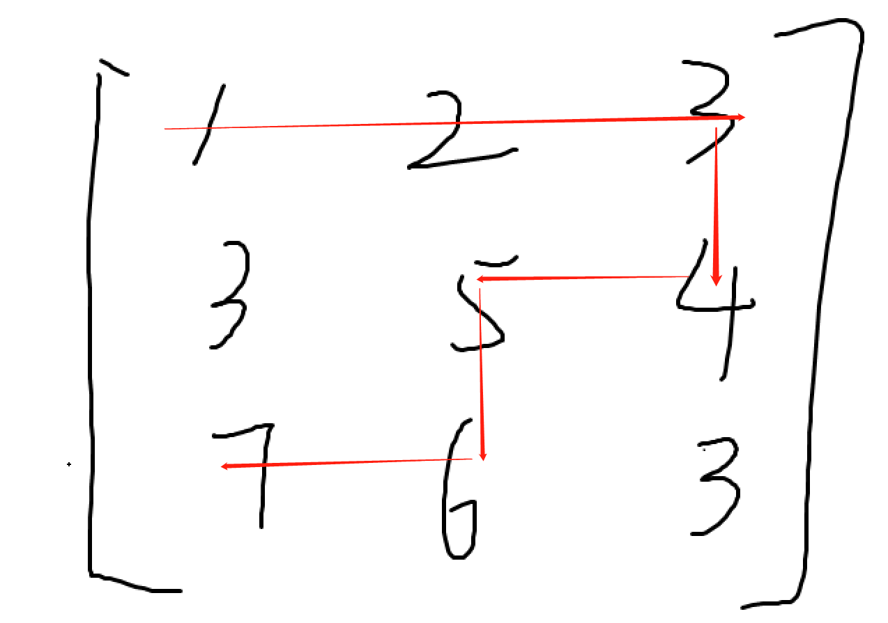
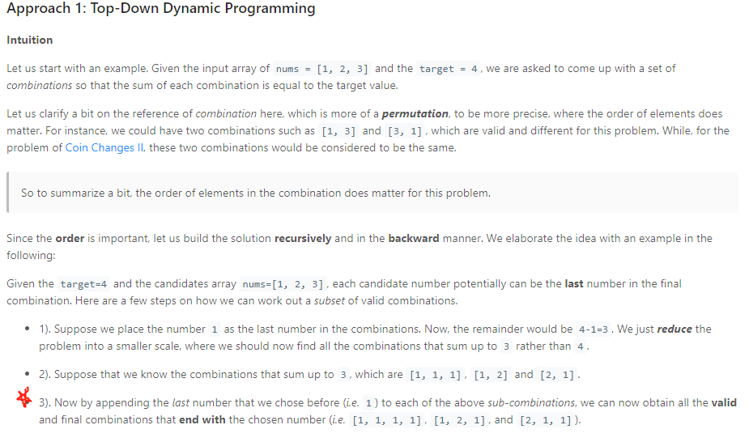

### 329. Longest Increasing Path in a Matrix ***

Proposals:

- brute force dfs

- dp dp, since LAS in a matrix is equivalent to longest descending sequence
  - let `dp1[i][j]` = longest ascending path ending at (i, j), **allowing moving right to down ONLY**

  - similarly, `dp2[i][j]` = longest descending ....

  - use a global max to track either the longest ascending or descending path so far
      time: O(n^2), space: O(n^2 optimized to n)

  - **BUT** this won't work, **there are paths that cannot be described by only moving right and down**

      

- dfs with memorization using 4 directions

  - **distinguish this approach with find maximum profits in a matrix with `matrix[i][j] = profit of a single cell`, in the max profit problem**, we cannot do 4 direction dfs with memorization for the reason that  the max profit at `(i,j)` might be included in one of its neighbor already, causing duplicate profit being considered
  - for each i,j entry, the LIP starting from ij can be recursively defined being `dp[i][j] = max(dp[x][y]) + 1, for xy in 4 adjacent neighbors of ij`. 
    - This is valid because if `matrix[i1][j1] < matrix[i2][j2], with (i1, j1) being neighbor of (i2, j2), it must be the case that (i1, j1) is not on the LIP path starting from (i2, j2)`
    - time: O(mn), space: O(mn)

  ```java
  class Solution {
      int[][] dirs = {{0, 1}, {1, 0}, {-1, 0}, {0, -1}};
      public int longestIncreasingPath(int[][] matrix) {
          int m = matrix.length;
          int n = matrix[0].length;
          int[][] dp = new int[m][n];
          int max = 0;
          for (int i = 0; i < m; i++) {
              for (int j = 0; j < n; j++) {
                  if (dp[i][j] == 0) {
                      max = Math.max(max, dfs(matrix, i, j, dp));
                  }
              }
          }
          return max;
      }
      public int dfs(int[][] m, int i, int j, int[][] dp) {
          if (dp[i][j] != 0) {
              return dp[i][j];
          }
          
          dp[i][j] = 1;
          for (int[] dir : dirs) {
              int inext = i + dir[0];
              int jnext = j + dir[1];
              if (inext >= 0 && jnext >= 0 && inext < m.length && jnext < m[0].length && m[i][j] < m[inext][jnext])
              {
                  dp[i][j] = Math.max(dp[i][j], dfs(m, inext, jnext, dp) + 1);
              }
          }
          return dp[i][j];
      }
  }
  ```

  

### [79. Word Search](https://leetcode.com/problems/word-search/) **

Given a 2D board and a word, find if the word exists in the grid.

The word can be constructed from letters of sequentially adjacent cell, where "adjacent" cells are those horizontally or vertically neighboring. The same letter cell may not be used more than once.

```
Example:

board =
[
  ['A','B','C','E'],
  ['S','F','C','S'],
  ['A','D','E','E']
]

Given word = "ABCCED", return true.
Given word = "SEE", return true.
Given word = "ABCB", return false.
```

```java
class Solution {
    int[][] dirs = {{0, 1}, {0, -1}, {1, 0}, {-1, 0}};
    public boolean exist(char[][] board, String word) {
        int s = word.length();
        if (s == 0) {
            return true;
        }
        
        int m = board.length;
        int n = board[0].length;
        boolean[][] visited = new boolean[m][n];
        for (int i = 0; i < m; i++) {
            for (int j = 0; j < n; j++) {
                if (dfs(board, word, 0, i, j, visited)) {
                    return true;
                }
            }
        }
        return false;
    }
    public boolean dfs(char[][] board, String word, int cur, int i, int j, boolean[][] visited) {
        if (cur == word.length()) {
            return true;
        } else if (i < 0 || i >= board.length || j < 0 || j >= board[0].length || visited[i][j] ||board[i][j] != word.charAt(cur)) {
            return false;
        }
        
        visited[i][j] = true;
        for (int[] dir : dirs) {
            int inext = i + dir[0];
            int jnext = j + dir[1];
            if (dfs(board, word, cur + 1, inext, jnext, visited)) {
                return true;
            }
        }
        visited[i][j] = false;
        return false;
    }
}
```


### [491. Increasing Subsequences](https://leetcode.com/problems/increasing-subsequences/) ****

Given an integer array, your task is to find all the different possible increasing subsequences of the given array, and the length of an increasing subsequence should be at least 2.


```
Example:

Input: [4, 6, 7, 7]
Output: [[4, 6], [4, 7], [4, 6, 7], [4, 6, 7, 7], [6, 7], [6, 7, 7], [7,7], [4,7,7]]

Example2:

input: [4,3,2,1]
output: [[1,2],[1,2,3],[1,2,3,4],[1,2,4],[1,3],[1,3,4],[1,4],[2,3],[2,3,4],[2,4],[3,4]]
explaination: no increasing subsequence

Constraints:

The length of the given array will not exceed 15.
The range of integer in the given array is [-100,100].
The given array may contain duplicates, and two equal integers should also be considered as a special case of increasing sequence.
```

```java
/*

input: [4,6,7,7]
alg: dfs
                    {4, 6, 7, 7}
                /       |       \
                4       6       7
            /       |
            4,6     4,7
            |       |
            4,6,7   4,7,7

time: O(2^n)
space: O(n)

*/
class Solution {
    public List<List<Integer>> findSubsequences(int[] nums) {
        List<List<Integer>> res = new ArrayList<>();
        List<Integer> prefix = new ArrayList<>();
        dfs(nums, 0, prefix, res);
        return res;
    }
    public void dfs(int[] nums, int cur, List<Integer> prefix, List<List<Integer>> res) {
        if (prefix.size() > 1) {
            List<Integer> ls = new ArrayList<>();
            for (int i : prefix) {
                ls.add(i);
            }
            res.add(ls);
        }
        Set<Integer> set = new HashSet<>();
        for (int i = cur; i < nums.length; i++) {
            if (!prefix.isEmpty() && nums[i] < prefix.get(prefix.size() - 1)) {
                continue;
            } else if (set.contains(nums[i])) {
                continue;   //yes this can be simplified, for clarification only
            }
            prefix.add(nums[i]);
            set.add(nums[i]);
            dfs(nums, i + 1, prefix, res);
            prefix.remove(prefix.size() - 1);
        }
    }
}
```


### 473. Matchsticks to Square

Remember the story of Little Match Girl? By now, you know exactly what matchsticks the little match girl has, please find out a way you can make one square by using up all those matchsticks. You should not break any stick, but you can link them up, and each matchstick must be used exactly one time.

Your input will be several matchsticks the girl has, represented with their stick length. Your output will either be true or false, to represent whether you could make one square using all the matchsticks the little match girl has.

```
Example 1:
Input: [1,1,2,2,2]
Output: true

Explanation: You can form a square with length 2, one side of the square came two sticks with length 1.
Example 2:
Input: [3,3,3,3,4]
Output: false

Explanation: You cannot find a way to form a square with all the matchsticks.
```

```java
/*
dfs:

recursion tree: each level represent pick a num to one of the four bucket

            {1,1,2,2,2}
        /       |       |       \
      {1,,,}   {,1}     {,,1,}  {,,,1}
      /     \
     {11,,,} {1,1,,} ...
    
time: O(4^n)
space: O(n)
*/
class Solution {
    public boolean makesquare(int[] nums) {
        if (nums.length == 0) {
            return false;
        }
        
        int[] sums = new int[4];
        
        int sum = 0;
        for (int n : nums) {
            sum += n;
        }
        
        int d = sum / 4;
        if (d * 4 != sum) {
            return false;
        }
        
        return dfs(nums, 0, sums, d);
    }
    public boolean dfs(int[] nums, int cur, int[] sums, int s) {
        if (cur == nums.length) {
            if (sums[0] == s && sums[0] == sums[1] && sums[1] == sums[2] && sums[2] == sums[3]) {
                return true;
            }
            return false;
        }
        
        int n = nums[cur];
        for (int i = 0; i < sums.length; i++) {
            if (sums[i] + n <= s) {
                sums[i] += n;
                if (dfs(nums, cur + 1, sums, s)) {
                return true;
                }
                sums[i] -= n;
            }
        }
        return false;
    }
    
}
```

### [140. Word Break II](https://leetcode.com/problems/word-break-ii/)*****
Given a non-empty string s and a dictionary wordDict containing a list of non-empty words, add spaces in s to construct a sentence where each word is a valid dictionary word. Return all such possible sentences.

```
Note:

The same word in the dictionary may be reused multiple times in the segmentation.
You may assume the dictionary does not contain duplicate words.
Example 1:

Input:
s = "catsanddog"
wordDict = ["cat", "cats", "and", "sand", "dog"]
Output:
[
  "cats and dog",
  "cat sand dog"
]
```

```java
/*
dfs:
    each level select a word from the word dict to break [0 ... i], add the word to a prefix list, and recursively add words in the range of [i + 1 ... len - 1], we use a dp to store a list of the concatenation of words can be made in range [i + 1 ... len - 1]

time: O(2^n)
space: O(2^n)
*/
class Solution {
    public List<String> wordBreak(String s, List<String> wordDict) {
        List<String> res = new ArrayList<>();
        if (s.length() == 0) {
            return res;
        }
        
        Set<String> set = new HashSet<>();
        for (String str : wordDict) {
            set.add(str);
        }
        List<List<String>> ls = dfs(s, 0, set, new HashMap<Integer, List<List<String>>>());
        for (List<String> l : ls) {
            StringBuilder sb = new StringBuilder();
            for (int i = l.size() - 1; i > 0; i--) {
                sb.append(l.get(i));
                sb.append(" ");
            }
            sb.deleteCharAt(sb.length() - 1);
            res.add(sb.toString());
        }
        return res;
    }
    public List<List<String>> dfs(String s, int cur, Set<String> set, Map<Integer, List<List<String>>> map) {
        if (cur == s.length()) {
            List<List<String>> ls = new ArrayList<>();
            List<String> l = new ArrayList<>();
            l.add("");
            ls.add(l);
            return ls;
        } else if (map.containsKey(cur)) {
            return map.get(cur);
        }
        
        List<List<String>> subres = new ArrayList<>();
        for (int i = cur; i < s.length(); i++) {
            String sub = s.substring(cur, i + 1);
            if (set.contains(sub)) {
                
                for (List<String> ls : dfs(s, i + 1, set, map)) {
                    List<String> l = new ArrayList<>();
                    l.addAll(ls);
                    l.add(sub);
                    subres.add(l);
                }
            }
        }
        map.put(cur, subres);
        return subres;
    }
}
```

### 967. Numbers With Same Consecutive Differences
Return all non-negative integers of length N such that the absolute difference between every two consecutive digits is K.

Note that every number in the answer must not have leading zeros except for the number 0 itself. For example, 01 has one leading zero and is invalid, but 0 is valid.

You may return the answer in any order.

```
Example 1:

Input: N = 3, K = 7
Output: [181,292,707,818,929]
Explanation: Note that 070 is not a valid number, because it has leading zeroes.
Example 2:

Input: N = 2, K = 1
Output: [10,12,21,23,32,34,43,45,54,56,65,67,76,78,87,89,98]
```

```java
/*

k = 3, N = 2
                        {}
                /       |       |       \
                1       2       3       4   ....
                |       |
                4       5
                
each level represent picking nth digit, for 1st digit, we simply pick all
nth digit must be a valid digit relative to the previous digit, meaning for n + 1 th digit, it must be generated from +- k from nth digits, thus each node has at 2 branches, and there are n levels
time: O(2^n)
space: O(n) backtracking
*/
class Solution {
    public int[] numsSameConsecDiff(int N, int K) {
        List<Integer> ls = new ArrayList<>();
        if (N == 1) {
            ls.add(0);
        }
        dfs(N, K, new int[N], 0, ls);
        
        int[] res = new int[ls.size()];
        for (int i = 0; i < ls.size(); i++) {
            res[i] = ls.get(i);
        }
        return res;
    }
    public void dfs(int n, int k, int[] prefix, int cur, List<Integer> res) {
        if (cur == prefix.length) {
            int num = 0;
            for (int i = 0; i < n; i++) {
                num = num * 10 + prefix[i];
            }
            res.add(num);
            return;
        }
        
        if (cur == 0) {
            for (int i = 1; i <= 9; i++) {
                prefix[cur] = i;
                dfs(n, k, prefix, cur + 1, res);
            }
        } else {
            int prev = prefix[cur - 1];
            int add = prev + k;
            int sub = prev - k;
            if (add < 10) {
                prefix[cur] = add;
                dfs(n, k, prefix, cur + 1, res);
            }
            if (sub != add && sub >= 0) {
                prefix[cur] = sub;
                dfs(n, k, prefix, cur + 1, res);
            }
        }
    }
}

```
### 1286. Iterator for Combination

```java

/*
alg: preprocess all combination and store as integer bit masks
                abcd
            /          \        \       \
            a           b       c       d
        /       \
        ab      ac

1. Generate all combinations as a preprocessing.
2. Use bit masking to generate all the combinations.

*/
class CombinationIterator {
    List<Integer> ls;
    int cur;
    int combinationLength;
    String s;
    public CombinationIterator(String characters, int combinationLength) {
        this.combinationLength = combinationLength;
        this.s = characters;
        ls = new ArrayList<Integer>();
        dfs(characters, 0, 0, combinationLength, ls, 0);
    }
    
    public String next() {
        char[] arr = new char[combinationLength];
        int idx = 0;
        int mask = ls.get(cur++);
        for (int i = 0; i < 15; i++) {
            if (((mask >> i) & 1) == 1) {
                arr[idx++] = s.charAt(i);
            }
        }
        return new String(arr);
    }
    
    public boolean hasNext() {
        return cur != ls.size();
    }
    public void dfs(String s, int cur, int size, int n, List<Integer> res, int prefix) {
        if (size == n) {
            res.add(prefix);
            return;
        }
        
        for (int i = cur; i < s.length(); i++) {
            prefix ^= (1 << i);
            dfs(s, i + 1, size + 1, n, res, prefix);
            prefix ^= (1 << i);
        }
    }
    
}

```


### 489. Robot Room Cleaner
Given a robot cleaner in a room modeled as a grid.

Each cell in the grid can be empty or blocked.

The robot cleaner with 4 given APIs can move forward, turn left or turn right. Each turn it made is 90 degrees.

When it tries to move into a blocked cell, its bumper sensor detects the obstacle and it stays on the current cell.

Design an algorithm to clean the entire room using only the 4 given APIs shown below.

```java
interface Robot {
  // returns true if next cell is open and robot moves into the cell.
  // returns false if next cell is obstacle and robot stays on the current cell.
  boolean move();

  // Robot will stay on the same cell after calling turnLeft/turnRight.
  // Each turn will be 90 degrees.
  void turnLeft();
  void turnRight();

  // Clean the current cell.
  void clean();
}
```

```java

/*
alg: dfs backtrack.
backtrack:
    1. need to maintain the current direction, so we always move up(relative to where the robot currently face, up means to move in the direction where robot face): *thus each time move to next cell, need to maintain the current face direction
    2. backtrack by turn left left, move, turn left left
    3. use a hashset to track the coordinates
*/
class Solution {
    int[][] dirs = {{0, -1}, {-1, 0}, {0, 1}, {1, 0}};
    Set<List<Integer>> set = new HashSet<>();
    
    public void cleanRoom(Robot robot) {
        set.add(Arrays.asList(0, 0));
        dfs(robot, 0, 0, 0);
    }
    public void dfs(Robot robot, int i, int j, int d) {
        
        robot.clean();
        for (int k = 0; k < 4; k++) {
            int dnext = (d + k) % 4;
            int inext = i + dirs[dnext][0];
            int jnext = j + dirs[dnext][1];
            List<Integer> next = Arrays.asList(inext, jnext);
            if (!set.contains(next) && robot.move()) {
                set.add(next);
                dfs(robot, inext, jnext, dnext);
                backTrack(robot);
            }
            robot.turnLeft();
        }
    }
    public void backTrack(Robot r) {
        r.turnLeft();
        r.turnLeft();
        r.move();
        r.turnLeft();
        r.turnLeft();
    }
}
```

### 40. Combination Sum II

Given a collection of candidate numbers (`candidates`) and a target number (`target`), find all unique combinations in `candidates` where the candidate numbers sum to `target`.

Each number in `candidates` may only be used **once** in the combination.

**Note:** The solution set must not contain duplicate combinations.

 

**Example 1:**

```
Input: candidates = [10,1,2,7,6,1,5], target = 8
Output: 
[
[1,1,6],
[1,2,5],
[1,7],
[2,6]
]
```

```java
/*
alg: dfs, sort the input arr to dedup

                    {1,1,2,3,4} t = 3
                 /          |           \
                1,t=2       2,t=1       3, t=0
            /       |          |        |
        1,1 t=1     1,2 t=0   return    return
time: O(2^n)
space: O(n)
*/
class Solution {
    public List<List<Integer>> combinationSum2(int[] candidates, int target) {
        List<List<Integer>> res = new ArrayList<>();
        Arrays.sort(candidates);
        dfs(candidates, target, 0, new ArrayList<Integer>(), res);
        return res;
    }
    public void dfs(int[] arr, int target, int cur, List<Integer> prefix, List<List<Integer>> res) {
        if (target == 0) {
            List<Integer> ls = new ArrayList<>();
            for (int i : prefix) {
                ls.add(i);
            }
            res.add(ls);
            return;
        }
        
        int i = cur;
        while (i < arr.length) {
            if (target - arr[i] >= 0) {
                prefix.add(arr[i]);
                dfs(arr, target - arr[i], i + 1, prefix, res);
                prefix.remove(prefix.size() - 1);
            }
            int i_next = i + 1;
            while (i_next < arr.length && arr[i_next] == arr[i]) {
                i_next++;
            }
            i = i_next;
        }
    }
}
```


### 216. Combination Sum III

Find all possible combinations of k numbers that add up to a number n, given that only numbers from 1 to 9 can be used and each combination should be a unique set of numbers.

Note:

All numbers will be positive integers.
The solution set must not contain duplicate combinations.
```
Example 1:

Input: k = 3, n = 7
Output: [[1,2,4]]
Example 2:

Input: k = 3, n = 9
Output: [[1,2,6], [1,3,5], [2,3,4]]
```

```java
/*
algorithm: dfs

each level pick a num from 1 - 9, it must be the case that the choice must make current sum < n. there are at most 9 branch for each node, and at most k levels
base case: we picked k numbers and curSum == sum

time: O(9^k)
space: O(k)

*/
class Solution {
    public List<List<Integer>> combinationSum3(int k, int n) {
        List<List<Integer>> ls = new ArrayList<>();
        dfs(n, 0, 0, 0, new int[k], ls);
        return ls;
    }
    
    //cur = current index, curSum = current prefix sum, range = number offset to pick, so we only pick numbers in [range + 1 ... 9], this deduplicate our answer as well as prevent same number getting picked twice
    public void dfs(int n, int cur, int curSum, int range, int[] prefix, List<List<Integer>> res) {
        if (cur == prefix.length) {
            if (curSum == n) {
                List<Integer> ls = new ArrayList<>();
                for (int i : prefix) {
                    ls.add(i);
                }
                res.add(ls);
            }
            return;
        }
        
        //we only pick number that is not picked in prefix[0 ... cur - 1], which means to pick in the range of [range + 1 ... 9]
        for (int i = range + 1; i <= 9; i++) {
            if (curSum + i <= n) {
                prefix[cur] = i;
                dfs(n, cur + 1, curSum + i, i, prefix, res);
            }
        }
        
    }
}

```

### 377. Combination Sum IV \*\*\*

Given an array of **distinct** integers `nums` and a target integer `target`, return *the number of possible combinations that add up to* `target`.

The answer is **guaranteed** to fit in a **32-bit** integer.

 

**Example 1:**

```
Input: nums = [1,2,3], target = 4
Output: 7
Explanation:
The possible combination ways are:
(1, 1, 1, 1)
(1, 1, 2)
(1, 2, 1)
(1, 3)
(2, 1, 1)
(2, 2)
(3, 1)
Note that different sequences are counted as different combinations.
```



```java
class Solution {
    private HashMap<Integer, Integer> memo;

    public int combinationSum4(int[] nums, int target) {
        // minor optimization
        // Arrays.sort(nums);
        memo = new HashMap<>();
        return combs(nums, target);
    }

    private int combs(int[] nums, int remain) {
        if (remain == 0)
            return 1;
        if (memo.containsKey(remain))
            return memo.get(remain);

        int result = 0;
        for (int num : nums) {
            if (remain - num >= 0)
                result += combs(nums, remain - num);
            // minor optimizaton, early stopping
            // else
            //     break;
        }
        memo.put(remain, result);
        return result;
    }
}
```

#### bottom up

```java
class Solution {

    public int combinationSum4(int[] nums, int target) {
        // minor optimization
        // Arrays.sort(nums);
        int[] dp = new int[target + 1];
        dp[0] = 1;

        for (int combSum = 1; combSum < target + 1; ++combSum) {
            for (int num : nums) {
                if (combSum - num >= 0)
                    dp[combSum] += dp[combSum - num];
                // minor optimizaton, early stopping
                // else
                //     break;
            }
        }
        return dp[target];
    }
}
```


### 980. Unique Paths III

On a 2-dimensional `grid`, there are 4 types of squares:

- `1` represents the starting square.  There is exactly one starting square.
- `2` represents the ending square.  There is exactly one ending square.
- `0` represents empty squares we can walk over.
- `-1` represents obstacles that we cannot walk over.
Return the number of 4-directional walks from the starting square to the ending square, that `walk over every non-obstacle square exactly once`.

```
Example 1:

Input: [[1,0,0,0],[0,0,0,0],[0,0,2,-1]]
Output: 2
Explanation: We have the following two paths: 
1. (0,0),(0,1),(0,2),(0,3),(1,3),(1,2),(1,1),(1,0),(2,0),(2,1),(2,2)
2. (0,0),(1,0),(2,0),(2,1),(1,1),(0,1),(0,2),(0,3),(1,3),(1,2),(2,2)
```
```java
class Solution {
    int[][] dirs = {{0, 1}, {1, 0}, {-1, 0}, {0, -1}};
    public int uniquePathsIII(int[][] grid) {
        int m = grid.length;
        int n = grid[0].length;
        int[] res = new int[1];
        List<Integer> s = null;
        int ei = 0;
        int ej = 0;
        int nzero = 0;
        for (int i = 0; i < m; i++) {
            for (int j = 0; j < n; j++) {
                if (grid[i][j] == 1) {
                    s = Arrays.asList(i, j);
                } else if (grid[i][j] == 2) {
                    ei = i;
                    ej = j;
                } else if (grid[i][j] == 0) {
                    nzero++;
                }
            }
        }
        Set<List<Integer>> set = new HashSet<>();
        set.add(s);
        dfs(grid, s.get(0), s.get(1), ei, ej, nzero + 2, set, res);
        return res[0];
    }
    public void dfs(int[][] grid, int i, int j, int ei, int ej, int n, Set<List<Integer>> set, int[] res) {
        if (i == ei && j == ej && set.size() == n) {
            res[0]++;
        }
        
        for (int[] dir : dirs) {
            int inext = dir[0] + i;
            int jnext = dir[1] + j;
            List<Integer> next = Arrays.asList(inext, jnext);
            if (inext < 0 || inext >= grid.length || jnext < 0 || jnext >= grid[0].length) {
                continue;
            } 
            if (!set.contains(next) && grid[inext][jnext] != -1) {
                set.add(next);
                dfs(grid, inext, jnext, ei, ej, n, set, res);
                set.remove(next);
            }
        }
    }
}

```


### 1849. Splitting a String Into Descending Consecutive Values

```java
class Solution {
    public boolean splitString(String s) {
        return dfs(s, 0, -1, 0);
    }
    public boolean dfs(String s, int cur, int prev, int cnt) {
        if (cur == s.length()) {
            if (cnt < 2) { //no spliting
                return false;
            } else {
                return true;
            }
            
        }
        
        //skip leading 0
        while (cur < s.length() && s.charAt(cur) == '0') {
            cur++;
        }
        
        if (cur == s.length()) {
            return prev == 1;   //0 is the last number, return true if prev == 1
        }
        
        int num = 0;
        for (int i = cur; i < s.length(); i++) {
            num = num * 10 + (s.charAt(i) - '0');
            if (prev == -1) { //if first split
                if (dfs(s, i + 1, num, cnt + 1)) {
                    return true;
                }
            } else if (num == prev - 1) { //non first split, must be prev - 1, and such number is unique
                if (dfs(s, i + 1, num, cnt + 1)) {
                    return true;
                } else {
                    return false;
                }
            }
        }
        return false;
    }
}
```


### BS478. Communication Towers \*\*

```java
import java.util.*;
/*
alg: dfs on to find groups of rows and columns, so in each group, all rows and columns can talk to each other

time: O(mn)
space: O(m + n)
*/
class Solution {
    public int solve(int[][] matrix) {
        if (matrix.length == 0 || matrix[0].length == 0) {
            return 0;
        }
        
        int cnt = 0;
        Set<String> set = new HashSet<>();
        for (int i = 0; i < matrix.length; i++) {
            if (!set.contains("r" + String.valueOf(i))) {
                int c = dfs(matrix, i, true, set);
                if (c > 0) {
                    cnt++;
                }
                
            }
        }
        
        return cnt;
    }

    //return if there is a tower group (if tower cur has no others to talk, return 0, else return n > 0)
    public int dfs(int[][] m, int cur, boolean row, Set<String> set) {
        if (row) {
            set.add("r" + String.valueOf(cur));
        } else {
            set.add("c" + String.valueOf(cur));
        }

        int cnt = 0;
        if (row) {
            for (int j = 0; j < m[0].length; j++) {
                if (m[cur][j] == 1 && !set.contains("c" + j)) {
                    cnt++;
                    //System.out.println(">>> going (" + cur + " " + j);
                    dfs(m, j, false, set);
                }
            }
        } else {
            for (int i = 0; i < m.length; i++) {
                if (m[i][cur] == 1 && !set.contains("r" + i)) {
                    cnt++;
                    //System.out.println(">>> going (" + i + " " + cur);
                    dfs(m, i, true, set);
                }
            }
        }
        return cnt;
    }
}
```


### 126. Word Ladder II \*\*\*

The solution did well in following optimization:

- to generate the graph, for each word `wi`, we can essentially use `O(27 * len(wi))` to generate all outgoing edges for `wi`. see `getNeighbors()`
- solution separates finding the shortest transformation sequence into find the shortest transformation distance using bfs then use dfs to search for that length.
  - this way we greatly reduced the space overhead as we do not need to maintain a prefix to track previously added words
  - it also limit # of nodes and depth that dfs will traverse to only the shortest depth. Since bfs will always stop after k steps where k = shortest distance


Solution:

The basic idea is:


1). Use BFS to find the shortest distance between start and end, tracing the distance of crossing nodes from start node to end node, and store node's next level neighbors to HashMap;

2). Use DFS to output paths with the same distance as the shortest distance from distance HashMap: compare if the distance of the next level node equals the distance of the current node + 1.


```java
class Solution {
    public List<List<String>> findLadders(String start, String end, List<String> wordList) {
       HashSet<String> dict = new HashSet<String>(wordList);
       List<List<String>> res = new ArrayList<List<String>>();         
       HashMap<String, ArrayList<String>> nodeNeighbors = new HashMap<String, ArrayList<String>>();// Neighbors for every node
       HashMap<String, Integer> distance = new HashMap<String, Integer>();// Distance of every node from the start node
       ArrayList<String> solution = new ArrayList<String>();

       dict.add(start);          
       bfs(start, end, dict, nodeNeighbors, distance);                 
       dfs(start, end, dict, nodeNeighbors, distance, solution, res);   
       return res;
    }

    // BFS: Trace every node's distance from the start node (level by level).
    private void bfs(String start, String end, Set<String> dict, HashMap<String, ArrayList<String>> nodeNeighbors, HashMap<String, Integer> distance) {
      for (String str : dict)
          nodeNeighbors.put(str, new ArrayList<String>());

      Queue<String> queue = new LinkedList<String>();
      queue.offer(start);
      distance.put(start, 0);

      while (!queue.isEmpty()) {
          int count = queue.size();
          boolean foundEnd = false;
          for (int i = 0; i < count; i++) {
              String cur = queue.poll();
              int curDistance = distance.get(cur);                
              ArrayList<String> neighbors = getNeighbors(cur, dict);

              for (String neighbor : neighbors) {
                  nodeNeighbors.get(cur).add(neighbor);
                  if (!distance.containsKey(neighbor)) {// Check if visited
                      distance.put(neighbor, curDistance + 1);
                      if (end.equals(neighbor))// Found the shortest path
                          foundEnd = true;
                      else
                          queue.offer(neighbor);
                      }
                  }
              }

              if (foundEnd)
                  break;
          }
      }

    // Find all next level nodes.    
    private ArrayList<String> getNeighbors(String node, Set<String> dict) {
      ArrayList<String> res = new ArrayList<String>();
      char chs[] = node.toCharArray();

      for (char ch ='a'; ch <= 'z'; ch++) {
          for (int i = 0; i < chs.length; i++) {
              if (chs[i] == ch) continue;
              char old_ch = chs[i];
              chs[i] = ch;
              if (dict.contains(String.valueOf(chs))) {
                  res.add(String.valueOf(chs));
              }
              chs[i] = old_ch;
          }

      }
      return res;
    }

    // DFS: output all paths with the shortest distance.
    private void dfs(String cur, String end, Set<String> dict, HashMap<String, ArrayList<String>> nodeNeighbors, HashMap<String, Integer> distance, ArrayList<String> solution, List<List<String>> res) {
        solution.add(cur);
        if (end.equals(cur)) {
           res.add(new ArrayList<String>(solution));
        } else {
           for (String next : nodeNeighbors.get(cur)) {            
                if (distance.get(next) == distance.get(cur) + 1) {
                     dfs(next, end, dict, nodeNeighbors, distance, solution, res);
                }
            }
        }           
       solution.remove(solution.size() - 1);
    }
}

```

