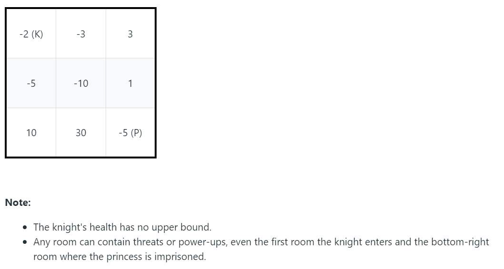

> Ratings: * to ***** (not so-so to review -> super worthy to review)

# Linear Scan snd Look Back 

### [518. Coin Change II](https://leetcode.com/problems/coin-change-2/) ***

You are given coins of different denominations and a total amount of money. Write a function to compute the number of combinations that make up that amount. You may assume that you have infinite number of each kind of coin.
> Example:
>
> Input: amount = 5, coins = [1, 2, 5]
>  Output: 4
>  Explanation: there are four ways to make up the amount:
>
>      5=5
>      5=2+2+1
>      5=2+1+1+1
>      5=1+1+1+1+1

```java
/*
*Note: the traditional approach dp[i] = # of ways to make amount j using all coins would not work, since duplicated value are included

dp[i, j] = # of ways to make amount j using coins from [0, ... i)

base case: dp[0, 0] = 1, dp[0, j] = 0

induction rule:
    dp[i,j] = either use coin[i] or not use coin[i] in the combination
            = dp[i, j - coins[i]] + dp[i - 1, j]
*/
class Solution {
    public int change(int amount, int[] coins) {
        if (amount == 0) {
            return 1;
        } else if (coins.length == 0) {
            return 0;
        }
        int n = coins.length;
        int[][] dp = new int[n][amount + 1];
        for (int j = 0; j <= amount; j++) {
            dp[0][j] = j % coins[0] == 0 ? 1 : 0;
        }
        
        for (int i = 1; i < n; i++) {
            for (int j = 0; j <= amount; j++) {
                int use = 0;
                int notUse = 0;
                if (j - coins[i] >= 0) {
                    use = dp[i][j - coins[i]];
                }
                notUse = dp[i - 1][j];
                
                dp[i][j] = use + notUse;
            }
        }
        return dp[n - 1][amount];
        
    }
}
```

### [368. Largest Divisible Subset](https://leetcode.com/problems/largest-divisible-subset/)   **

Given a set of distinct positive integers, find the largest subset such that every pair (Si, Sj) of elements in this subset satisfies:

Si % Sj = 0 or Sj % Si = 0.

If there are multiple solutions, return any subset is fine.

>Example 1:
>
>Input: [1,2,3]
>
>Output: [1,2] (of course, [1,3] will also be ok)

### [174. Dungeon Game](https://leetcode.com/problems/dungeon-game/) **

The demons had captured the princess (P) and imprisoned her in the bottom-right corner of a dungeon. The dungeon consists of M x N rooms laid out in a 2D grid. Our valiant knight (K) was initially positioned in the top-left room and must fight his way through the dungeon to rescue the princess.

The knight has an initial health point represented by a positive integer. If at any point his health point drops to 0 or below, he dies immediately.

Some of the rooms are guarded by demons, so the knight loses health (negative integers) upon entering these rooms; other rooms are either empty (0's) or contain magic orbs that increase the knight's health (positive integers).

In order to reach the princess as quickly as possible, the knight decides to move only rightward or downward in each step.

 

**Write a function to determine the knight's minimum initial health so that he is able to rescue the princess.**

For example, given the dungeon below, the initial health of the knight must be at least 7 if he follows the optimal path `RIGHT-> RIGHT -> DOWN -> DOWN`.



```java
/*
let dp[i][j] = minimumHP required to reach d[m - 1][n - 1]

base case:
    dp[m - 1][n - 1] = Math.max(1, 1 - d[m - 1][n - 1]);
    
        (*max(1, 1 - d[m - 1][n - 1]) means:
            if d[m - 1][n - 1] < 0: we have a hp loss with the monster and thus we take -d[m - 1][n - 1] and + 1 for we need at least 1 hp to survive)
    
    dp[m - 1][j] = Math.max(1, dp[m - 1][j + 1] - d[m - 1][j])
    dp[i][n - 1] = Math.max(1, dp[i + 1][n - 1] - d[i][n - 1])
    
    
induction rule:
    dp[i][j] = min(Math.max(1, dp[i + 1][j] - d[i][j],
                   Math.max(1, dp[i][j + 1] - d[i][j]))
    
*/
class Solution {
    public int calculateMinimumHP(int[][] d) {
        int m = d.length;
        int n = d[0].length;
        int[][] dp = new int[m][n];
        
        //base case
        dp[m - 1][n - 1] = Math.max(1, 1 - d[m - 1][n - 1]);
        for (int i = m - 2; i >= 0; i--) {
            dp[i][n - 1] = Math.max(1, dp[i + 1][n - 1] - d[i][n - 1]);
        }
        for (int j = n - 2; j >= 0; j--) {
            dp[m - 1][j] = Math.max(1, dp[m - 1][j + 1] - d[m - 1][j]);
        }
        
        //induction rule
        for (int i = m - 2; i >= 0; i--) {
            for (int j = n - 2; j >= 0; j--) {
                dp[i][j] = Math.min(Math.max(1, dp[i + 1][j] - d[i][j]),
                   Math.max(1, dp[i][j + 1] - d[i][j]));
            }
        }
        return dp[0][0];
        
    }
}
```