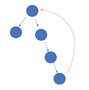
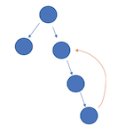
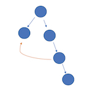
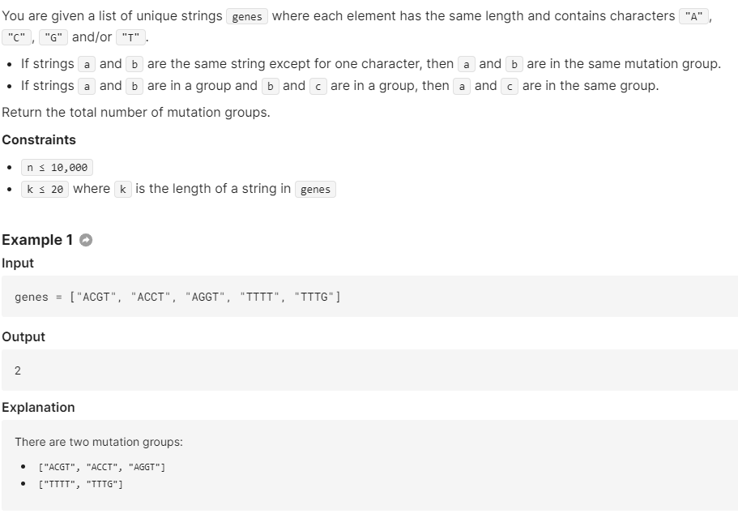

# Union Find(Disjoint Set Union)

Union Find (or Disjoint Set Union) can be usually applied to following type of problems:

1. cycle detection

2. count number of connected component

Requirements of union find:

- undirected

[Watch the YouTube Vid](https://www.youtube.com/watch?v=wU6udHRIkcc&ab_channel=AbdulBari)

Although dfs can a lot of time accomplish the same thing, but sometimes under some restriction, union find can yield a better runtime for the problem. see [leetcode problem 684](https://leetcode.com/problems/redundant-connection/).

**Ways to optimize Union Find**:

- **collapsing find/path compression**: in the `find()` operation, we relink the node's parent reference to the root of the component(`parent[root] = -1`). This way, we keep the depth of the tree small and can have better amortized runtime

  ```java
      public int find(int x) {
          if (parent[x] != x) parent[x] = find(parent[x]); //colapsing, here parent[x] = x indicates the node is root. can also use nagative # to represent root
          return parent[x];
      }
  ```

- **using rank to union two components**: Union-by-rank involves distributing the workload of `find` across leaders evenly. Whenever we `dsu.union(x, y)`, we have two leaders `xr, yr` and we have to choose whether we want `parent[x] = yr` or `parent[y] = xr`. We choose the leader that has a higher following to pick up a new follower.

  - Specifically, the meaning of `rank` is that there are less than `2 ^ rank[x]` followers of `x`. T**his strategy can be shown to give us better bounds for how long the recursive loop in `dsu.find` could run for.**
  - **rank[x]** can be simply interpreted as an **approximation of # of nodes in the component with root node = x**

  ```java
  class DSU {
      int[] parent;
      int[] rank;
  
      public DSU(int size) {
          parent = new int[size];
          for (int i = 0; i < size; i++) parent[i] = i;
          rank = new int[size];
      }
      public boolean union(int x, int y) {
              int xr = find(x), yr = find(y);
              if (xr == yr) {
                  return false;
              } else if (rank[xr] < rank[yr]) {
                  parent[xr] = yr;
              } else if (rank[xr] > rank[yr]) {
                  parent[yr] = xr;
              } else {
                  parent[yr] = xr;
                  rank[xr]++;
              }
              return true;
      }
      public int find(int x) {
          if (parent[x] != x) parent[x] = find(parent[x]);
          return parent[x];
      }
  }
  ```

  


### 128

sort是暴力解, O(N)思路如下

- we can treat two consecutive numbers as having an edge in between, so the goal is to search for the biggest connected component

- The challenge in this problem is that numbers are **not sorted**, meaning we cannot figure out whether there exists an edge between two numbers without scanning through the entire array. Thus we use an `HashSet`, then by looking up `set(arr[i] - 1)` we can know if there is a parent node for `arr[i]`

- Now the logic is simple:

  ```
  for each arr[i]:
  	continuously check if there exists arr[i - 1], update the maximum length
  ```

- however, for a sequence of `[1, 2, 3, 4, 5]`, we notice its not necessary to do such check for `1, 2, 3, 4`, since it is repetitive, thus only want to start the union **find** operation on the leaf node, which is `5`  in this case. Thus the improved algorithm looks like this:

  ```
  for num in arr:
  	set.add(num)
  for each arr[i]:
  	if !set.contains(arr[i + 1]):
  		continuously check if there eixsts arr[i - 1]
  	update the maximum lenght
  
  time: O(n)
  space: O(n)
  ```
  
  

### 684. Redundant Connection \*

The problem isnt hard but:

- all edges are in format of [u, v] such that u < v, so we can safely build a one directional graph, and traverse from vertex 1, since given all vertex starts from 1 to N

- once we built the graph, we can run a dfs starting from 1 with a HashSet, once we found a vertex already in the set, we then found the edge that can be removed

  ```java
  class Solution {
      public int[] findRedundantConnection(int[][] edges) {
          Map<Integer, List<Integer>> graph = buildGraph(edges);
          Set<Integer> set = new HashSet<>();
          set.add(1);
          return dfs(1, graph, set);
      }
      public int[] dfs(int cur, Map<Integer, List<Integer>> graph, Set<Integer> seen) {
          for (int v : graph.getOrDefault(cur, new ArrayList<Integer>())) {
              if (seen.contains(v)) {
                  return cur < v ? new int[]{cur, v} : new int[]{v, cur};
              }
              seen.add(v);
              int[] arr = dfs(v, graph, seen);
              if (arr != null) {
                  return arr;
              }
          }
          return null;
      }
      public Map<Integer, List<Integer>> buildGraph(int[][] edges) {
          Map<Integer, List<Integer>> map = new HashMap<>();
          for (int[] e : edges) {
              map.computeIfAbsent(e[0], x -> new ArrayList<Integer>()).add(e[1]);
          }
          return map;
      }
  }
  ```

- **However**, the problem specified that Return an edge that can be removed so that the resulting graph is a tree of N nodes. **If there are multiple answers, return the answer that occurs last in the given 2D-array.** The answer edge `[u, v]` should be in the same format, with `u < v`.


So due to this last restriction, we need to do a dfs and add an edge to the graph one by one, this way we can find the answer that occurs last. the cost of dfs increase by 1 each time we traverse 1 edge (1 + 2 + 3 + .... + V as we adding one edge to the graph at a time), so **O(V^2)** for the total time complexity

```java
class Solution {
    Set<Integer> seen = new HashSet();
    int MAX_EDGE_VAL = 1000;

    public int[] findRedundantConnection(int[][] edges) {
        ArrayList<Integer>[] graph = new ArrayList[MAX_EDGE_VAL + 1];
        for (int i = 0; i <= MAX_EDGE_VAL; i++) {
            graph[i] = new ArrayList();
        }

        for (int[] edge: edges) {
            seen.clear();
            if (!graph[edge[0]].isEmpty() && !graph[edge[1]].isEmpty() &&
                    dfs(graph, edge[0], edge[1])) {
                return edge;
            }
            graph[edge[0]].add(edge[1]);	//add one edge at a time
            graph[edge[1]].add(edge[0]);
        }
        throw new AssertionError();
    }
    public boolean dfs(ArrayList<Integer>[] graph, int source, int target) {
        if (!seen.contains(source)) {
            seen.add(source);
            if (source == target) return true;
            for (int nei: graph[source]) {
                if (dfs(graph, nei, target)) return true;
            }
        }
        return false;
    }
}
```


#### Union found is the best solution

```java
class Solution {
    int MAX_EDGE_VAL = 1000;

    public int[] findRedundantConnection(int[][] edges) {
        DSU dsu = new DSU(MAX_EDGE_VAL + 1);
        for (int[] edge: edges) {
            if (!dsu.union(edge[0], edge[1])) return edge;
        }
        throw new AssertionError();
    }
}

class DSU {
    int[] parent;
    int[] rank;

    public DSU(int size) {
        parent = new int[size];
        for (int i = 0; i < size; i++) parent[i] = i;
        rank = new int[size];
    }

    public int find(int x) {
        if (parent[x] != x) parent[x] = find(parent[x]);
        return parent[x];
    }

    public boolean union(int x, int y) {
        int xr = find(x), yr = find(y);
        if (xr == yr) {
            return false;
        } else if (rank[xr] < rank[yr]) {
            parent[xr] = yr;
        } else if (rank[xr] > rank[yr]) {
            parent[yr] = xr;
        } else {
            parent[yr] = xr;
            rank[xr]++;
        }
        return true;
    }
}
```

### 685. Redundant Connection II

写在最前面，觉得思路很乱的时候拿起纸笔走一走样例，模拟模拟流程，会清晰许多。
题目说了只需要去除一条边，就能变成一个根树（有向），反过来说一定存在（可以存在很多）某个根树加了一条边变成了现在的图。
这条多余的边，会分为以下情况：


1. 这条边从任意一个节点出发，指向树根。

   

   

   

   这种情况下，树不合法的原因是，树没了根，因为所有点的入度都为1。显而易见的是在环上的任意一条边都可以删除，删除之后就可以得到一个合法的根树。
   **即这条橙色的多余的边，只是我们上面提到的存在的可能性的某一种，如你所见，其实环上的每一条边都可以是“多余边”，请理解这句话**，既然每一条都可以删除，那按照题目要求删掉环中最后出现的那条边就好。

   

2. 这条边从任意节点出发，指向祖先链上任意一个非根节点。
   
   这种情况下，树不合法的原因是出现了一个有两个入度的节点，**并且其中一个入度来自环中的一条边**。可以观察到，这两个入度里，只能删除来自环里的那条边。

   

3. 这条边从任意节点出发，指向非祖先链上任意一个节点。

   

   

   

   这种情况下，树不合法的原因也是出现了一个有两个入度的节点，**但两个入度都在环上**。可以观察到，这两个入度都能删掉，所以按照题目要求删掉排序在后面的那条。

   

**以上提到的环，都是指无向环，即假装这个图是个无向图的环**


情况分析清楚了，怎么做呢。我们可以从前到后，并查集合并每一条边，对于情况2、3，我们会在这个过程中碰到一条边导致某个点的入度从1变为2，也就是那个有两个入度的点的排在后面的那个入度。我们先把这两条边edge1，edge2记下来，**如果我们跳过并查集合并edge2**，那么对于情况2、3会出现不同的结果。


- 情况3会发现合并到最后一路畅通，什么事情都不会发生，**因此跳过这条edge2就是答案**。
- 情况2中，**如果跳过的这条edge2是在环里的那条边，则也会一路畅通，那答案就是 edge2**, 如果跳过的这条edge2是不在环里的那条边，**那么接下来并查集合并的时候一定会碰到环！那么答案就是 edge1。
- **如果合并的过程中压根没碰到过一条边会导致双入度点，那么就是情况1，这种情况下，**合并过程中会碰到一条边导致环的出现，（一个环，在最后一条边出现之前都不是个环）因此的这条边就是情况1的答案。**


这里是我的答案，并查集路径压缩了，不过没有按秩合并，时间是100%。

```java
class Solution {  
    int[] anc;//并查集
    int[] parent;// record the father of every node to find the one with 2 fathers,记录每个点的父亲，为了找到双入度点
    public int[] findRedundantDirectedConnection(int[][] edges) {
        anc=new int[edges.length+1];
        parent=new int[edges.length+1];
        int[] edge1=null;
        int[] edge2=null;
        int[] lastEdgeCauseCircle=null;
        for (int[] pair:edges){
            int u=pair[0];
            int v=pair[1];
            
            if(anc[u]==0) anc[u]=u;
            if(anc[v]==0) anc[v]=v;//init the union-find set  初始化并查集
                
            if (parent[v]!=0){// node v already has a father, so we just skip the union of this edge and check if there will be a circle ，跳过 edge2,并记下 edge1,edge2
                edge1=new int[]{parent[v],v};
                edge2=pair;
            } else {
                parent[v]=u;
                int ancU=find(u);
                int ancV=find(v);
                if(ancU!=ancV){
                    anc[ancV]=ancU;
                } else { //meet a circle , 碰到了环
                    lastEdgeCauseCircle=pair;
                }
            }
        }
        if (edge1!=null&&edge2!=null) return lastEdgeCauseCircle==null?edge2:edge1; //如果是情况2、3，则根据有没有碰到环返回 edge1 或 edge2
        else return lastEdgeCauseCircle; //否则就是情况1，返回那个导致环的最后出现的边。
    }
     
    private int find(int node){
        if (anc[node]==node) return node;
        anc[node]=find(anc[node]);
        return anc[node];
    }
}
```


### 721. Accounts Merge

This problem is covered in graph.md, and dfs is a solution that yields good time complexity. With Union Find, the complexity can be better due to **inverse-Ackermann function**(smth that relates to union find, need to look up later)

Few things to note in the following solution:

- mapped emails into a monotonic increasing id, this id allows us to use int[] array data structure for union/find operation easily
- used `emailToName` to map each email to the account name for post processing


```java
class Solution {
    public List<List<String>> accountsMerge(List<List<String>> accounts) {
        DSU dsu = new DSU();
        Map<String, String> emailToName = new HashMap();
        Map<String, Integer> emailToID = new HashMap();
        int id = 0;
        for (List<String> account: accounts) {
            String name = "";
            for (String email: account) {
                if (name == "") {
                    name = email;
                    continue;
                }
                emailToName.put(email, name);
                if (!emailToID.containsKey(email)) {
                    emailToID.put(email, id++);
                }
                dsu.union(emailToID.get(account.get(1)), emailToID.get(email));
            }
        }

        Map<Integer, List<String>> ans = new HashMap();
        for (String email: emailToName.keySet()) {
            int index = dsu.find(emailToID.get(email));
            ans.computeIfAbsent(index, x-> new ArrayList()).add(email);
        }
        for (List<String> component: ans.values()) {
            Collections.sort(component);
            component.add(0, emailToName.get(component.get(0)));
        }
        return new ArrayList(ans.values());
    }
}
class DSU {
    int[] parent;
    public DSU() {
        parent = new int[10001];
        for (int i = 0; i <= 10000; ++i)
            parent[i] = i;
    }
    public int find(int x) {
        if (parent[x] != x) parent[x] = find(parent[x]);
        return parent[x];
    }
    public void union(int x, int y) {
        parent[find(x)] = find(y);
    }
}
```


### 323. Number of Connected Components in an Undirected Graph \*

```java
class Solution {
    public int countComponents(int n, int[][] edges) {
        DSU dsu = new DSU(n);
        for (int[] e : edges) {
            dsu.union(e[0], e[1]);
        }
        
        int res = 0;
        for (int i = 0; i < n; i++) {
            if (dsu.parent[i] == i) {
                res++;
            }
        }
        return res;
    }
    class DSU {
        int[] parent;
        int[] sizes;
        
        public DSU(int n) {
            parent = new int[n];
            sizes = new int[n];
            for (int i = 0; i < n; i++) {
                parent[i] = i;
            }
            Arrays.fill(sizes, 1);
        }
        
        public int find(int x) {
            if (parent[x] != x) {
                parent[x] = find(parent[x]);
            }
            return parent[x];
        }
        
        public int union(int x, int y) {
            int px = find(x);
            int py = find(y);
            if (px == py) {
                return 0;
            } else if (sizes[px] < sizes[py]) { //if x is smaller compoennt, merge x into y
                parent[px] = py;
                sizes[py] += sizes[px];
            } else { //if y is smaller component, y merge into x
                parent[py] = px;
                sizes[px] += sizes[py];
            }
            return 1;
        }
    }
}
```


### BS. Gene Mutation Groups \*\*

this problem is an example of using union find to count number of connected component in the graph, note that we can still use union find given that the graph has some edges causes cycle. Since in `union()` operation, when we spot the cycle `parent(x) == parent(y)` we can simply not do anything (`return 0`in our case). 



```java
import java.util.*;
class Solution {
    public int solve(String[] genes) {
        int n = genes.length;
        DSU dsu = new DSU(n);
        for (int i = 0; i < n; i++) {
            for (int j = i + 1; j < n; j++) {
                if (oneDiff(genes[i], genes[j])) {
                    dsu.union(i, j);
                }
            }
        }

        //count # of cc
        int cnt = 0;
        for (int i = 0; i < n; i++) {
            if (dsu.parent[i] == i) {
                cnt++;
            }
        }
        return cnt;
    }
    public boolean oneDiff(String s1, String s2) {
        if (s1.length() != s2.length()) {
            return false;
        }
        int cnt = 0;
        for (int i = 0; i < s1.length(); i++) {
            if (s1.charAt(i) != s2.charAt(i)) {
                if (cnt > 0) {
                    return false;
                }
                cnt++;
            }
        }
        return true;
    }

    class DSU {
        int[] parent;
        int[] size;
        public DSU(int n) {
            parent = new int[n];
            size = new int[n];
            for (int i = 0; i < n; i++) {
                parent[i] = i;
            }
            Arrays.fill(size, 1);
        }
        public int find(int x) {
            if (parent[x] != x) {
                parent[x] = find(parent[x]);
            }
            return parent[x];
        }
        public int union(int x, int y) {
            int px = find(x);
            int py = find(y);
            if (px == py) {
                return 0;
            } else if (size[px] < size[py]) {
                parent[px] = py;
                size[py] += size[px];
            } else {
                parent[py] = px;
                size[px] += size[py];
            }
            return 1;
        }
    }
}
```

