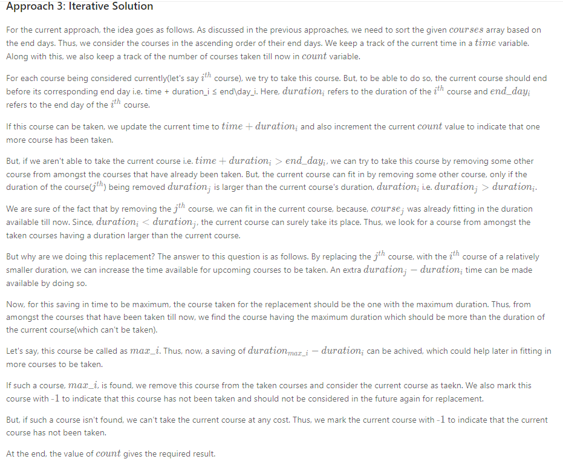

# Greedy

### **June Google Onsite** [402. Remove Digits](https://leetcode.com/problems/remove-k-digits/)
Given a non-negative integer num represented as a string, remove k digits from the number so that the new number is the smallest possible.

Note:

The length of num is less than 10002 and will be ≥ k.
The given num does not contain any leading zero.

```
Example 1:

Input: num = "1432219", k = 3
Output: "1219"
Explanation: Remove the three digits 4, 3, and 2 to form the new number 1219 which is the smallest.
Example 2:

Input: num = "10200", k = 1
Output: "200"
Explanation: Remove the leading 1 and the number is 200. Note that the output must not contain leading zeroes.
Example 3:

Input: num = "10", k = 2
Output: "0"
Explanation: Remove all the digits from the number and it is left with nothing which is 0.
```

```java
/*
brute force: dfs with C(len, k) runtime
algorithm: greedy

lemma:
1. given two numbers after removed k digits n1 = [d1, d2, ... dx], n2 = [d2, ...., dy]: if d2 < d1, and index of d2 > d1, then n2 < n1

the algorithm works as following:
use a stack to track the most recent numbers to do the comparison
starting from index i from left to right of input num:
    while i < len:
        if k > 0:
            //we still have elements to remove
            while (k > 0 && num[i] < num[stackTop]):
                k--;
                stack.pop();
        stack.push(i)
    //post processing for monotonically increasing elements if k > 0:
    while k > 0:
        stack.pop

time: O(n)
space: O(n)
*/
class Solution {
    public String removeKdigits(String num, int k) {
        Deque<Integer> stack = new ArrayDeque<>();
        for (int i = 0; i < num.length(); i++) {
            while (k > 0 && !stack.isEmpty() && num.charAt(i) < num.charAt(stack.peekFirst())) {
                k--;
                stack.pollFirst();
            }
            if (stack.isEmpty() && num.charAt(i) == '0') {
                continue;
            }
            stack.offerFirst(i);
        }
        
        while (k > 0 && !stack.isEmpty()) {
            stack.pollFirst();
            k--;
        }
        if (stack.isEmpty()) {
                return "0";
        }
        StringBuilder res = new StringBuilder();
        while (!stack.isEmpty()) {
            res.append(num.charAt(stack.pollFirst()));
        }
        return res.reverse().toString();
    }
}
```

### 435. Non-overlapping Intervals
Given a collection of intervals, find the minimum number of intervals you need to remove to make the rest of the intervals non-overlapping.

```
Example 1:

Input: [[1,2],[2,3],[3,4],[1,3]]
Output: 1
Explanation: [1,3] can be removed and the rest of intervals are non-overlapping.
Example 2:

Input: [[1,2],[1,2],[1,2]]
Output: 2
Explanation: You need to remove two [1,2] to make the rest of intervals non-overlapping.
Example 3:

Input: [[1,2],[2,3]]
Output: 0
Explanation: You don't need to remove any of the intervals since they're already non-overlapping.
```
```java
/*
best first search(greedy):
    preprocess sort the interval by j then by i
    linear scan(from left to right) the sorted intervals, and keep a global interval right end, remove excessive intervals one by one
    
time: O(nlogn)
space: O(n)
*/
class Solution {
    public int eraseOverlapIntervals(int[][] intervals) {
        int n = intervals.length;
        if (n == 0) {
            return n;
        }
        Arrays.sort(intervals, (i1, i2) -> {
            return i1[1] - i2[1] == 0 ? i1[0] - i2[0] : i1[1] - i2[1];
        });
        
        int res = 0;
        int r = intervals[0][1];
        
        for (int i = 1; i < intervals.length; i++) {
            int[] it = intervals[i];
            if (it[0] < r) {
                res++;
            } else {
                r = it[1];
            }
        }
        return res;
    }
}
```


### 134. Gas Station
There are N gas stations along a circular route, where the amount of gas at station `i` is `gas[i]`.

You have a car with an unlimited gas tank and it costs `cost[i]` of gas to travel from station `i` to its next station `(i+1)`. You begin the journey with an empty tank at one of the gas stations.

Return the starting gas station's index if you can travel around the circuit once in the clockwise direction, otherwise return -1.

Note:
- If there exists a solution, it is guaranteed to be unique.
- Both input arrays are non-empty and have the same length.
- Each element in the input arrays is a non-negative integer.

```java
//alg1 greedy time: O(n) space: O(1)
class Solution {
  public int canCompleteCircuit(int[] gas, int[] cost) {
    int n = gas.length;

    int total_tank = 0;
    int curr_tank = 0;
    int starting_station = 0;
    for (int i = 0; i < n; ++i) {
      total_tank += gas[i] - cost[i];
      curr_tank += gas[i] - cost[i];
      // If one couldn't get here,
      if (curr_tank < 0) {
        // Pick up the next station as the starting one.
        starting_station = i + 1;
        // Start with an empty tank.
        curr_tank = 0;
      }
    }
    return total_tank >= 0 ? starting_station : -1;
  }
}
```

```java
//alg2: sliding window, time: O(2*n), space: O(1)
/*
we keep a sliding window of current trip and wrap around when hit the boundary

suppose window is bounded by [i, j), we initialize i so i has gas[i] + cost[i] >= 0, we maintain a variable n=current remain gas for current window


for j = 1 : 2 * gas.length - 1
    if n - (gas[j] + cost[j]) >= 0:
        add j to current trip, j++, update n
        if window length = j - i == gas.len: we are done
    else we have to drop window left i:
        while (n - (gas[j] + cost[j]) < 0):
            n -= (gas[i] + cost[i])
            i++
        add j to current trip, j++, update n
*/
class Solution {
    public int canCompleteCircuit(int[] gas, int[] cost) {
        int i = 0;
        int j = 0;
        int n = gas.length;
        int r = 0;  //remain gas
        while (i < 2 * n) {
            while (i < 2 * n && r + (gas[j % n] - cost[j % n]) < 0) {
                if (i == j) {
                    //if same index and already negative gas left
                    i++;
                    j++;
                } else {
                    r -= (gas[i % n] - cost[i % n]);
                    i++;
                }
            }
            
            if (i >= 2 * n) {
                return -1;
            }
            
            //add j into trip
            r += (gas[j % n] - cost[j % n]);
            j++;
            if (Math.abs(j - i) == n) {
                return i % n;
            }
        }
        return -1;
    }
}
```


### 1288. Remove Covered Intervals
```java
/*
greedt:

sort the intervals by begin (from small to big), then from end(from big to small)

begining at interval[0] and interval[1], if it_0[1] >= it_1[1], then it_1 is covered, otherwise it_j[0] >= it_1[0] and since it_1[1] >= it_0[1], we can discard it_0, any possible intervals covered by it_0 can be covered by it_1

time: O(nlogn)
space: O(1)
*/
class Solution {
    public int removeCoveredIntervals(int[][] intervals) {
        Arrays.sort(intervals, (i1, i2) -> {
            return i1[0] != i2[0] ? i1[0] - i2[0] : i2[1] - i1[1];
        });
        
        int n = 0;
        int prev = 0;
        for (int i = 1; i < intervals.length; i++) {
            int[] it = intervals[i];
            int[] pit = intervals[prev];
            if (pit[1] >= it[1]) {
                n++;
            } else {
                prev = i;
            }
        }
        return intervals.length - n;
    }
}
```


### 1605. Find Valid Matrix Given Row and Column Sums
```java
class Solution {
    public int[][] restoreMatrix(int[] rowSum, int[] colSum) {
        int m = rowSum.length;
        int n = colSum.length;
        int[][] res = new int[m][n];
        
        int i = 0;
        int j = 0;
        while (i < m && j < n) {
            int min = Math.min(rowSum[i], colSum[j]);
            res[i][j] = min;
            rowSum[i] -= min;
            colSum[j] -= min;
            if (rowSum[i] == 0) {
                i++;
            } else {
                j++;
            }
        }
        return res;
    }
}
```

### 316. Remove Duplicate Letters   *****
```java
class Solution {
    public String removeDuplicateLetters(String s) {

        Stack<Character> stack = new Stack<>();

        // this lets us keep track of what's in our solution in O(1) time
        HashSet<Character> seen = new HashSet<>();

        // this will let us know if there are any more instances of s[i] left in s
        HashMap<Character, Integer> last_occurrence = new HashMap<>();
        for(int i = 0; i < s.length(); i++) last_occurrence.put(s.charAt(i), i);

        for(int i = 0; i < s.length(); i++){
            char c = s.charAt(i);
            // we can only try to add c if it's not already in our solution
            // this is to maintain only one of each character
            if (!seen.contains(c)){
                // if the last letter in our solution:
                //     1. exists
                //     2. is greater than c so removing it will make the string smaller
                //     3. it's not the last occurrence
                // we remove it from the solution to keep the solution optimal
                while(!stack.isEmpty() && c < stack.peek() && last_occurrence.get(stack.peek()) > i){
                    seen.remove(stack.pop());
                }
                seen.add(c);
                stack.push(c);
            }
        }
    StringBuilder sb = new StringBuilder(stack.size());
    for (Character c : stack) sb.append(c.charValue());
    return sb.toString();
    }
}
```

### 253. Meeting Rooms II ****
Given an array of meeting time intervals consisting of start and end times [[s1,e1],[s2,e2],...] (si < ei), find the minimum number of conference rooms required.

```
Example 1:

Input: [[0, 30],[5, 10],[15, 20]]
Output: 2
```

```java
/*
algorithm: since we need a room whenever the current interval time is up, we must allocate new room is no other room is avalible currently, or if there is a meeting finished, we use that room. This follows a greedy, and best first approach. Sort the input by starting time, and assign them one by one, use a min heap to retrieve the finished meeting room in O(logn) time

time: O(nlogn) for sort and pq
space: O(n) for sort, and pq storage
*/
class Solution {
    public int minMeetingRooms(int[][] intervals) {
        if (intervals.length == 0) {
            return 0;
        }
        //sort by starting time
        Arrays.sort(intervals, (l1, l2) -> l1[0] - l2[0]);
        //initialize min heap
        PriorityQueue<List<Integer>> pq = new PriorityQueue<>((l1, l2) -> l1.get(1) - l2.get(1));
        /*
        * redundency here: we don't really need the start of interval to put in to heap
        * so pq<Integer: endTime> is sufficient
        */
        int nroom = 1;
        pq.offer(Arrays.asList(0, 0));
        for (int[] i : intervals) {
            //if a finished room can match current meeting time
            if (pq.peek().get(1) <= i[0]) {
                List<Integer> room = pq.poll();
                room.set(1, i[1]);  //update finishing time of room and put it back to heap
                pq.offer(room);
            } else {
                //cannot match any
                pq.offer(Arrays.asList(i[0], i[1]));
                nroom++;
            }
        }
        return nroom;
    }
}
```

### 948. Bag of Tokens  ****
```java
/*
naive greedy: sort token, starting with the smallest token, attemp to make points out of it, and when can not make point, get power from the biggest token. track the maximum score can be achieved 

time: O(nlogn)
space: O(n)
*/
class Solution {
    public int bagOfTokensScore(int[] tokens, int p) {
        Arrays.sort(tokens);
        int n = tokens.length;
        int l = 0;
        int r = n - 1;
        int score = 0;
        int max = 0;
        while (l <= r) {
            if (p >= tokens[l]) {
                score++;
                p -= tokens[l];
                l++;
                max = Math.max(score, max);
            } else {
                if (score <= 0) {
                    break;
                }
                p += tokens[r--];
                score--;
            }
        }
        return max;
    }
}
```


### 1833. Maximum Ice Cream Bars

```java
/*
alg1: dp
dp[i][j] = max icecream buying icecream [0 ... i], with j coins left
recursive rule:
    dp[i][j] = Math.max(dp[i - 1][j - costs[i]] + 1, dp[i - 1][j])
base case:
    dp[0][j] = 1 if costs[i] <= j else 0

time: O(n*k), n = size of costs array, k = # of coins
space: O(n*k), can be optimized to O(k) by rolling the dp

class Solution {
    public int maxIceCream(int[] costs, int coins) {
        int[][] dp = new int[2][coins + 1];
        for (int i = 1; i <= costs.length; i++) {
            for (int j = 1; j <= coins; j++) {
                dp[i % 2][j] = dp[(i - 1) % 2][j];
                if (j - costs[i - 1] >= 0) {
                    dp[i % 2][j] = Math.max(dp[i % 2][j], dp[(i - 1) % 2][j - costs[i - 1]] + 1);
                }
            }
        }
        return dp[costs.length % 2][coins];
    }
}
*/
/*
alg2: greedy
since the goal is to maximize the number of ice cream, we always prefer to take the smallest cost ice cream first
time: O(nlogn) sort + linear scan
*/
class Solution {
    public int maxIceCream(int[] costs, int coins) {
        Arrays.sort(costs);
        int res = 0;
        for (int c : costs) {
            if (coins - c < 0) {
                return res;
            } else {
                coins -= c;
                res++;
            }
        }
        return res;
    }
}
```

### 630. Course Schedule III \*



```java
//time: O(n^2), space: O(1)
public class Solution {
    public int scheduleCourse(int[][] courses) {
        System.out.println(courses.length);
        Arrays.sort(courses, (a, b) -> a[1] - b[1]);
        int time = 0, count = 0;
        for (int i = 0; i < courses.length; i++) {
            if (time + courses[i][0] <= courses[i][1]) {
                time += courses[i][0];
                count++;
            } else {
                int max_i = i;
                for (int j = 0; j < i; j++) {
                    if (courses[j][0] > courses[max_i][0])
                        max_i = j;
                }
                if (courses[max_i][0] > courses[i][0]) {
                    time += courses[i][0] - courses[max_i][0];
                }
                courses[max_i][0] = -1;
            }
        }
        return count;
    }
}
```

