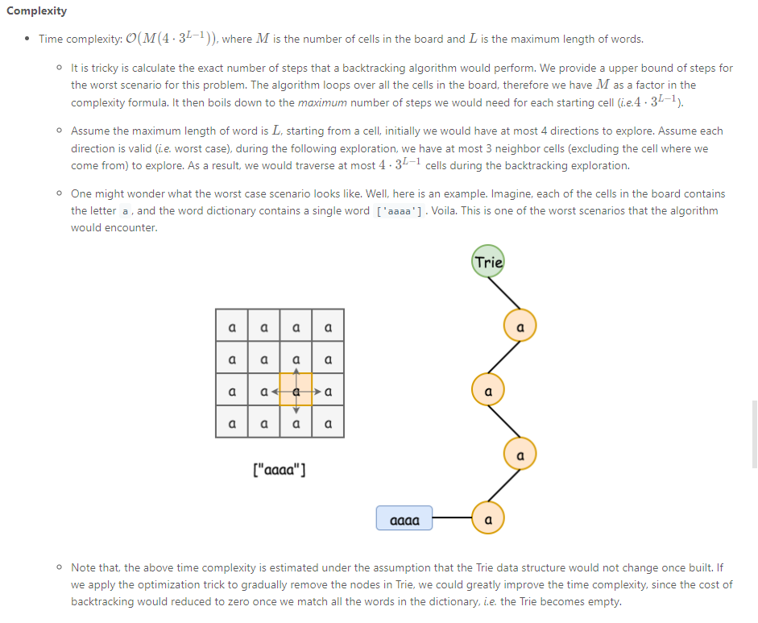

# Trie

## some templates

### Iteratively Build Trie with a list of words:

```java
public TrieNode build(char[][] board, String[] words) {

    // Step 1). Construct the Trie
    TrieNode root = new TrieNode();
    for (String word : words) {
      TrieNode node = root;

      for (Character letter : word.toCharArray()) {
        if (node.children.containsKey(letter)) {
          node = node.children.get(letter);
        } else {
          TrieNode newNode = new TrieNode();
          node.children.put(letter, newNode);
          node = newNode;
        }
      }
      node.word = word;  // store words in Trie
    }
    class TrieNode {
  		HashMap<Character, TrieNode> children = new HashMap<Character, TrieNode>();
  		String word = null;
  		public TrieNode() {}
	}
}
```


## Problems

### 211. Design Add and Search Words Data Structure

```
Algorithm1: use Map(LengthOfDictWord, listOfDictWords)
define m = length of input word to look up, n = # of words in the dict, k = average length of dict words
for add operation: t = O(1), s = O(n * k)
for search operation: O((# of words of length m) * m)


Alg1 Note: we cant just use a hashmap of words, since the '.'input will require linear search of the whole map, which gets too expensive.

Algorithm2: Trie
for search operation: t = O(m), but in case of wild card '.', worst complexity is O(n * k) meaning we exhaust the trie built with all dictionary words. s = O(n * k)

but in case of large words to pre-store in the dictionary, hash map method will involve collision causing higher time complexity as well as higher space overhead to ensure the hash buckets load rate is good
```


### 212. Word Search II \*\*\*\*\*

[Reference Leetcode Solution Repo](https://leetcode.com/problems/word-search-ii/solution/)

*this problem contains all the basic and some great optimizations you can be doing with Trie, which includes:

- How to build Trie iteratively

  ```java
  // Step 1). Construct the Trie
      TrieNode root = new TrieNode();
      for (String word : words) {
        TrieNode node = root;
  
        for (Character letter : word.toCharArray()) {
          if (node.children.containsKey(letter)) {
            node = node.children.get(letter);
          } else {
            TrieNode newNode = new TrieNode();
            node.children.put(letter, newNode);
            node = newNode;
          }
        }
        node.word = word;  // store words in Trie
      }
  ```

  

- How to optimize Trie

  - Prune word node so words only get to added once, in my raw solution, I used a `HashSet<String>` to handle to duplication

    ```java
        // check if there is any match
        if (currNode.word != null) {
          this._result.add(currNode.word);
          currNode.word = null;	//set the word to null so its added exactly once
        }
    ```

    

  - Prune Trie leaf nodes. Since if the search reached a leaf node(a node contains no children, not a node that can be an end of word, but due to the nature of Trie, the node that is an end of a word must also be a leaf node), that node can be removed. This is because:

    - the search path of Trie is always an valid one, so if we reached a leaf node x, node x must be an end of a word, and since we only need to **search once** for this particular word, we can remove this node so future search won't have to reach this node anymore. In the code snipet, it is illustrated through

      ```java
      // Optimization: incrementally remove the leaf nodes
          if (currNode.children.isEmpty()) {
            parent.children.remove(letter);
          }
      ```

#### Solution:

```java
class TrieNode {
  HashMap<Character, TrieNode> children = new HashMap<Character, TrieNode>();
  String word = null;
  public TrieNode() {}
}

class Solution {
  char[][] _board = null;
  ArrayList<String> _result = new ArrayList<String>();

  public List<String> findWords(char[][] board, String[] words) {

    // Step 1). Construct the Trie
    TrieNode root = new TrieNode();
    for (String word : words) {
      TrieNode node = root;

      for (Character letter : word.toCharArray()) {
        if (node.children.containsKey(letter)) {
          node = node.children.get(letter);
        } else {
          TrieNode newNode = new TrieNode();
          node.children.put(letter, newNode);
          node = newNode;
        }
      }
      node.word = word;  // store words in Trie
    }

    this._board = board;
    // Step 2). Backtracking starting for each cell in the board
    for (int row = 0; row < board.length; ++row) {
      for (int col = 0; col < board[row].length; ++col) {
        if (root.children.containsKey(board[row][col])) {
          backtracking(row, col, root);
        }
      }
    }

    return this._result;
  }
  
  private void backtracking(int row, int col, TrieNode parent) {
    Character letter = this._board[row][col];
    TrieNode currNode = parent.children.get(letter);

    // check if there is any match
    if (currNode.word != null) {
      this._result.add(currNode.word);
      currNode.word = null;
    }

    // mark the current letter before the EXPLORATION
    this._board[row][col] = '#';

    // explore neighbor cells in around-clock directions: up, right, down, left
    int[] rowOffset = {-1, 0, 1, 0};
    int[] colOffset = {0, 1, 0, -1};
    for (int i = 0; i < 4; ++i) {
      int newRow = row + rowOffset[i];
      int newCol = col + colOffset[i];
      if (newRow < 0 || newRow >= this._board.length || newCol < 0
          || newCol >= this._board[0].length) {
        continue;
      }
      if (currNode.children.containsKey(this._board[newRow][newCol])) {
        backtracking(newRow, newCol, currNode);
      }
    }

    // End of EXPLORATION, restore the original letter in the board.
    this._board[row][col] = letter;

    // Optimization: incrementally remove the leaf nodes
    if (currNode.children.isEmpty()) {
      parent.children.remove(letter);
    }
  }
}
```

#### Complexity



space: O(N), N = # of char used to build Trie

#### my trie recursive solution

```java
class Solution {
    int[][] dirs = {{0, 1}, {0, -1}, {1, 0}, {-1, 0}};
    
    public List<String> findWords(char[][] board, String[] words) {
        Trie trie = buildTrie(words);
        List<String> res = new ArrayList<>();
        search(board, trie, res);
        return res;
    }
    
    public void search(char[][] board, Trie trie, List<String> res) {
        //performs dfs on each (i, j) entry
        int m = board.length;
        int n = board[0].length;
        for (int i = 0; i < m; i++) {
            for (int j = 0; j < n; j++) {
                Trie start = trie.neighbors.get(board[i][j]);
                if (start != null) {
                    char c = board[i][j];
                    board[i][j] = '-'; //mark as visited
                    helper(board, start, i, j, res);
                    board[i][j] = c; //unmar visited
                }
                
            }
        }
    }
    
    public void helper(char[][] board, Trie cur, int i, int j, List<String> res) {
        if (cur.word != null) {
            res.add(cur.word);
            cur.word = null;
        }
        
        for (int[] dir : dirs) {
            int inext = i + dir[0];
            int jnext = j + dir[1];
            
            if (inext >= 0 && inext < board.length && jnext >= 0 && jnext < board[0].length && board[inext][jnext] != '-') {
                char c = board[inext][jnext];
                Trie child = cur.neighbors.get(board[inext][jnext]);
                if (child != null) {
                    board[inext][jnext] = '-';
                    helper(board, child, inext, jnext, res);
                    board[inext][jnext] = c;    //backtrack
                    
                    //prune the leaf
                    if (child.neighbors.isEmpty()) {
                        cur.neighbors.remove(c);
                    }
                }
            }
            
        }
        
    }
    
    public Trie buildTrie(String[] words) {
        Trie trie = new Trie();
        
        for (String word : words) {
            Trie node = trie;
            for (char c : word.toCharArray()) {
                node = node.neighbors.computeIfAbsent(c, ch -> new Trie());
            }
            node.word = word;
        }
        
        return trie;
    }
    
    class Trie {
        Map<Character, Trie> neighbors;
        String word;
        public Trie() {
            neighbors = new HashMap<>();
            word = null;
        }
    }
    
}
```


### 642. Design Search AutoComplete System

```
Algorithm: uses Trie with attribute 'freq', so if user type prefix 'abc', we get the TrieNode at "abc", dfs collect all sentences at "abc" prefixed TrieNodes and find top-3 most frequent words

optimizations:
1. dfs: if user type "abc", we did full TrieNode dfs effectively 3 times for the TrieNode prefixed at "abc", 2 times for "ab", 1 time for "a". There is duplication of search for "abc", and "ab". this duplication effect gets worse as the prefix input str length gets big
	- To solve this problem. Trade space for time. So when dfs full TrieNode Tree at first prefix at "a", we generate a Map<TrieNodePrefix, Top3ListWords>, so we no longer need to do another full dfs search for prefix "ab" nor "abc".
2. top 3 most frequent word
	- use top-k search algorithm with a min heap of size 3, now time will be cut down to O(n*log3) where n = # of words in the prefix TrieNode
```


### 336. Palindrome Pairs (hard)

this one is straightforward to come up with a Trie solution. But some details need to be taken care of:

- for any two words w1, w2. say we are concatenating w1 on the left and w2 on the right
  - `len(w1) == len(w2)`
  - `len(w1) < len(w2)`: need to run dfs for the rest of the trie search
  - `len(w1) > len(w2)`
- input contains empty string, so need special handling

```java
/*
alg: trie search, time: O(n), space: O(n), n = # of characters in words array

*/
class Solution {
    public List<List<Integer>> palindromePairs(String[] words) {
        TrieNode trie = buildTrie(words);
        List<List<Integer>> res = new ArrayList<>();
        
        for (int i = 0; i < words.length; i++) {
            String word = words[i];
            search(words, word, i, trie, res);    
        }
        return res;
    }
    /*
    since we are searching for palindrom, search from word[n - 1].
    when two word w1, w2. we are currentlt try if we can concat w1 + w2 (not w2 + w1)
    if len(w1) == len(w2): add w2's index when reached last character, search continues
    if len(w1) < len(w2): when consumes w1's index, track the rest of the trienode to each next validIndex, if palindrom, add to res. continue the search until trienode = null
    if len(w1) > len(w2): when consumes w2's index, check if the rest of w1 is a valid palindrom. search continues until trienode = null
    */
    public void search(String[] words, String word, int wordIdx, TrieNode trie, List<List<Integer>> res) {
        TrieNode next;
        for (int i = 0; i < word.length(); i++) {
            next = trie.neighbors.get(word.charAt(i));
            
            if (next == null) {
                return;
            }
            
            if (next.wordIdx != -1) {
                if (i == word.length() - 1) { //len(word) == len(next)
                    if (wordIdx != next.wordIdx) { //prevent same word
                        res.add(Arrays.asList(wordIdx, next.wordIdx));
                    }
                } else if (checkPalindromStr(word, i + 1, word.length() - 1)) { //len(word) > len(next), check word[0 ... i - 1] is palindrom
                    res.add(Arrays.asList(wordIdx, next.wordIdx));
                }
            }
            
            trie = next;
        }
        
        //len(word) < len(next), do a dfs search
        StringBuilder helper = new StringBuilder();
        dfsSearchPalindrom(words, wordIdx, trie, res, helper);
    }
    
    public void dfsSearchPalindrom(String[] words, int wordIdx, TrieNode root, List<List<Integer>> res, StringBuilder prefix) {
        
        if (root.wordIdx != -1 && prefix.length() != 0) {
            if (checkPalindromStr(prefix.toString(), 0, prefix.length() - 1)) {
                res.add(Arrays.asList(wordIdx, root.wordIdx));
                if (words[wordIdx].length() == 0) { 
                    //if the right concat word is empty str, we also add emptyStr + curWord to result
                    res.add(Arrays.asList(root.wordIdx, wordIdx));
                }
            }
        }
        
        for (Map.Entry<Character, TrieNode> e : root.neighbors.entrySet()) {
            char c = e.getKey();
            TrieNode t = e.getValue();
            prefix.append(c);
            dfsSearchPalindrom(words, wordIdx, t, res, prefix);
            prefix.deleteCharAt(prefix.length() - 1);
        }
        
    }
    
    public boolean checkPalindromStr(String word, int i, int j) {
        while (i < j) {
            if (word.charAt(i++) != word.charAt(j--)) {
                return false;
            }
        }
        return true;
    }
    public TrieNode buildTrie(String[] words) {
        TrieNode root = new TrieNode();
        for (int i = 0; i < words.length; i++) {
            String word = words[i];
            TrieNode node = root;
            char[] arr = word.toCharArray();
            for (int j = arr.length - 1; j >= 0; j--) {
                char c = arr[j];
                if (node.neighbors.containsKey(c)) {
                    node = node.neighbors.get(c);
                } else {
                    TrieNode n = new TrieNode();
                    node.neighbors.put(c, n);
                    node = n;
                }
            }
            node.wordIdx = i;
        }
        return root;
    }
    
    class TrieNode {
        Map<Character, TrieNode> neighbors;
        int wordIdx;
        public TrieNode() {
            neighbors = new HashMap<>();
            wordIdx = -1;
        }
    }
}
```

