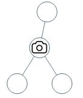

# Tree Recursion

### 968. Binary Tree Cameras

Given a binary tree, we install cameras on the nodes of the tree. 

Each camera at a node can monitor **its parent, itself, and its immediate children**.

Calculate the minimum number of cameras needed to monitor all nodes of the tree.

 

**Example 1:**



```
Input: [0,0,null,0,0]
Output: 1
Explanation: One camera is enough to monitor all nodes if placed as shown.
```

**Example 2:**


```
Input: [0,0,null,0,null,0,null,null,0]
Output: 2
Explanation: At least two cameras are needed to monitor all nodes of the tree. The above image shows one of the valid configurations of camera placement.
```

**Example 3(Tricky, since two camera are 2 nodes apart)**


```java
/*
we dont put camera on leaf, since by putting the camera on its parent can always monitor more nodes. thus starting from the leaf node, we can greedily build cameras

alg1: bfs with parent pointers, starting from the leaf. Time: O(n). Space: O(n)
    1. build parent relation map, and track the degree
    2. push all edge degree = 1 nodes onto queue
    3. process queue, queue = nodes with degree = 1; initialize a set marking if a node is being watched; initializea set to track which node has camera installed
        - expand rule:
            - if current node is unwatched, install a camera to its only neighbor if not already installed
            - if current node is watched, do nothing
        - generate rule:
            - if currnt node has camera, mark all neighbor as watched
            - decrease neighbor degree by 1, push neighbors that have degree 1 onto queue


alg2: dfs

recursive rule:
    1. get child information from left and right
    2. if any of child requires cur to install camera, or current root has no parent and not marked as visited, we must install at cur node. mark all neighbor as watched, tell parent no need to install for cur node
    3. otherwise we tell parent they need to install for cur
base case:
    if current is a leaf, tell parent to install

time: O(n)
space: O(n) for usage of the hashset
*/
class Solution {
    public int minCameraCover(TreeNode root) {
        int[] res = new int[1];
        rec(root, res, null, new HashSet<TreeNode>());
        return res[0];
    }
    public boolean rec(TreeNode root, int[] res, TreeNode parent, Set<TreeNode> watched) {
        if (root == null) {
            return false;
        } else if (root.left == null && root.right == null) {
            if (parent == null) {
                res[0]++;
            }
            return true;
        }
        
        boolean l = rec(root.left, res, root, watched);
        boolean r = rec(root.right, res, root, watched);
        if ((parent == null && !watched.contains(root)) || l || r) {
            //if no more parent to request to install camera there, or left and right child told cur to install
            res[0]++;
            watched.add(root.left);
            watched.add(root.right);
            watched.add(root);
            watched.add(parent);
            return false;
        } else if (watched.contains(root)) {
            return false;
        }
        
        //!watched.contains(root) && no more parent
        return true;
    }
    

```


### 337. House Robber III \*\*\*

```java
class Solution {
    public int rob(TreeNode root) {
        int[] res = rec(root);
        return Math.max(res[0], res[1]);
    }
    public int[] rec(TreeNode root) {
        if (root == null) {
            return new int[]{0, 0};
        }
        
        int[] l = rec(root.left);
        int[] r = rec(root.right);
        //rob root
        int rob = root.val + l[1] + r[1];
        
        //not rob root
        int nrob = Math.max(l[0], l[1]) + Math.max(r[0], r[1]);
        return new int[]{rob, nrob};
    }
}
```

### [96. Unique Binary Search Trees](https://leetcode.com/problems/unique-binary-search-trees/) ***

Given n, how many structurally unique BST's (binary search trees) that store values 1 ... n?

Example:
```
Input: 3
Output: 5
Explanation:
Given n = 3, there are a total of 5 unique BST's:

   1         3     3      2      1
    \       /     /      / \      \
     3     2     1      1   3      2
    /     /       \                 \
   2     1         2                 3
```

```java
/*
alg: recursion
    when constructing bst with i as root, we have left be [0 ... i - 1], right [i + 1 ... n]
    
    suppose recursive function f returns # of unique BST from [0, n]
    for i in [1, n]:
        pick a number i as root, so root = i
        # of ways to make BST with i as root  
            = # of BST formed from [0 ... i - 1] * # of BST formed from [i + 1 ... n]
            = f(i - 1) * # of BST formed from [i + 1 ... n]
            = f(i - 1) * f(n - i)  //since # BST formed from [123] = [456], structure of BST would be the same, so we can map # of BST from [456] to [123]
    
*/
class Solution {
    public int numTrees(int n) {
        if (n <= 1) {
            return n;
        }    
        
        int[] dp = new int[n + 1];
        dp[1] = 1;
        dp[0] = 1;
        for (int i = 2; i <= n; i++) {
            for (int j = 1; j <= i; j++) {
                //root = j
                dp[i] += dp[j - 1] * dp[i - j];
            }
        }
        return dp[n];
    }
}
```

### 116. Populating Next Right Pointers in Each Node
```java
/*
recursion:

recursive rule:
    for current root, link its left and right child next pointer
    link right child to root.next.left
    recusively connect the left and right child
*/
class Solution {
    public Node connect(Node root) {
        if (root == null) {
            return root;
        }
        
        if (root.left != null) {
            root.left.next = root.right;
            if (root.next != null) {
                root.right.next = root.next.left;
            }
        }
        
        connect(root.left);
        connect(root.right);
        return root;
    }
}
```
> Iterative
```java
    //two pointers simulating bfs process
    public Node connect(Node root) {
        if (root == null) return root;
        Node start = root;
        while (start.left != null) {
            Node cur = start;
            while (cur != null) {
                if (cur.left != null) cur.left.next = cur.right;
                if (cur.right != null && cur.next != null) cur.right.next = cur.next.left;
                cur = cur.next;
            }
            start = start.left;
        }
        return root;
    }
}
```
### [222. Count Complete Tree Nodes](https://leetcode.com/problems/count-complete-tree-nodes/) ***

Given a complete binary tree, count the number of nodes.

Note:

Definition of a complete binary tree from Wikipedia:
In a complete binary tree every level, except possibly the last, is completely filled, and all nodes in the last level are as far left as possible. It can have between 1 and 2h nodes inclusive at the last level h.

Example:
```
Input: 
    1
   / \
  2   3
 / \  /
4  5 6

Output: 6
```

```java
/**
 * Definition for a binary tree node.
 * public class TreeNode {
 *     int val;
 *     TreeNode left;
 *     TreeNode right;
 *     TreeNode(int x) { val = x; }
 * }
 */
/*
algorithm: tree recursion and binary search
notice for a complete binary tree, either the leftSubtree of root is a full binary tree or rightSubTree is a full binary tree. To determine which side is a full binary tree, getHeight(leftChild) and getHeight(rightChild)
    1. leftHeight == rightHeight: leftSubtree is full binary tree
        # of nodes = leftSubtree + root + rightSubtree
                   = (2^leftHeight - 1) + (1) + countNodes(root.right) 
    2. leftHeight == rightHeight + 1: right is full binary tree
        # of nodes = leftSubtree + root + rightSubtree
                   = countNodes(root.left) + 1 + (2^rightHeight - 1)
    no other cases are possible since it's a complete binary tree

we implement our algorithm using recursion since each step we can obtain # of nodes from one side of the subtree(thus our problem size reduce by half) and recursively get the answer from the other side.
our recursion algorithm works as following:
    1. get leftHeight and rightHeight from child
    2. case1: leftHeight == 0
            leftsubtree is empty, so must the right,
            # of nodes in the tree is root itself = 1
       case2: rightHeight == 0 
            rightSubtree is empty but not left, 
            # of nodes in the tree = leftSubtree + root
                                   = (2^leftHeight - 1) + 1
       case3: leftHeight != 0 && rightHeight != 0
            both subtrees are non empty, which is the case above we have analyzed
            1. leftHeight == rightHeight
            2. leftHeight == rightHeight + 1
Complexity:
there are logn levels for complete binary tree, each level we run get height function that cost logn (go all the way left is the height for a complete binary tree), so intotal O((logn)^2)
space: O(logn)
*/
class Solution {
    public int countNodes(TreeNode root) {
        if (root == null) {
            return 0;
        }
        
        int leftHeight = getHeight(root.left, 0);
        int rightHeight = getHeight(root.right, 0);
        if (leftHeight == 0) {
            return 1;
        }
        //leftHeight != 0 && rightHeight != 0
        if (leftHeight == rightHeight) {
            return ((int) Math.pow(2, leftHeight)) + countNodes(root.right);
        }
        return ((int) Math.pow(2, rightHeight)) + countNodes(root.left);
    }
    
    public int getHeight(TreeNode root, int level) {
        if (root == null) {
            return level;
        }
        return getHeight(root.left, level + 1);
    }
}
```

### 1026. Maximum Difference Between Node and Ancestor

```java
/**
recursion, O(n)
*/
class Solution {
    public int maxAncestorDiff(TreeNode root) {
        int[] res = new int[1];
        rec(root, res);
        return res[0];
    }
    public int[] rec(TreeNode root, int[] res) {
        if (root == null) {
            return new int[]{Integer.MAX_VALUE, Integer.MAX_VALUE};
        }
        int[] l = rec(root.left, res);
        int[] r = rec(root.right, res);
        
        for (int i = 0; i < 2; i++) {
            if (l[i] == Integer.MAX_VALUE) {
                l[i] = root.val;
            }
            if (r[i] == Integer.MAX_VALUE) {
                r[i] = root.val;
            }
            
            res[0] = Math.max(res[0], Math.abs(root.val - l[i]));
            res[0] = Math.max(res[0], Math.abs(root.val - r[i]));
        }
        
        l[0] = Math.min(l[0], Math.min(r[0], root.val));
        l[1] = Math.max(l[1], Math.max(r[1], root.val));
        return l;
    }
}
```

### 776. Split BST**

```java
/*
def f(root, v): TreeNode[]
    recursive rule:
        if (root.val > v):
            r = root
            split = f(root.left, v)
            r.left = split[1]
            l = split[0]
            root.left = null
            return {l, r}
        else:
            l = root.left
            split = f(root.right, v)
            l.right = split[0]
            r = split[1]
            return {l, r}
    
    base case:
        if (root == null):
            return {null, null}
*/
class Solution {
    public TreeNode[] splitBST(TreeNode root, int V) {
        if (root == null) {
            return new TreeNode[2];
        }
        
        if (root.val > V) {
            TreeNode r = root;
            TreeNode[] split = splitBST(root.left, V);
            TreeNode l = split[0];
            r.left = split[1];
            return new TreeNode[]{l, r};
        } else {
            TreeNode l = root;
            TreeNode[] split = splitBST(root.right, V);
            TreeNode r = split[1];
            l.right = split[0];
            return new TreeNode[]{l, r};
        }
    }
}
```


### 120. Triangle \*

Given a `triangle` array, return *the minimum path sum from top to bottom*.

For each step, you may move to an adjacent number of the row below. More formally, if you are on index `i` on the current row, you may move to either index `i` or index `i + 1` on the next row.

 

**Example 1:**

```
Input: triangle = [[2],[3,4],[6,5,7],[4,1,8,3]]
Output: 11
Explanation: The triangle looks like:
   2
  3 4
 6 5 7
4 1 8 3
The minimum path sum from top to bottom is 2 + 3 + 5 + 1 = 11 (underlined above).
```

```java
/*
alg: tree recursion. we can view the traingle as a tree. we need to track row = index of row, and current index = index within triangle[row]. Then we have converted the problem of finding the minimum root to leaf sum

   2
  3 4
 6 5 7
4 1 8 3

notice both 3 and 4 in layer 2 have same child 5. Thus we use dp to memorize child solutions, dp indexed by row index and index of the index within the row
- we can use bottom up dp instead, and while using rolling dp array due to the recursive rule. achieving O(n) space only, n = # of rows
*/
class Solution {
    public int minimumTotal(List<List<Integer>> triangle) {
        int rLen = triangle.size();
        int width = triangle.get(triangle.size() - 1).size();
        return rec(triangle, 0, 0, new Integer[rLen][width]);
    }
    public int rec(List<List<Integer>> t, int r, int i, Integer[][] dp) {
        if (r == t.size() || i < 0 || i >= t.get(r).size()) {
            return Integer.MAX_VALUE;
        } else if (dp[r][i] != null) {
            return dp[r][i];
        }
        
        int left = rec(t, r + 1, i, dp);
        int right = rec(t, r + 1, i + 1, dp);
        
        int min = Math.min(left, right) == Integer.MAX_VALUE ? t.get(r).get(i) : Math.min(left, right) + t.get(r).get(i);
        dp[r][i] = min;
        return min;
    }
}
```


# Tree Traversal


### 589. N-ary Tree Preorder Traversal

```java
/*
recursive solution is obvious, while we can also use a stack to simulate the recusion stack

*/
class Solution {
    public List<Integer> preorder(Node root) {
        List<Integer> res = new ArrayList<>();
        Deque<Node> stack = new ArrayDeque<>();
        if (root == null) {
            return res;
        }
        stack.offerFirst(root);
        while (!stack.isEmpty()) {
            Node cur = stack.pollFirst();
            res.add(cur.val);
            for (int i = cur.children.size() - 1; i >= 0; i--) {
                stack.offerFirst(cur.children.get(i));
            }
        }
        return res;
    }
}
```

